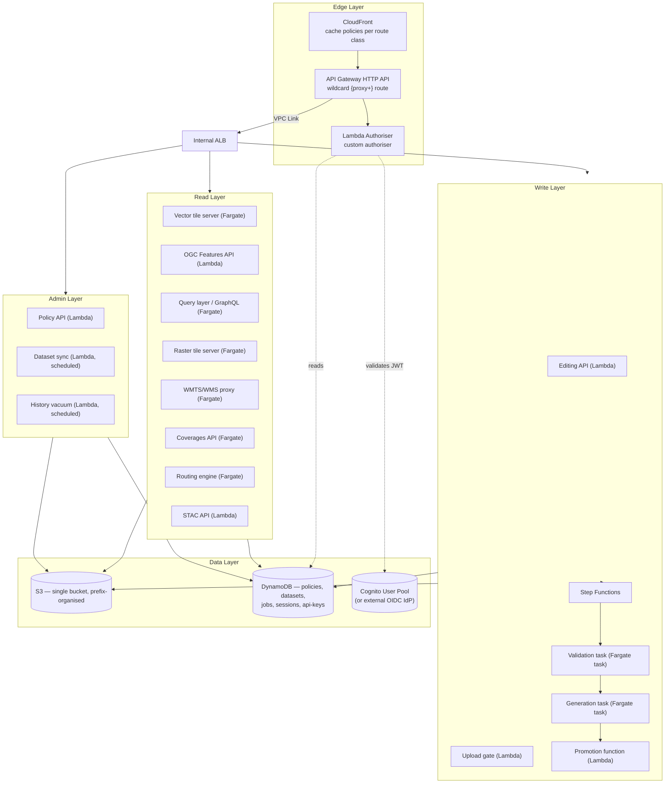
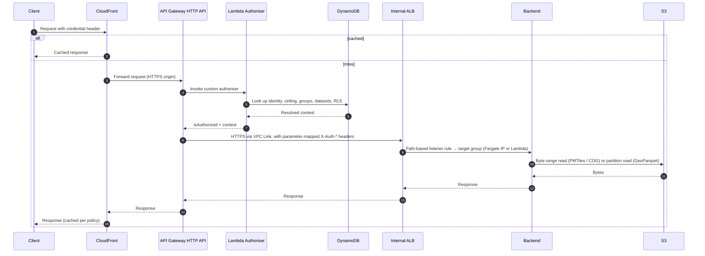

# 02 — Architecture

This document describes the overall shape of the platform: the layers, the components within each layer, and the path a request takes through them. It is the map you keep open while reading the other documents.

## Five layers

### Edge layer

The edge layer handles TLS termination, edge caching, and authorisation. Every request entering the platform passes through it. No backend service is reachable from the public internet; the only public endpoint is the API Gateway HTTP API, and it is fronted by CloudFront.

Components:

- **CloudFront** — terminates TLS, caches responses according to per-route cache policies (see below), and forwards cache misses to the API Gateway origin. Cache keys for authenticated content include the `Authorization` and `X-Api-Key` request headers, so each credential gets its own edge entry.
- **API Gateway HTTP API** — a single wildcard `{proxy+}` route attached to a Lambda custom authoriser, with a VPC Link integration to the internal ALB. Provides request throttling, structured CloudWatch access logging, CORS handling, and route-level configuration.
- **Lambda authoriser** — a small Lambda function that resolves identity (Cognito or external-OIDC JWT, or platform-issued API key) into a permission context. The API Gateway HTTP API parameter-mapping feature turns the authoriser's response context into trusted `X-Auth-*` headers attached to the forwarded request. Backends never see the original token.

### Read layer

Serves data to clients. Every component in this layer is read-only and stateless; persistent state lives in the data layer.

Components are grouped by *capability domain*, not by transport. The compute substrate (Fargate or Lambda) is chosen per component based on workload — see [12 Deployment](12_DEPLOYMENT.md) for the compute-split rationale.

- **Vector tile server (Fargate)** — serves MVT tiles from PMTiles archives in S3 via byte-range reads. See [05 Vector Tiles](05_VECTOR_TILES.md).
- **OGC Features API (Lambda)** — standards-compliant feature access. May be implemented as a standalone Lambda over GeoParquet, or as a façade over the query layer. See [06 OGC Features API](06_OGC_FEATURES_API.md).
- **Query layer (Fargate)** — GraphQL endpoint offering spatial operations, network routing, and cross-dataset queries. Optional; not deployed in environments that only need OGC compliance. See [07 Query Layer](07_QUERY_LAYER.md).
- **Raster tile server (Fargate)** — dynamic tile rendering from COGs in S3. See [08 Raster Services](08_RASTER_SERVICES.md).
- **WMTS/WMS proxy (Fargate)** — protocol translation to OGC WMTS 1.0.0 and WMS 1.3.0, plus an adapter for ArcGIS-compatible vector tile services.
- **Coverages API (Fargate)** — OGC API - Coverages over COGs.
- **Routing engine (Fargate)** — network routing, isochrones, map-matching, and road snapping. See [09 Routing](09_ROUTING.md).
- **STAC API (Lambda)** — catalogue and discovery over the DynamoDB dataset registry. See [10 Discovery](10_DISCOVERY.md).

### Write layer

Coordinates user-initiated edits to authoritative datasets. Edits are decoupled from the request that initiates them: the request layer accepts an intent and a payload; Step Functions performs the work asynchronously and reports status through a job record.

Components:

- **Editing API (Lambda)** — manages edit sessions, presigned S3 upload URLs, finalisation, review approvals, and validation-check configuration.
- **Upload gate (Lambda)** — accepts standalone bulk-upload requests (non-session edits), authorises the caller against dataset and role, and returns presigned S3 upload URLs.
- **Step Functions state machine** — orchestrates validation, generation, and promotion. Retry policies with exponential backoff cover transient failures; catch blocks route uncaught errors to a failure handler. Execution history is visible in the AWS console.
- **Validation task (Fargate task, transient)** — an ECS task launched per job that runs schema, geometry, and user-defined SQL checks against an uploaded dataset. Uses DuckDB with the spatial extension.
- **Generation task (Fargate task, transient)** — an ECS task launched per job that produces serving artefacts (PMTiles via Tippecanoe, with optional delta and difference variants for review). Up to 200 GiB ephemeral storage per task.
- **Promotion function (Lambda)** — performs the S3 `CopyObject` atomic swap, issues the CloudFront invalidation, writes SCD2 history rows, emits an event-log entry, and dequeues the next queued job for the dataset.

See [11 Editing Pipeline](11_EDITING_PIPELINE.md) for the full state machine.

### Admin layer

Long-running concerns that are not in the request path of any user.

- **Policy API (Lambda)** — administrative REST surface for managing identity ceilings, platform groups, projects, group claims, dataset registration, row-level security configuration, API keys, and user invitations. See [03 Authorisation](03_AUTHORISATION.md).
- **Dataset sync (Lambda, EventBridge-scheduled)** — scanner that reconciles the DynamoDB dataset registry against actual S3 contents, surfacing newly-arrived datasets for review.
- **History vacuum (Lambda, EventBridge-scheduled)** — compactor that merges per-edit SCD2 history files into monthly archives.
- **Event-log compactor (Lambda, EventBridge-scheduled)** — same pattern for the per-dataset event log under `metadata/dataset_events/`.

### Data layer

Three durable substrates, each with a clear purpose:

- **S3 (single bucket)** — all spatial data, edit uploads, serving artefacts, SCD2 history, and event logs. Prefix-organised; lifecycle rules per prefix. See [04 Data Layout](04_DATA_LAYOUT.md).
- **DynamoDB** — auth policies, dataset registry, edit sessions, jobs, API keys, row-level-security configuration. Single-table designs for related data with GSIs for inverse-direction lookups; separate tables only where access patterns or TTL requirements diverge. On-demand billing, PITR enabled.
- **Identity provider** — Cognito User Pool by default, or any OIDC-compliant external IdP listed in the trusted-issuers configuration. The platform consumes signed JWTs; no identity management within the platform itself.

## Request flow

The flow is identical for every backend in the read layer. The only thing that varies is the path the gateway matches and the backend it forwards to.

For edits, the early stages of the flow are the same; the backend (the editing API) writes to the key-value store and object storage, optionally invokes the workflow engine, and returns a job identifier. The actual work happens asynchronously and the client polls the job API.

## CloudFront cache policy classes

CloudFront is configured with three cache policies, each applied to a class of behaviours on the distribution:

| Policy class | TTL | Cache key includes | Applies to |
|---|---|---|---|
| Auth no-cache | 1 second | Default | Feature reads, admin APIs, edit APIs, job APIs — anything that must reflect current permissions |
| API-key tiles | 7 days | `Authorization` and `X-Api-Key` headers | Vector tiles, raster tiles, WMTS, mosaics, capabilities documents |
| API-key metadata | 1 hour | `Authorization` and `X-Api-Key` headers | TileJSON, STAC collections, dataset listings |

Per-credential keying means a tile cached for one API key is not served to another, even if both have access to the same dataset. This is intentional: every distinct credential is verified at least once, and there is no risk of cross-credential cache reuse.

> *In plain terms:* the same tile is stored at the edge once per credential. Tile bytes are cheap, but the guarantee that nobody ever reads a tile cached against someone else's permissions is valuable.

CloudFront path-pattern invalidation (`/tiles/vector/{dataset}/*`) is issued by the promotion function on every successful pipeline run so edge caches re-fetch the new tiles.

## Backend addressing — internal ALB

Inside the platform, a single internal Application Load Balancer (ALB v2) sits in private subnets and is the only ingress to all backends. API Gateway HTTP API reaches it through a **VPC Link** private integration; the ALB is **not reachable from the public internet**.

> *In plain terms:* every backend trusts the `X-Auth-*` headers because the only way those headers can reach a backend is through the gateway's parameter mapping. A client cannot forge them because a client cannot reach the ALB at all.

The ALB routes by path pattern via listener rules (each rule is a `CfnListenerRule` with a unique priority and a `PathPatternConfigProperty`). Several rules use the ALB v2 URL-rewrite transform (`RewriteConfigObjectProperty`) to strip the public path prefix before forwarding to the backend's native path:

| Path prefix | Backend |
|---|---|
| `/stac/*` | STAC API |
| `/rest/auth/*`, `/rest/datasets/*` | Policy API |
| `/tiles/vector/*` | Vector tile server (with URL rewrite) |
| `/graphql/*` | Query layer |
| `/features/*` | OGC Features API |
| `/routing/*` | Routing engine |
| `/coverages/*` | Coverages API |
| `/tiles/raster/*`, `/mosaics/*` | Raster tile server |
| `/wmts/*`, `/wms/*` | WMTS/WMS proxy |
| `/edit-sessions/*`, `/editing/*`, `/validation-checks/*`, `/validation-sequences/*` | Editing API |
| `/uploads/*` | Upload gate |
| `/jobs/*` | Job API |

Each rule is independent. A new backend is added by writing a new `CfnListenerRule` with a non-conflicting priority and pointing it at a new target group. Target groups accept Fargate task IPs (target-type `ip`) or Lambda function ARNs (target-type `lambda`); the ALB transparently selects between them based on the rule's target group.

## Component substitutability

A summary of which components are off-the-shelf and which are custom (in the sense of being purpose-built for this platform, regardless of who builds them):

| Component | AWS substrate | Build vs buy |
|---|---|---|
| CloudFront | Managed CDN | Configuration only |
| API Gateway HTTP API | Managed gateway | Configuration only |
| Lambda authoriser | Lambda + DynamoDB | Custom (small, focused) |
| Vector tile server | Fargate service running an off-the-shelf PMTiles HTTP server (e.g. go-pmtiles) | Container only |
| OGC Features API | Lambda | Custom (small) — see [06 OGC Features API](06_OGC_FEATURES_API.md) for the two valid shapes |
| Query layer | Fargate service | Custom (substantial) — only build if rich query capability is required |
| Raster tile server | Fargate service running an off-the-shelf COG-aware tile server (e.g. TiTiler) | Container only |
| WMTS/WMS proxy | Fargate service | Custom (moderate) |
| Coverages API | Fargate service | Custom (small) |
| Routing engine | Fargate service running an off-the-shelf routing engine (e.g. Valhalla) with regional OSM data baked into the image | Container with embedded data |
| STAC API | Lambda over DynamoDB | Custom (small) |
| Editing API | Lambda | Custom (moderate) |
| Validation / generation tasks | Fargate transient ECS tasks | Custom (moderate) — use DuckDB and Tippecanoe |
| Promotion function | Lambda | Custom (small) |
| Policy API | Lambda | Custom (moderate) |

Custom components are deliberately small because the design principle of stable contracts (Principle 4) confines complexity to single components. There is no monolith.

## Where to read next

- The data layer is the most consequential design choice — go to [04 Data Layout](04_DATA_LAYOUT.md) next.
- The authorisation model determines every request's behaviour — [03 Authorisation](03_AUTHORISATION.md).
- The rationale for each technology pick is in [15 Design Decisions](16_DESIGN_DECISIONS.md).
