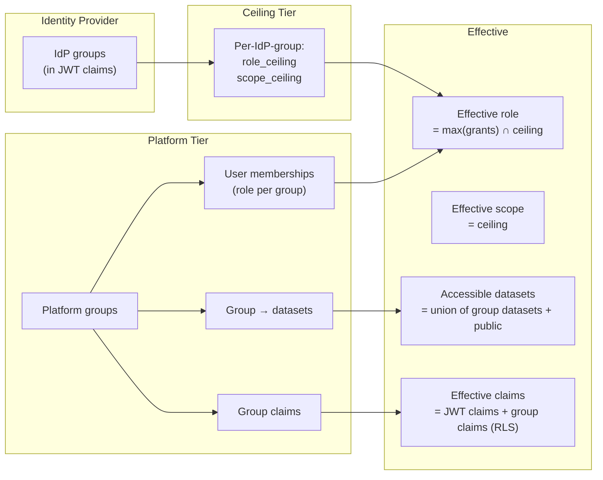
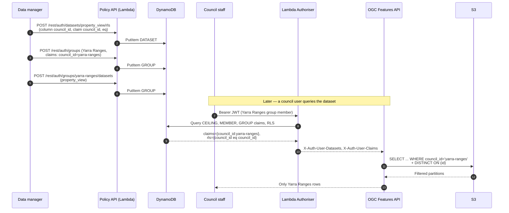
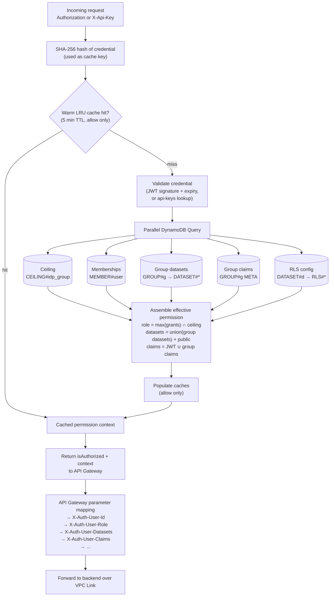

# 03 — Authorisation

A single authorisation layer sits between every request and every backend. It is implemented as an **API Gateway HTTP API custom authoriser running as a Lambda function** in front of all backends. The Lambda resolves the caller's identity, computes their effective permissions from DynamoDB, returns a permission context, and API Gateway's parameter-mapping feature converts that context into `X-Auth-*` headers attached to the forwarded request. Backends do not validate tokens, look up policies, or fetch user data; they read the trusted headers off the request.

This document specifies the authorisation model, the algorithm, and the contracts.

## Identity sources

Two credential types are accepted:

**OIDC JWT** — a bearer token issued by any trusted identity provider. The platform accepts tokens from a configured list of trusted issuers (a `TRUSTED_ISSUERS` environment variable on the authoriser Lambda). Each issuer publishes a JWKS endpoint; the Lambda fetches and caches signing keys for one hour. Tokens are validated for signature (RS256/RS384/RS512), expiry, issuer, and audience. The claims in the token carry the user identity and the user's IdP group memberships.

A **Cognito User Pool** is the default identity provider, but any OIDC-compliant external IdP (Entra ID, Auth0, Okta, Google Identity) can be added to the trusted-issuers list. Federation between Cognito and an external IdP is configured on the Cognito side and is transparent to this platform.

**API keys** — opaque tokens issued by the platform itself, stored as SHA-256 hashes in a DynamoDB `api-keys` table. Each key has an owner (a user or a platform group), an active flag, an optional description, and an issuance timestamp. The raw key is returned only at issuance; the platform stores only the hash.

Anonymous access is supported for explicitly-public resources (see "Public access" below). Requests with no credential are not rejected at the authoriser; they are resolved to an anonymous identity with access only to public datasets.

## Three-tier permission model



### Tier 1: Ceiling (from the identity provider)

Each IdP group the user belongs to maps to a **ceiling** — the maximum role and scope that anyone in that group may receive, regardless of how generously they are granted permissions inside the platform.

| Ceiling field | Meaning |
|---|---|
| `role_ceiling` | The highest role the user may exercise (e.g. `data_manager`). Inside the platform, no grant may exceed this. |
| `scope_ceiling` | The highest scope the user may exercise (e.g. `partner`, `internal`). Limits the visibility category of data. |

If the user belongs to multiple IdP groups, the **most permissive** ceiling applies (the maximum role and scope across all groups). The rationale: the IdP is the authority for organisational role; if any IdP group says "this person may act as a `data_manager`," the platform respects that.

The ceiling exists so that platform administrators cannot accidentally grant a contractor admin privileges by adding them to the wrong group. The IdP is the upstream constraint.

> *In plain terms:* the IdP sets the ceiling, the platform hands out keys underneath it. A grant inside the platform can never exceed what HR has said about the person upstream.

### Tier 2: Platform grants (managed in the platform)

Within the ceiling, the platform manages:

- **Platform groups** — named collections of users and datasets, with optional default claims attached to the group.
- **Memberships** — a user belongs to zero or more platform groups, with a role per group.
- **Group datasets** — which datasets each platform group can access.
- **Group claims** — key/value pairs attached to a group that flow into the user's effective claims at auth time (used for row-level security; see below).

Memberships and grants are admin-managed via the policy API. A user gains access to a dataset by being added to a group that has access to that dataset.

### Tier 3: Effective permission

For each request, the authoriser computes:

| Computed | Algorithm |
|---|---|
| Effective role | The most permissive role across all platform-group memberships, capped at the ceiling. |
| Effective scope | The ceiling scope (scope is not refined by platform groups; the ceiling is authoritative). |
| Accessible datasets | The union of datasets granted by all the user's platform groups, plus datasets explicitly marked public. |
| Effective claims | JWT claims merged with platform-group claims. Group claims override JWT claims when both are present. |

## Roles and scopes

**Roles** form a hierarchy. Each role implies all lesser roles:

| Role | Capabilities |
|---|---|
| `platform_admin` | All operations. Bypasses row-level security. |
| `data_manager` | Manage datasets, schemas, validation rules, and bulk data edits. Bypasses RLS. |
| `publisher` | Approve edit sessions (review role). |
| `editor` | Create edit sessions, upload data, finalise sessions. |
| `viewer` | Read access to authorised datasets, subject to RLS. |
| `public` | Read access to datasets explicitly marked public. |

**Scopes** are categories of data visibility, not capabilities. They are intended to allow a single dataset registry to host content of different sensitivity:

| Scope | Meaning |
|---|---|
| `public` | Open data, no restriction. |
| `partner` | Restricted to identified external partners. |
| `project` | Restricted to a specific project group. |
| `internal` | Restricted to internal organisational use. |

The scope is currently informational on the authorisation side: the authoriser caps role and computes the accessible-dataset list, but it does not filter datasets by scope. Scope is injected into `X-Auth-User-Scope` for downstream backends that choose to enforce it. No backend in the prototype actually does — the access decision in practice is "is the dataset in the user's `X-Auth-User-Datasets` list?", and scope is metadata for future per-route enforcement. A stricter contract would push scope evaluation into the authoriser (so a request for an `internal`-scoped dataset by a `public`-scoped caller never reaches the backend) or add scope checks to every read backend; both are reachable extensions.

## API keys

API keys are the principal mechanism for desktop GIS, scripts, and any client that cannot perform an interactive OIDC sign-in.

**Issuance:**
- An admin (or a user via self-service) creates a key with an owner type (`user` or `group`) and an owner identifier. The platform generates a random key, computes its SHA-256 hash, stores the hash with the metadata, and returns the raw key once. The raw key is never stored or retrievable thereafter.
- The key's effective permissions are deliberately conservative regardless of how the request was framed:
  - **User-scoped keys** receive the `viewer` role and access only to datasets explicitly marked `public`. The owning user's group memberships and dataset grants are *not* inherited — this is a deliberate downgrade so that a leaked key cannot exercise the caller's elevated roles or private dataset access.
  - **Group-scoped keys** inherit the owning group's datasets (and group claims, which feed RLS) at the `viewer` role. This is the canonical way to grant a desktop GIS team access to a set of layers.
  - The `scope` on every API key is always `public` in storage. There is no request-time `scope` parameter; any `scope` field in client examples is informational only and is not honoured by the auth path.

**Use:**
- Clients send the raw key in an `X-Api-Key` header (or, where supported, as a query parameter).
- The authoriser hashes the incoming key, looks it up, and proceeds with the resolved owner's permissions.

**Revocation:**
- Setting a key's `active` flag to false revokes it. The authoriser checks `active` on every cache miss; warm authoriser caches will continue to honour the key for up to the cache TTL (5 minutes — see "Caching" below).

## Row-level security (RLS)

RLS filters individual feature rows within an authorised dataset. The rules themselves are configured per-dataset and stored centrally in DynamoDB (`DATASET#{id}` / `RLS#{column}` items). Enforcement happens in whichever read backend touches the data: in the prototype that means **the query layer** (GraphQL, Fargate, DuckDB-backed), and since the OGC Features API is a thin HTTP façade over GraphQL, OGC reads pick up the same RLS predicates by composition. Any feature-returning read path that composes onto the same engine — OGC Features REST, direct GraphQL queries, the history resolvers — applies the same per-row filters and the same `platform_admin`/`data_manager` bypass. Vector tiles are byte-served and cannot be row-filtered at the tile layer; this is a known limit of the format.

**OGC-only deployments.** A deployment that chooses Shape A from [06 OGC Features API](06_OGC_FEATURES_API.md) — standalone Lambda over GeoParquet, no query layer — has to load the same RLS rule set into that Lambda and translate it into the same SQL `WHERE` clauses. The DynamoDB rules are the source of truth in both shapes; only the *enforcement code* changes. Treat RLS as a per-deployment responsibility of whichever Lambda or service does the feature read, not a property of the OGC façade.

**Configuration model**: each RLS rule is `(dataset, column, claim, operator)`:

| Field | Meaning |
|---|---|
| `dataset` | The dataset the rule applies to. |
| `column` | The column in the dataset to filter on. |
| `claim` | The claim key from the user's effective claims to compare against. |
| `operator` | `eq` (exact match), `in` (multi-value match), `contains` (substring). |

**Resolution at request time**:
1. The authoriser builds the user's effective claims by merging JWT claims and platform-group claims.
2. For each authorised dataset, the authoriser fetches the dataset's RLS configuration.
3. The configuration is included in the permission context delivered to the OGC Features backend.
4. The backend applies the appropriate filter expressions on the dataset's query.

**Example**: a council group has `claims: {council_id: "yarra-ranges"}`. The shared `property_view` dataset has an RLS rule `(council_id, council_id, eq)`. Members of the council group see only rows where the dataset's `council_id` column equals `"yarra-ranges"`. A user belonging to multiple councils gets a multi-value match.

**Bypass**: roles `platform_admin` and `data_manager` bypass RLS — they see every row, by design, because their job is to manage the data.

### Journey: a dataset author configures multi-tenant access

> *In plain terms:* the dataset author decides which column distinguishes "your rows" from "everyone else's rows", points it at a claim that users will carry, and from that moment on the platform pre-filters every query and every feature response.

A property dataset holds rows for many councils. Each council should only see its own rows. There is no per-user configuration — the council *is* the unit of access.

1. **The dataset is already in the registry.** Each row has a `council_id` column carrying values like `yarra-ranges`, `casey`, `boroondara`. The values are stable identifiers, not display names.

2. **The data manager defines the row-level-security rule on the dataset:**

   ```
   POST /rest/auth/datasets/property_view/rls
   { "column": "council_id",
     "claim":  "council_id",
     "operator": "eq" }
   ```

   The rule says: at query time, restrict the dataset to rows where the `council_id` column matches the caller's `council_id` claim, exactly.

3. **The data manager creates one platform group per council, each carrying its own claim value:**

   ```
   POST /rest/auth/groups
   { "name": "Yarra Ranges Council",
     "claims": { "council_id": "yarra-ranges" } }

   POST /rest/auth/groups
   { "name": "Casey Council",
     "claims": { "council_id": "casey" } }
   ```

   The claim is attached to the *group*, not to individual users. Adding a council staff member to the Yarra Ranges group automatically gives them the `council_id=yarra-ranges` claim at auth time.

4. **The data manager links the dataset to every council group:**

   ```
   POST /rest/auth/groups/yarra-ranges/datasets  { "dataset_id": "property_view" }
   POST /rest/auth/groups/casey/datasets         { "dataset_id": "property_view" }
   ```

   All councils have access to `property_view`, but they will see different rows.

5. **Council staff are invited or self-onboard via the IdP.** On first sign-in the post-authentication Lambda converts the invitation into a membership in the appropriate council group.

6. **At query time:** a Yarra Ranges user requests `/features/v1/collections/property_view/items`. The Lambda authoriser merges group claims into the effective claims, sees `council_id=yarra-ranges`, looks up the dataset's RLS rule, and includes it in the permission context as part of `X-Auth-User-Claims`. The OGC Features API translates the RLS rule into a DuckDB `WHERE council_id = 'yarra-ranges'` clause appended to the partition-pruned query. The user receives only Yarra Ranges rows.

7. **A staff member who belongs to multiple councils** (a regional officer assigned to several groups) gets a multi-value claim: `council_id=["yarra-ranges","casey"]`. The OGC Features API uses an `IN` predicate, returning rows from both councils.



**Operators supported on RLS rules:** `eq` (exact match), `in` (multi-value match — useful when a single user belongs to multiple groups with the same claim key), `contains` (substring — useful for hierarchical identifiers).

**A note on vector tiles.** RLS applies to every feature-returning read path through the query layer — direct GraphQL and the OGC Features façade. Vector tiles cannot be filtered per-row at the tile layer — PMTiles is byte-served and the server cannot evaluate predicates. If a dataset must be tightly row-restricted, expose it through OGC Features (or direct GraphQL) only, not as a vector tile layer. For datasets where row visibility differs only by category (not by tenant), build separate tile layers per category instead.

## Public access

Datasets may be marked as publicly accessible. Public access is the platform's way to expose open data without requiring authentication.

- The dataset registry has a `public` flag.
- The authoriser, even with no credential present, returns a permission context whose `accessible datasets` list includes all public-flagged datasets.
- An unauthenticated request to a public dataset succeeds with the `public` role.
- Public access participates in CDN caching; an `Authorization`-free request shares a single cache entry.

## Permission context header contract

The Lambda authoriser does not pass tokens to backends. Instead, it returns a context object in its response; API Gateway HTTP API's parameter mapping then attaches the context fields as `X-Auth-*` headers on the request forwarded over VPC Link to the internal ALB. Backends trust these headers because the ALB is internal-only and only the VPC Link's security group is permitted to reach it.

| Header | Content |
|---|---|
| `X-Auth-User-Id` | A stable user identifier — the JWT subject claim, or `apikey:{owner_id}` for API-key auth. |
| `X-Auth-User-Email` | The user's email, when available. |
| `X-Auth-User-Role` | The effective role. |
| `X-Auth-User-Scope` | The scope ceiling. |
| `X-Auth-User-Datasets` | Comma-separated dataset identifiers the user may access. |
| `X-Auth-User-Groups` | Comma-separated platform-group identifiers the user belongs to. |
| `X-Auth-User-Claims` | Effective claims as a JSON-encoded object (used by backends that need claims for RLS). |

**Contract guarantees** (the basis for backend trust):
- Headers are set by API Gateway from the authoriser's response. Clients cannot inject them — the gateway's parameter mapping is the only path through which `X-Auth-*` headers reach the ALB; any client-supplied `X-Auth-*` is ignored.
- The internal ALB is in private subnets with a security group that allows ingress only from the VPC Link security group. Backends are not reachable from the public internet.
- If the authoriser returns `isAuthorized: false`, API Gateway returns 401/403 directly and the ALB is never invoked.
- If a backend receives a request *without* `X-Auth-User-Role`, it must treat the request as anonymous (fail-closed for writes; restrict reads to public datasets). This is the defence in depth for the rare case of a misconfigured route.

The API Gateway HTTP API authoriser result cache is **disabled** (TTL=0). Every request invokes the Lambda; per-Lambda-container LRU caching (described below) is what saves DynamoDB capacity. This is deliberate: the gateway's authoriser cache cannot be invalidated programmatically.

## What happens inside the authoriser



> *In plain terms:* the authoriser turns a credential into a permission decision and a set of headers, in parallel rather than serially, so a request without a warm cache still completes in tens of milliseconds.

## Caching

Two layers of caching inside the authoriser Lambda, with deliberate TTLs:

| Layer | TTL | Behaviour on revocation |
|---|---|---|
| Authoriser result cache (warm Lambda container memory, LRU) | 5 minutes | Allow decisions are cached; deny decisions are not. A revoked key fails on the next request once the cache entry expires (up to 5 minutes). |
| Permission-data cache inside the authoriser (DynamoDB lookups for groups, datasets, claims) | 300 seconds | Permission upgrades take up to five minutes to propagate. |

Cache entries are keyed on a SHA-256 hash of the credential, never on the raw credential, so raw keys are not retained in process memory across requests.

> *In plain terms:* a memory dump of a warm authoriser does not yield a usable key. The cache holds hashes and permission decisions, not the secrets that produced them.

When the Lambda container is recycled (scale-down, deployment, runtime restart), both caches disappear; the next request rebuilds them from DynamoDB.

## Self-service surface

A small set of endpoints allows authenticated users to act on their own profile without admin intervention:

| Endpoint | Action |
|---|---|
| `GET /rest/auth/me` | Return the caller's identity, role, scope, groups, and datasets. |
| `POST /rest/auth/me/apikey` | Issue a personal API key (subject to the caller's existing permissions). |
| `DELETE /rest/auth/me/apikey/{hash}` | Revoke a personal API key. |

## Admin surface

The policy API offers the following resource classes; each supports the usual `list / get / create / update / delete` patterns appropriate to the resource:

| Resource | Purpose |
|---|---|
| Ceilings | Map IdP group identifiers to `(role_ceiling, scope_ceiling)`. |
| Platform groups | Named groups with optional default claims. |
| Group memberships | User-to-group assignments with a role. |
| Group datasets | Which datasets each group accesses. |
| Projects | Named projects that bundle groups (optional organisational layer). |
| Datasets | Dataset registration: identifier, public flag, metadata, lineage. |
| Dataset RLS | Row-level security rules per dataset. |
| API keys | Issue and revoke keys for users or groups. |
| Invitations | Email-based invitations that resolve to memberships on first sign-in. |

## Invitations and first sign-in

Inviting a user is decoupled from creating one. An admin creates an invitation specifying `(email, group, role)`. The invitation is stored as a `PK=INVITE#{email} SK=GROUP#{group_id}` item in the DynamoDB policies table.

When the user first authenticates via Cognito (or the configured external IdP), a **Cognito User Pool post-authentication Lambda trigger** runs. The trigger queries DynamoDB for any pending invitations for that email, converts each into a `PK=MEMBER#{user_id} SK=GROUP#{group_id}` membership item, and deletes the invitation. Subsequent logins find no pending invitations and the membership persists.

This design lets administrators provision access before the user exists in the IdP, and it survives IdP-side identity churn (a user re-created with the same email retains the platform memberships). If the IdP is an external OIDC provider rather than Cognito, the equivalent mechanism is a federated identity in Cognito with the post-auth trigger still attached, or — for direct external IdP use without Cognito — a small reconciliation Lambda invoked on first request that performs the same invitation lookup.

## Permission propagation latency

Permission changes — adding a user to a group, granting a dataset, revoking a key — take effect on a request-by-request basis but are subject to:

1. **Authoriser warm-cache TTL** (5 minutes for allow decisions; matches the longest practical revocation latency).
2. **Internal permission data cache** (300 seconds for groups/datasets/claims).

In the worst case, a user's *upgrade* (added to a group with more permissions) is visible within five minutes. A *downgrade* (removed from a group) is visible within the same window. A revoked API key fails on the next request once the cache entry for that key has expired (within 5 minutes — same TTL as the rest of the authoriser cache).

This is intentional: hitting the key-value store on every request would defeat the function-runtime scaling story. Sub-second revocation is achievable by tightening the TTLs at proportional cost in store reads.

## What this design does well

- A single, small body of authorisation code controls every request. Backends are simple.
- The IdP is the authority for *who* the user is and *which organisational roles* they may exercise. The platform is the authority for *which datasets* they may see and *with what claims*.
- RLS via group claims allows partner-tenanted access to shared datasets without per-user IdP attributes.
- API keys cover desktop GIS, scripts, and machine clients without requiring those clients to perform OIDC flows.
- The authorisation model is IdP-agnostic; switching identity providers is a configuration change.

## What it leaves to the deployment

- **IdP federation** is the responsibility of the chosen IdP's configuration; the platform consumes whatever the IdP issues.
- **Multi-factor authentication** is enforced at the IdP, not at the platform.
- **Audit completeness** — the gateway access log captures user, path, and status on every request; per-resource audit (which feature was modified, which dataset was accessed by column) is the responsibility of the relevant backend's event log. The editing pipeline writes such an event log; read backends do not.

See [11 Editing Pipeline](11_EDITING_PIPELINE.md) for the edit event log.
