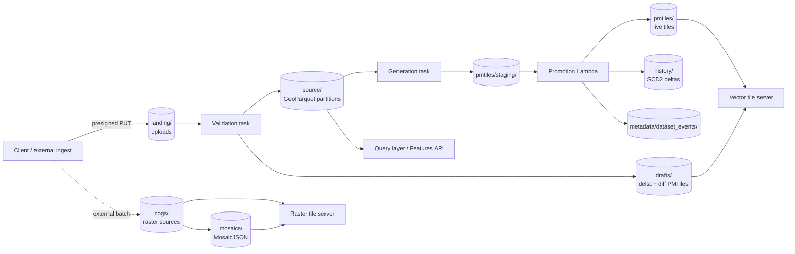

# 04 — Data Layout

All of the platform's spatial data lives in **Amazon S3** as cloud-native files served via byte-range reads. Metadata, policies, and operational state live in **Amazon DynamoDB**. This document specifies the layouts of both.

## S3 layout

A single S3 bucket holds all spatial data, organised by prefix. A single bucket — rather than one per data class — simplifies IAM (a single bucket ARN), lifecycle management (one S3 Lifecycle policy with per-prefix rules), and administration. S3 has no per-bucket charges, so prefixes are purely organisational.

```
spatial-data-bucket/
├── cogs/                       Raster sources (COGs, organised by region/dataset/date)
├── elevation/                  DEMs (special-cased COGs)
├── mosaics/                    MosaicJSON descriptors (raster mosaics)
├── pmtiles/                    Live vector tiles (atomic-swap target)
│   └── staging/                Generation output before promotion
├── source/                     Hive-partitioned GeoParquet (authoritative vector data)
│   └── {dataset}/z={z}/x={x}/y={y}/data.parquet
├── drafts/                     Edit session artefacts (delta/diff PMTiles, check results)
│   └── {dataset}/{session}/
├── landing/                    User uploads — triggers the editing pipeline
│   └── {dataset}/{job}/
├── history/                    Per-row history (SCD2)
│   └── {dataset}/
├── metadata/
│   └── dataset_events/         Per-dataset event log (Parquet)
├── viewer/                     Static web map viewer
└── map-client/                 Map client application bundle
```

Each prefix has a single purpose and a defined producer/consumer relationship.

| Prefix | Producer | Consumer |
|---|---|---|
| `cogs/` | External processes (data ingest) | Raster tile server, coverages API |
| `elevation/` | External processes | Raster tile server |
| `mosaics/` | External processes or admin scripts | Raster tile server, WMTS proxy |
| `pmtiles/` | Promotion function (atomic copy from staging) | Vector tile server |
| `pmtiles/staging/` | Generation task | Promotion function |
| `source/` | Validation task | Query layer, OGC Features API |
| `drafts/` | Validation and generation tasks | Reviewer (via vector tile server), editing API |
| `landing/` | Clients (via presigned upload) | Workflow engine (triggered by storage event) |
| `history/` | Promotion function (writes deltas); history vacuum (compacts) | Query layer (point-in-time queries) |
| `metadata/dataset_events/` | Promotion function (writes events); event-log compactor (compacts) | Admin and operations queries |

The same shape, viewed as a flow:



Each prefix is the only thing some component writes to and the only thing some other component reads from. That one-producer-one-consumer property is what keeps lifecycle rules, IAM, and reasoning about staleness manageable.

### Vector data: GeoParquet with Hive-style spatial partitioning

The authoritative storage for vector features is **GeoParquet** under `source/`. Files are organised by tile coordinates in a Hive-style directory layout:

```
source/{dataset_id}/z={z}/x={x}/y={y}/data.parquet
```

The tile coordinates correspond to a chosen partition zoom (typically zoom 6). At zoom 6, the world is divided into a grid of 4096 tiles (64×64), giving partitions that are coarse enough to limit object count but fine enough that bbox queries only read a handful of files.

**Why this layout:**

- **Predicate pushdown on partition keys.** Analytical engines (DuckDB, BigQuery, Athena, Spark) understand the Hive `key=value` directory convention natively. A bbox query is translated into a tile-set query and only the matching partitions are read.
- **Incremental edits.** When a feature is edited, only the partitions whose tiles intersect the feature's geometry are rewritten. An 800,000-feature dataset can absorb a single-feature edit by rewriting a few small Parquet files.
- **Ecosystem compatibility.** GeoParquet is readable by QGIS, GeoPandas, and any modern data tool that supports Parquet plus geometry.

**Cross-partition writes.** Features that span multiple tiles are written to every partition they intersect, with their full geometry (not clipped). This:

- Avoids the need to reassemble clipped geometries at read time.
- Makes single-partition reads complete (every feature touching the query bbox is present in the partitions read).

The cost is that a single feature may appear multiple times across partitions. This is handled at read time.

**Read-time deduplication.** Every query reads with `DISTINCT ON (id)` semantics (or an equivalent window function for distance-ordered results). The result is one row per feature identifier, regardless of how many partitions held it. Every dataset must declare an `id_column` in its registry entry; the validation task enforces this on intake.

> *In plain terms:* writes pay the cost of duplicating a straddling feature across the tiles it touches; reads pay the cost of collapsing those duplicates back into one. The alternative — clipping geometries at partition boundaries on write — pushes the cost onto every read instead, where it is harder to do correctly.

### Vector tiles: PMTiles

Vector tiles are stored as **PMTiles** archives at `pmtiles/{dataset_id}.pmtiles`. PMTiles is a single-file format that packs all tiles of a dataset into one archive with an index that supports HTTP byte-range reads. S3's range-read semantics are the substrate that makes this format efficient — a vector tile server fetches the small header range to read the index, then issues per-tile range requests for the bytes it needs.

The atomic-swap pattern uses S3's `CopyObject` operation: generation writes to `pmtiles/staging/{dataset_id}.pmtiles`, then the promotion Lambda issues a `CopyObject` from staging to `pmtiles/{dataset_id}.pmtiles`. S3 `CopyObject` is atomic from the consumer's perspective — the live URL either serves the old file or the new file, never a partial mix — and the new copy receives a new ETag. Vector tile servers that cache PMTiles directories keyed on ETag invalidate their cache automatically on the next access.

> *In plain terms:* the file is swapped in place without anyone seeing a half-written version, and the tile server notices the swap on its very next read without being restarted.

For datasets that use the reviewed editing flow, additional PMTiles are produced per session under `drafts/`:

```
drafts/{dataset}/{session}/delta.pmtiles
drafts/{dataset}/{session}/diff.pmtiles
```

- `delta.pmtiles` contains only the edited features, tagged with an edit-operation marker (add/update/delete) and a validation-status marker.
- `diff.pmtiles` contains geometric differences (computed by spatial subtraction between session features and live features) tagged with a diff-type marker (geometry_added, geometry_removed, feature_added, feature_deleted, attributes_only).

> *In plain terms:* reviewers see two small overlay layers — "what is changing" and "the shape of the change" — rather than having to diff two whole datasets in their head.

These are served by the vector tile server at a path matching `/tiles/vector/drafts/...` so a reviewer can render them in a map client.

### Raster data: Cloud-Optimized GeoTIFFs

Raster data is stored as **COGs** under `cogs/`. COGs are tiled internally with overviews; clients (GDAL-aware) can issue HTTP range requests for exactly the bytes needed for a given zoom level and area.

Mosaics across multiple COGs are described by **MosaicJSON** files under `mosaics/`. A MosaicJSON references many COG URLs and describes their spatial arrangement; tile servers query the mosaic to find which COGs cover a given tile and composite the result.

### History: row-level slowly-changing-dimension (SCD2)

Per-row history is stored under `history/{dataset}/` as flat (non-partitioned) Parquet files. Each row carries SCD2 columns:

| Column | Meaning |
|---|---|
| `_valid_from` | Timestamp the row version became active. |
| `_valid_to` | Timestamp the row version was superseded (null for current). |
| `_is_current` | Boolean — true if `_valid_to` is null. |
| `_change_type` | `insert`, `update`, or `delete`. |
| `_job_id` | The pipeline job that produced this version. |

**Write pattern** (per promotion):
- New row versions and inserts are written to `{job_id}_delta.parquet`.
- For updates and deletes, lightweight closeout files (`{job_id}_closeout.parquet` containing `id`, `_valid_to`, `_is_current=false`) record that the prior version is no longer current.

**Initial snapshot**: when history is first enabled on a large dataset, a single `_initial.parquet` is written with the current dataset state. The history vacuum (see below) compacts deltas but never rewrites the initial snapshot.

**Read pattern**: queries glob over `history/{dataset}/**/*.parquet`. Predicate pushdown on `_valid_from`/`_valid_to` makes point-in-time queries efficient. A "feature X as of time T" query reads only the row versions whose validity window covers T.

**Vacuum**: a scheduled task merges small delta and closeout files into monthly compacted files. The initial snapshot is left untouched. Retention is configurable per dataset (default one year).

**Opt-in**: history is enabled per dataset via the dataset registry. Datasets without history enabled do not produce history rows.

**Best-effort**: history writes are best-effort relative to promotion. A failed history write logs the error but does not fail the pipeline job; a missing history entry is acceptable but an incomplete promotion is not.

### Event log

`metadata/dataset_events/` holds per-dataset operational events as Parquet files. Events include:

- Pipeline state transitions
- Schema changes
- Validation rule changes
- SQL edits
- Administrative actions on the dataset

A scheduled compactor merges small per-event files into monthly archives, mirroring the history vacuum pattern.

## DynamoDB layout

A small number of DynamoDB tables hold operational state. The policies table uses a **single-table design** (multiple item types distinguished by partition-key prefix). Other tables are simpler: one item type per table where access patterns or TTL requirements diverge. All tables use **on-demand** billing and have **point-in-time recovery (PITR)** enabled.

### Policies table (single-table design)

All authorisation policies live in one DynamoDB table. Partition-key prefixes (`CEILING#`, `GROUP#`, `MEMBER#`, etc.) distinguish item types; sort-key patterns enable the queries each domain needs in a single round trip:

| Partition key | Sort key | Item type |
|---|---|---|
| `CEILING#{idp_group_id}` | `META` | Ceiling mapping (role_ceiling, scope_ceiling) |
| `GROUP#{group_id}` | `META` | Platform group metadata (name, description, claims JSON) |
| `GROUP#{group_id}` | `DATASET#{dataset_id}` | Group↔dataset link |
| `GROUP#{group_id}` | `PROJECT#{project_id}` | Group↔project link |
| `MEMBER#{user_id}` | `GROUP#{group_id}` | Platform group membership (role, joined_at) |
| `PROJECT#{project_id}` | `META` | Project metadata |
| `PROJECT#{project_id}` | `GROUP#{group_id}` | Project↔group link |
| `DATASET#{dataset_id}` | `RLS#{column_name}` | Row-level security rule (claim, operator) |
| `INVITE#{email}` | `GROUP#{group_id}` | Pending invitation (role, invited_by, invited_at) |

This single-table design is deliberate: every authorisation query is a DynamoDB `Query` on a partition key, returning all the items the authoriser needs for that subject (ceiling, memberships, dataset grants, claims) in one round trip. Conditional writes on the `version` attribute provide optimistic locking where concurrent writes are possible.

### API keys table

Separate from policies because access patterns differ (one item per credential, no relational lookups):

| Field | Description |
|---|---|
| `APIKEY#{sha256(key)}` (partition key) | The key hash |
| `owner_type` | `user` or `group` |
| `owner_id` | The owning user or group identifier |
| `active` | Boolean — flip to false to revoke |
| `description` | Human-readable label |
| `created_at` | Issuance timestamp |
| `scope` | `public` (default) — reserved for future use |

### Datasets table

The dataset registry. Holds public-facing metadata, lineage, and operational status.

| Field | Description |
|---|---|
| `DATASET#{dataset_id}` (partition key) | Dataset identifier |
| `name` | Human-readable name |
| `data_type` | `vector`, `raster`, or `table` |
| `public` | Boolean — included in anonymous access if true |
| `active` | Boolean — included in catalogue listings |
| `metadata` | Free-form JSON: description, attribution, lineage, contact |
| `schema` | JSON Schema describing the vector dataset's attribute columns |
| `id_column` | The unique-identifier column (required for cross-partition deduplication) |
| `min_zoom`, `max_zoom` | Tile generation parameters |
| `partition_zoom` | Spatial partitioning zoom for `source/` (typically 6) |
| `review_required` | Boolean — edits go through a review step before promotion |
| `history_enabled` | Boolean — write SCD2 history on each promotion |
| `history_retention_days` | Optional retention setting (default 365) |
| `pipeline_status` | `idle`, `processing`, or `failed` |
| `needs_review` | Boolean — set when dataset-sync detects a new dataset that an admin should classify |

### Jobs table

Pipeline jobs. One item per pipeline execution.

| Field | Description |
|---|---|
| `JOB#{job_id}` (partition key) | Job identifier |
| `dataset_id` | The dataset this job targets |
| `status` | `pending`, `queued`, `validating`, `generating`, `complete`, `failed`, `cancelled` |
| `operation` | `add`, `update`, `patch`, `delete`, `replace`, `regenerate`, `sql_edit` |
| `created_at`, `updated_at`, `completed_at` | Timestamps |
| `payload_key` | Object-storage key of the upload (under `landing/`) |
| `execution_arn` | Workflow execution identifier |
| `error` | Human-readable error message on failure |

A **DynamoDB Global Secondary Index (GSI)** on `(dataset_id, status)` supports the per-dataset concurrency check (one active job per dataset). The check is implemented as a `Query` on the GSI for `status IN (pending, validating, generating)`; the result determines whether a new job is created as `pending` or `queued`.

### Edit sessions table

Sessions for reviewed editing. One item per session.

| Field | Description |
|---|---|
| `SESSION#{session_id}` (partition key) | Session identifier |
| `dataset_id` | Target dataset |
| `owner_id` | User who created the session |
| `status` | See [11 Editing Pipeline](11_EDITING_PIPELINE.md) for the state machine |
| `version` | Optimistic-locking counter |
| `created_at`, `updated_at`, `submitted_at`, `reviewed_at` | Timestamps |
| `reviewer_id` | Approver's user identifier (must differ from `owner_id`) |
| `payload_summary` | Counts of adds/updates/deletes |
| `validation_summary` | Aggregate validation results |

DynamoDB **GSIs** on `(dataset_id, status)`, `(owner_id, updated_at)`, and `(reviewer_id, status)` support the operator queries.

**Session expiry (DynamoDB TTL):**
- Sessions in terminal states (`promoted`, `rejected`, `cancelled`) carry a DynamoDB TTL six months in the future. The TTL field is set on transition to the terminal state.
- Sessions in non-terminal states (`draft`, `uploading`, `submitted`, `validating`, `reviewing`, `failed`) carry a DynamoDB TTL refreshed to one month from the most recent activity. An abandoned session is removed automatically.

The DynamoDB TTL governs the *session record* in the `edit-sessions` table. It is independent of the S3 lifecycle rule for the `drafts/` prefix (see "Storage class and lifecycle" below), which governs the *content files* (delta and diff PMTiles, validation results). The two run on different cadences and need not match.

### Validation checks and sequences

User-defined validation rules:

| Partition key | Item type |
|---|---|
| `CHECK#{check_id}` | A single check: SQL template + parameter declarations + severity (`error`/`warning`) |
| `VALSEQ#{sequence_id}` | A named sequence of check identifiers, applied as a group |

Datasets reference an ordered list of validation sequences in their registry entry. The validation task applies them in order.

## Storage class and lifecycle

The bucket carries an **S3 Lifecycle policy** that transitions objects to **S3 Intelligent-Tiering** after 30 days. All prefixes share that base rule except:

- `pmtiles/` — live tile artefacts. Keep in Standard; never transition.
- `pmtiles/staging/` — short-lived; the promotion Lambda deletes the staging file on success. A safety-net lifecycle rule expires anything remaining after 1 day.
- `landing/` — short-lived; the promotion Lambda removes the upload on job completion. A safety-net lifecycle rule expires anything remaining after 7 days.
- `drafts/` — session content (delta and diff PMTiles, validation result JSON). Lifecycle rule deletes content after **90 days** regardless of session status — this is the *content-file* retention, distinct from the DynamoDB session-record TTL above. A still-active session whose drafts were lifecycle-deleted can re-run generation; the metadata persists in DynamoDB.

**S3 Versioning** is enabled on the bucket so that an accidental delete or overwrite can be recovered. The lifecycle policy includes a rule that expires non-current versions after 30 days to bound the cost.

## Access patterns at a glance

| Operation | Path |
|---|---|
| Serve a vector tile | S3 byte-range read of `pmtiles/{dataset}.pmtiles` |
| Serve a feature query | DuckDB read of `source/{dataset}/z=*/x=*/y=*/data.parquet` with partition predicate, then `DISTINCT ON (id)` |
| Serve a raster tile | S3 byte-range read of one or more `cogs/` objects (possibly via a `mosaics/` MosaicJSON descriptor) |
| Ingest an edit | Client `PUT` to `landing/{dataset}/{job}/{file}` via S3 presigned URL |
| Promote an edit | S3 `CopyObject` `pmtiles/staging/{dataset}.pmtiles` → `pmtiles/{dataset}.pmtiles` |
| Append history | Write `history/{dataset}/{job}_delta.parquet` (+ optional closeout) |
| Append event | Write `metadata/dataset_events/dataset_id={dataset}/{job}.parquet` |
| Look up authorisation | DynamoDB `Query` on the policies-table partition |
| Look up a dataset | DynamoDB `GetItem` on the datasets table |
| Look up active jobs for a dataset | DynamoDB `Query` on the `(dataset_id, status)` GSI on the jobs table |

The whole design is built around these patterns being O(1) or O(touched partitions), never O(dataset size).
