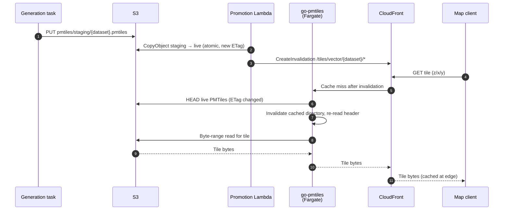

# 05 — Vector Tiles

Vector tiles are served from PMTiles archives in S3 via byte-range reads. This is the simplest and lowest-maintenance component in the platform.

> **Prior iteration.** An earlier version of the platform served vector tiles with **Martin** (a Rust tile server) reading from PostgreSQL/PostGIS. That meant an always-on database in the read path, and Martin's PMTiles support did not re-read the file on update (a restart was needed when tiles changed). Both problems were solved by switching to **go-pmtiles** reading directly from S3: no database, automatic ETag-based refresh on atomic swap, and a much smaller operational footprint. The vector-tile path's URL contract (`/tiles/vector/...`) is unchanged from the Martin era; only the implementation behind it moved.

## Format

**PMTiles** is a single-file archive of Mapbox Vector Tiles. The file contains:
- A header with metadata (tile format, extent, minzoom/maxzoom, bounds).
- A directory that maps tile coordinates `(z, x, y)` to byte ranges within the file.
- The MVT tile bytes themselves, gzipped.

A consumer reads a small range at the file head to fetch the directory, then issues a range read for each tile. With CDN caching, most tile requests are satisfied at the edge after the first hit.

## Serving model

A small HTTP service (an off-the-shelf PMTiles server such as **go-pmtiles**, running as a **Fargate service**) reads PMTiles archives from S3 and serves three concerns:

| Endpoint | Purpose |
|---|---|
| `/tiles/vector/{dataset}/{z}/{x}/{y}.mvt` | Serve a single MVT tile |
| `/tiles/vector/{dataset}/tile.json` | TileJSON metadata for the dataset |
| `/tiles/vector/{dataset}` (or similar) | Health and capability information |

The service maintains a small in-memory cache of PMTiles directories (one per dataset) so it does not re-fetch the directory on every tile request. When the underlying S3 object's ETag changes, the cache entry is invalidated and the directory is re-read. This makes the atomic-swap pattern (see below) work without operator intervention.

The service does not implement authorisation logic. The Lambda authoriser in front of the platform decides whether the request is allowed before the tile server sees it; the ALB routes the request to the go-pmtiles target group only if API Gateway forwards it.

## Atomic update via S3 CopyObject

Tiles for a dataset are stored at `pmtiles/{dataset}.pmtiles`. When a new version is generated, it is written to `pmtiles/staging/{dataset}.pmtiles`. The promotion Lambda issues an **S3 `CopyObject`** from staging to live:

```
pmtiles/staging/{dataset}.pmtiles  →  pmtiles/{dataset}.pmtiles
```

S3 `CopyObject` within a bucket is atomic from the consumer's perspective. The object's URL either serves the previous file or the new file — never a partial mix — and the change is reflected in the object's ETag.

The go-pmtiles server observes the new ETag on its next access, invalidates its directory cache for that dataset, and serves the new tiles. No restart or deployment is needed.

A **CloudFront invalidation** for `/tiles/vector/{dataset}/*` is issued by the promotion Lambda as part of the same step, evicting pre-swap tiles cached at the edge.



> *In plain terms:* the swap is the moment of truth — the file is exchanged atomically, the edge cache is invalidated, and the tile server picks up the new ETag on its very next read. There is no restart, no deployment, and no half-served version.

## Draft tiles for reviewed editing

When a dataset has the reviewed-editing flag set, the generation task additionally produces two smaller PMTiles per edit session:

| File | Content |
|---|---|
| `drafts/{dataset}/{session}/delta.pmtiles` | Only the edited features, annotated with edit-operation and validation-status tags |
| `drafts/{dataset}/{session}/diff.pmtiles` | Geometric differences between session and live data, annotated with diff-type tags |

These are served by the same go-pmtiles service, behind a path of the shape `/tiles/vector/drafts/{dataset}/{session}/{type}/{z}/{x}/{y}.mvt`. Reviewers in a map client can render them as overlay layers showing what is changing.

The draft tiles do not replace or affect the live tiles; they are isolated to the session's S3 prefix and only exist for the lifetime of the session (cleaned up by the **S3 Lifecycle rule** on the `drafts/` prefix 90 days after creation regardless of outcome — see [04 Data Layout](04_DATA_LAYOUT.md) for the distinction between this content-file retention and the DynamoDB session-record TTL).

## Generation

Vector tiles are produced by the generation task in the editing pipeline (see [11 Editing Pipeline](11_EDITING_PIPELINE.md)). The pipeline is:

```
GeoParquet (source/) → FlatGeobuf intermediate → Tippecanoe → PMTiles → staging
```

**FlatGeobuf** is used as an intermediate because Tippecanoe ingests it efficiently (3–5× smaller than GeoJSON; parallel reads).

**Tippecanoe** is the production-quality tile generator. It applies geometry-aware simplification, feature dropping at low zoom levels, layer organisation, and attribute encoding. The parameters used vary by geometry type:

| Geometry | Strategy |
|---|---|
| Points | Cluster-aware (`-r1 --cluster-distance=1`), no dropping |
| Lines | Simplification with `--simplification=15` |
| Polygons | `--simplification=30 --detect-shared-borders` to preserve adjacency |

Two modes:

- **Full generation** — for `replace` operations or first-time generation. Reads all partitions, builds the entire PMTiles archive.
- **Incremental generation** — for `add`, `update`, `patch`, and `delete` operations. Reads only the affected partitions, builds a small PMTiles, and `tile-join`s it into the current live archive. Faster for large datasets with small edits.

## Limits

The vector tile path has clear limits, all inherent to the format:

- **No live filter.** Tiles are byte-served; the server cannot evaluate per-row filters at request time. Row-level security therefore cannot be applied at the tile level; granting a user a dataset means granting them all the tiles for that dataset.
- **Update granularity is the dataset.** PMTiles is one file per dataset; per-feature partial updates require a regeneration of at least the affected partitions and a tile-join.
- **No server-side styling.** Styling is the client's responsibility (with the MapLibre/Mapbox style spec being the common contract).

These limits are acceptable for the platform's use cases. Tiles cover broad-visibility data (where withholding individual features would be confusing anyway); feature-level filtering is offered by the OGC Features API and the query layer instead.

## What this serves well

- Datasets up to tens of millions of features (PMTiles handles the size; Tippecanoe handles the generation).
- Web maps where the audience and content per layer are aligned (granted-or-not, no per-row filtering).
- Desktop GIS users via WMTS (the WMTS proxy redirects to vector or raster tile servers as appropriate).
- ArcGIS users via the Esri vector-tile-service adapter (a thin translation of MVT into Esri's expected JSON metadata; see [08 Raster Services](08_RASTER_SERVICES.md) for the adapter's location).
