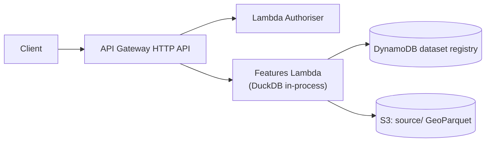
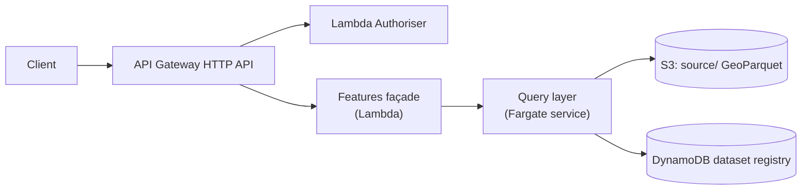

# 06 — OGC API Features

The OGC API Features endpoint is the standards-compliant way to access vector data as discrete features rather than as pre-rendered tiles. It is the canonical interface for desktop GIS users (QGIS, ArcGIS) and for any consumer that wants feature attributes and exact geometry rather than a tile.

## What it offers

The OGC API Features specification defines a small, focused contract. The platform implements its core conformance classes:

| Endpoint | Purpose |
|---|---|
| `GET /features/v1` | Landing page with links to conformance, collections, etc. |
| `GET /features/v1/conformance` | Declared conformance classes |
| `GET /features/v1/collections` | List of feature collections the caller may access |
| `GET /features/v1/collections/{id}` | Single collection description (extent, CRS, links) |
| `GET /features/v1/collections/{id}/items` | Query features with bbox, attribute filters, pagination |
| `GET /features/v1/collections/{id}/items/{feature_id}` | Retrieve a single feature by identifier |

Responses are returned as GeoJSON by default; some implementations additionally support HTML for browser-friendly inspection and other formats (CSV, Parquet) by content negotiation.

## Two valid implementation shapes

The OGC Features API can be built in two ways. Pick based on whether the deployment also needs the rich query layer.

### A. Standalone — Lambda over GeoParquet on S3

When the only requirement is OGC compliance for feature access, the simplest implementation is a small **AWS Lambda function** that reads GeoParquet directly from S3 using **DuckDB** with the `httpfs` and `spatial` extensions. The Lambda runs behind the ALB (or directly attached to an API Gateway integration); cold-start latency is sub-second and warm-request latency is dominated by the S3 read.

This implementation is small enough to fit comfortably in a single Lambda. The whole flow is:

1. Receive the request; parse path and query parameters.
2. Read the user's accessible datasets from the permission headers.
3. Look up the collection in the dataset registry; reject with 404 if not present or not accessible.
4. Build a query against the appropriate `source/{dataset}/z=*/x=*/y=*/data.parquet` glob using the partition predicate derived from the bounding box.
5. Apply row-level security filters from the permission context.
6. Execute the query with `DISTINCT ON (id)` for deduplication.
7. Format the result as GeoJSON and return.

The handler is the only custom code. The analytical engine, the data format, and the object store handle the heavy lifting.

**When to choose this shape:**
- The deployment does not need spatial operations beyond bbox/attribute filtering and single-feature retrieval.
- Lambda cold-start latency is acceptable (typically a fraction of a second once DuckDB and its extensions are loaded; warm requests can reuse the loaded DuckDB instance *opportunistically* — Lambda execution environments are reused for warm invocations but the lifetime is not guaranteed, so the cache benefit is a bonus rather than a contract).
- Operational simplicity is valued over query richness.

> **Prior iteration.** This *was* in fact the platform's original OGC Features implementation: a Fargate service running DuckDB and serving feature queries directly. When the GraphQL query layer was introduced, the Fargate service was refactored into a thin Lambda façade calling GraphQL (shape B below) so the spatial engine wasn't duplicated. The lesson: if a deployment doesn't need the query layer, the standalone Lambda shape is the right starting point — the Fargate-with-DuckDB shape was over-engineered for OGC-only use cases. Lambda has caught up: DuckDB initialises fast enough on warm Lambda containers to make Fargate's persistent-cache advantage marginal for OGC queries.

### B. Façade over the query layer

When the deployment includes the query layer (see [07 Query Layer](07_QUERY_LAYER.md)) — to support spatial operations, routing, joins, validation, and cross-dataset workflows — the OGC Features API can be a thin **Lambda façade** that translates standards-compliant HTTP requests into GraphQL calls to the query layer (a Fargate service) and translates responses back.

The façade is responsible for:
- Parsing OGC parameters (bbox, datetime, filter, limit, offset).
- Mapping them to query-layer operations.
- Formatting responses as GeoJSON, HTML, etc.
- Honouring OGC conformance class requirements (pagination links, CRS handling).

The query layer handles the actual data access. This avoids duplicating the spatial-query engine in two places, and means improvements to the query layer (e.g. better predicate handling) automatically improve the OGC API.

**When to choose this shape:**
- The query layer already exists for other reasons.
- Future OGC extensions (CQL2 filtering, complex queries) would benefit from a unified engine.

### Choosing between the two

If unsure, start with shape A. It is genuinely simple: a function handler, a JSON schema from the dataset registry, and a GeoParquet read. Add the query layer (shape B) when a real requirement for richer queries emerges; the OGC façade is then a routine refactor.

## Query semantics

Regardless of implementation shape, the OGC API surface supports the same query semantics:

| Parameter | Meaning |
|---|---|
| `bbox` | `minx,miny,maxx,maxy` (in CRS84 by default). Filters to features intersecting the bbox. |
| `bbox-crs` | CRS for the bbox parameter (optional). |
| `crs` | Output CRS for geometries (optional). |
| `datetime` | RFC 3339 datetime or interval, for temporal filtering on a designated time column. |
| `filter` | CQL2-Text or CQL2-JSON filter expression (optional, conformance-class-dependent). |
| `limit` | Maximum items in response. |
| `offset` (or `cursor`) | Pagination control. |

**Bbox queries use partition pushdown.** A request with a bbox is converted to the set of tile coordinates at the dataset's partition zoom that intersect the bbox. Only the GeoParquet files in those partitions are read. Predicate pushdown inside Parquet further reduces row-group reads.

> *In plain terms:* a bbox query never opens files outside the area the user asked about, and inside each file it skips chunks whose stored min/max values fall outside the bbox. Two layers of skipping compound, which is what makes feature queries fast against millions of rows without a running database.

**Single-feature retrieval is a point lookup.** The platform's deduplication strategy means every dataset has a designated `id_column`. The endpoint `GET /collections/{id}/items/{feature_id}` queries `WHERE {id_column} = {feature_id}` with `LIMIT 1`. The query touches whatever partitions hold the feature; for datasets with millions of features, this completes in milliseconds with proper Parquet statistics.

**Pagination uses cursor semantics under the hood.** Limit/offset is supported for compatibility, but offset-based pagination on large datasets is expensive. Implementations should prefer cursor-based pagination (using the last seen `id` as the cursor) for deep paging.

## Row-level security

The OGC Features API enforces row-level security as specified in [03 Authorisation](03_AUTHORISATION.md). The authoriser's permission context includes:

- `X-Auth-User-Datasets` — datasets the user may access. Collections outside this list return 404 (not 403, to avoid leaking existence).
- `X-Auth-User-Claims` — JSON-encoded effective claims used to evaluate RLS filters.

For each query, the handler:
1. Fetches the dataset's RLS configuration from the registry.
2. Translates RLS rules into WHERE-clause additions using the user's claim values.
3. Appends them to the query.

Roles `platform_admin` and `data_manager` bypass RLS — they always see all rows.

## Write operations

The OGC API Features specification includes a transactions extension. The platform's editing model differs deliberately:

- **Single-feature writes** (`POST`, `PUT`, `PATCH`, `DELETE` on `items`) are accepted by the editing API rather than the read API. The endpoints exist for OGC-conformance reasons but they translate into editing-API operations.
- **Bulk writes** go through the editing pipeline via presigned uploads, as described in [11 Editing Pipeline](11_EDITING_PIPELINE.md).
- **Reviewed datasets** (those with `review_required=true` in the registry) cannot be edited directly through the OGC transactions API; the editing-session flow must be used.

Some deployments may choose to omit the transactions class from the OGC API's declared conformance entirely, presenting a read-only OGC surface and routing all writes through the editing pipeline. This is the simpler and recommended stance.

> *Why this was built rather than adopted.* At the time of this design, no standards-compliant OGC stack offered GeoJSON feature editing over object-store-backed providers with validation, review gates, and audit history. [pygeoapi](https://pygeoapi.io/) is the closest peer for an OGC API server, and its read-side support is mature, but its transactions extension implementation did not cover object-store-resident providers (only PostgreSQL). The platform's editing pipeline ([11 Editing Pipeline](11_EDITING_PIPELINE.md)) fills that gap rather than duplicating what the read-side OGC servers do well.

## Conformance classes

A minimal deployment declares conformance to:

- Core
- OAS30
- HTML
- GeoJSON

A deployment with the query-layer façade additionally declares:

- CQL2 filtering (Text and JSON)
- Sortby

A deployment that exposes single-feature writes additionally declares:

- Create/Replace/Delete (but consider omitting this for reviewed datasets)

The exact conformance URIs are listed at `/conformance`. Clients (QGIS, ArcGIS, browser libraries) discover capabilities from this endpoint and adapt.

## Limits

- The platform does not support transactions across multiple collections.
- Complex CQL2 filters that exceed DuckDB's expressive range are rejected rather than silently truncated.
- The query layer (when used as backend) has its own request-time limit; the OGC API surface inherits it.
- Large response sizes are bounded by a configurable maximum (typically 10,000 features per page).
