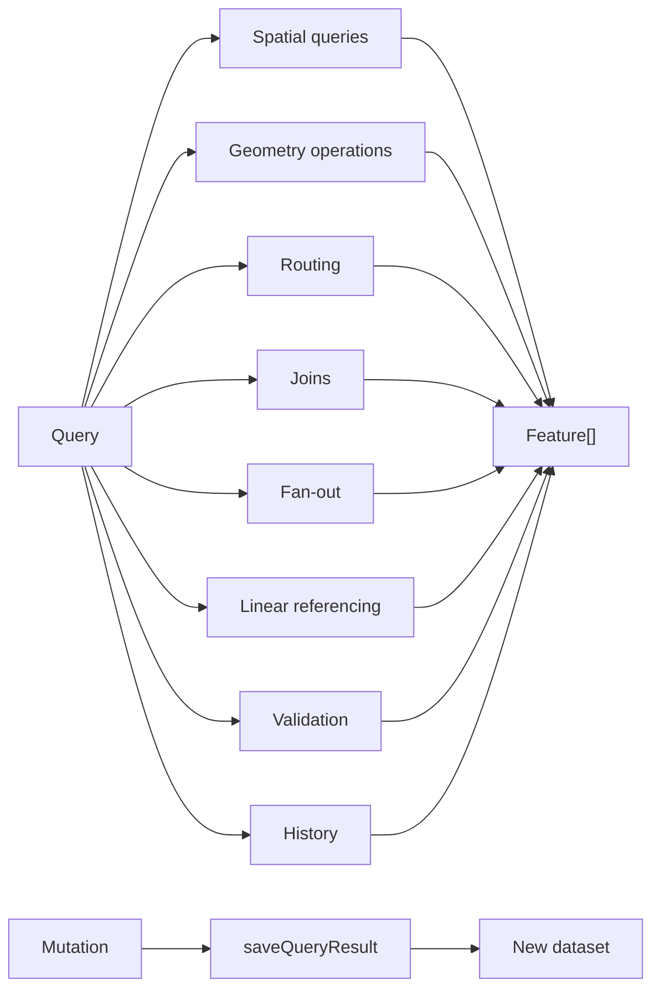

# 07 — Query Layer

The query layer is an optional component that offers a rich, composable interface for spatial operations, network routing, and cross-dataset queries. It is the difference between "an OGC-compliant feature server" and "a platform you can build interactive spatial workflows on."

This document specifies the query layer's capabilities, design, and contract. If a deployment does not need these capabilities, the query layer can be omitted; the OGC Features API (see [06](06_OGC_FEATURES_API.md)) can run standalone over GeoParquet without it.

## Why GraphQL

The query layer uses **GraphQL** as its interface. The reasoning:

- **Typed schema for spatial operations.** Operations such as buffer, intersect, union, dissolve, isochrone, route, snap-to-road have natural representations as typed fields with typed inputs.
- **Client-shaped responses.** Clients ask for exactly the fields they need. A map client requesting features for rendering does not need to receive every attribute; it asks for geometry, id, and the few attributes its style depends on.
- **Composability.** Operations return the same `Feature` type, so the result of one operation can be the input to another. Compute an isochrone, then filter another dataset to that geometry, then save the result — all in one query.
- **One endpoint, many capabilities.** A single `/graphql` URL replaces what would be a dozen REST endpoints in an alternative design.
- **Discovery.** The schema is introspectable; clients (and humans, via GraphiQL) can browse capabilities.

The trade-off is that GraphQL is not an OGC standard. The query layer is therefore intentionally an *internal* interface, separate from the standards-compliant OGC surface. Consumers who require OGC compliance use the OGC Features API; consumers who can use the richer interface use the query layer.

## Capability domains

The query layer organises its capabilities into eight domains:



| Domain | Examples |
|---|---|
| Spatial queries | Bounding box, radius, point-in-polygon, geometry filter (inline GeoJSON or another dataset) |
| Geometry operations | Buffer, union, intersection, difference, dissolve, simplify, centroid, convex hull, explode |
| Routing | Route, isochrone, map-match, snap-to-road (delegated to the routing engine) |
| Joins | Spatial join (intersects, within, contains), attribute join |
| Fan-out | Apply an operation across multiple datasets, returning combined results |
| Linear referencing | Measure, slice, project along line geometries |
| Validation | Check a candidate feature set against schema and geometry rules |
| History | Time-travel queries against the SCD2 row history |

Every operation returns a `Feature` (or list of features). This is the basis of composability.

## The unified Feature type

A single `Feature` type is the universal return type:

```
type Feature {
  id: ID
  geometry: GeoJSON
  properties: JSON
  sourceDataset: String
  ...
}
```

A feature produced by a spatial query, a geometry operation, or a routing call is structurally the same type. The map client renders any of them with the same code path. A subsequent query can take a list of features as input.

## Unified input modes

Every operation accepts inputs through one of three modes, via a shared input resolver:

| Mode | Use case |
|---|---|
| **Point** | A single `(lon, lat)` for operations that act on a location (e.g. isochrone origin) |
| **Dataset + bbox** | All features in a dataset intersecting a bbox |
| **Dataset + feature_ids** | A specific set of features from a dataset |

A spatial operation does not need to know how the user expressed the input set — the resolver handles it. This standardisation is the difference between "many operations" and "many operations that compose."

## Saving results

The query layer offers a mutation that persists a query result as a new dataset:

```
mutation saveQueryResult(
  result: [Feature!]!,
  name: String!,
  metadata: JSON
): SavedDataset
```

The mutation in its hardened form would:
1. Require an `editor` (or `data_manager`) role check.
2. Write the result through a short-lived edit session so the editing pipeline's validation, generation, and review gates apply.
3. Register the dataset in the registry on promotion.
4. Make the new dataset available via vector tiles, OGC Features, and the query layer once the pipeline completes.

**What the prototype actually does today.** The resolver writes the result directly to a separate `derived/{name}/data.parquet` prefix (not `source/`), registers the dataset with `data_type=derived` and lineage pointing at the source query, and emits a `dataset_derived` event. It does **not** route the write through the editing pipeline — no Step Functions execution, no PMTiles generation, no review gate — and it does not enforce a role check at the schema or resolver layer. The dataset becomes queryable as derived GeoParquet but is not tile-rendered until a separate `regenerate` job is triggered manually.

This gap is on the list of things to harden before a production build: route saves through the editing pipeline (so the same validation/review/promotion path applies), enforce the role check on the resolver, and write to `source/` only via promotion. The current behaviour is a prototype hook, not a finished surface.

The intent of the primitive — turn the platform from "data hosting" into "spatial computing", letting a user compute an isochrone, intersect it with property boundaries, and save the result as a layer their team can render — is unchanged. The seam is the thing that needs more work.

## Context variables and view definitions

Two patterns help clients build interactive workflows:

**Context variables.** A client can declare named values (a date, a boundary, a chosen feature) once per session and reference them across multiple queries. The query layer resolves them transparently.

**View definitions.** A named, parameterised query template can be saved on the server and invoked by name with parameters. This lets administrators provide pre-built queries that match common workflows ("show me parcels within 200m of any waterway in this council").

Neither of these is required for basic operation; they are conveniences for client developers building interactive applications.

## Engine choice: DuckDB spatial

The recommended substrate for the spatial side of the query layer is **DuckDB** with the spatial extension. The rationale:

- **Reads GeoParquet from object storage with predicate pushdown.** Partition keys (z/x/y) are filtered on path; row-group statistics filter further.
- **Spatial operations are native.** Buffer, intersect, union, dissolve, simplify, centroid, convex hull are SQL functions provided by the spatial extension.
- **In-process.** No separate database server. The query layer is a stateless service that loads DuckDB in-process.
- **Connection durability.** A long-lived DuckDB connection retains the Parquet metadata cache (file layouts, row group boundaries, column statistics) across requests, so the second query against the same dataset skips the S3 metadata round trips. This is a meaningful performance gain.

> *In plain terms:* the first query teaches DuckDB the shape of every Parquet file it touches; every subsequent query against that dataset can reuse that knowledge through DuckDB's own object-store cache layer. Lambda can keep its execution environment around between invocations opportunistically — sometimes the second request reuses the first's cache, sometimes it does not — but Fargate makes that reuse deliberate and long-lived.
- **Standards interoperability.** GeoParquet is consumable by every modern data tool; the platform is not painting itself into a vendor corner.

The query layer is designed to keep a warm DuckDB instance per container, with connection pooling per worker, extensions loaded once at startup, and periodic credential refresh for object storage access.

## Routing integration

Network routing operations (route, isochrone, map-match, snap-to-road) require a road graph, which is outside DuckDB's scope. The query layer delegates these operations over HTTP to a dedicated routing engine (see [09 Routing](09_ROUTING.md)). Results are returned as `Feature`s, so they compose with spatial operations transparently.

This means a client can express:

> *Compute a 15-minute drive-time isochrone from this address; intersect it with the property boundaries dataset; return features with a `taxable_value` column for rendering.*

…as a single GraphQL query, even though the work touches the routing engine and the spatial engine separately.

## Compute model

The query layer runs as a **Fargate service**, not as Lambda. Fargate is chosen because:

- **A warm DuckDB Parquet metadata cache amortises across many requests on Fargate.** Lambda can reuse execution environments opportunistically, so a hot Lambda gets some cache reuse too, but the lifetime is unpredictable and per-environment; Fargate gives deliberate, long-lived process warmth and controllable memory/cache lifetime. In the prototype the GraphQL service opens a fresh `:memory:` DuckDB connection per request and relies on DuckDB's own object-store cache layer for cross-request hits — a Fargate-resident process is the only place that cache can persist usefully.
- **The DuckDB spatial extension has a non-trivial load cost.** A long-lived Fargate task loads the extension once at startup; a Lambda would reload on every cold start, and a process restart on Fargate is still expensive but uncommon.
- **Interactive map traffic benefits from sustained warmth.** Idle cost is configurable via Fargate Service Auto Scaling: `off` mode runs zero tasks (cheapest, 503-until-woken), `minimal` keeps one warm task at a few dollars per month, `performance` pre-warms several.

**First-request behaviour when desired=0.** There is **no wake-up Lambda, no scheduled warmer, no ALB-request-count scaler in the prototype.** A request arriving against a desired-count-0 service hits the ALB target group with no healthy targets and **returns HTTP 503** until target-tracking auto-scaling reacts to CPU/queue metrics, spins up the first task, image-pulls, and passes health checks — typically 60–120 seconds in measured runs. Clients must therefore expect: 503 on the first request after a quiet period, with retry-after behaviour required client-side. A hardened deployment should either (a) keep `minimal` (one warm task) as the default for any service serving interactive map traffic, or (b) add a small Lambda scaler triggered by the ALB 5xx alarm that sets `desiredCount` to 1 and then drops back to 0 after the scale-in cooldown. Neither (a) the explicit acceptance of 503-on-first nor (b) the Lambda scaler is present in the prototype — the off-mode design intent was always "manually woken before use", and that is the contract today.

> **Why the OGC Features API has a different compute choice.** The OGC Features API (Lambda) and the query layer (Fargate) make opposite calls about the persistent-cache trade-off. The Features API serves simple, well-bounded queries (bbox + filter + limit) where the warmth advantage is small; Lambda's pay-per-invocation cost shape and zero idle cost win. The query layer serves multi-step composable workflows where the persistent cache amortises across many requests; Fargate's always-on cost is repaid by the cache hit rate.

> *In plain terms:* if a single query does little work, Lambda's cheap-but-cold model wins; if a session does a lot of work and benefits from remembering things, Fargate's keep-it-warm model wins.

## What the query layer is not for

- **Analytical queries by end users.** The platform does not expose ad-hoc SQL or BI-style queries to clients. Operations are scoped to spatial operations on registered datasets.
- **Large-scale joins or aggregations.** DuckDB handles moderate joins well; for datasets with hundreds of millions of rows joined to other large datasets, an analytical warehouse is the right tool.
- **Cross-database federation.** The query layer reads what the platform owns; it does not proxy external services.
- **Long-running computations.** A single query is expected to complete within tens of seconds, ideally less. Long workflows belong in the editing pipeline (which has a workflow engine and minute-to-hour timelines), not in the query layer.

## Operational caveats

- **Per-request batch limits.** Operations that fan out across many features (e.g. compute 100 isochrones at once) are bounded by a configurable batch limit (typically 50) to prevent runaway routing engine load.
- **Per-query timeout.** Each query has a server-side timeout (typically 30 seconds for spatial work, 60 seconds when routing is involved).
- **Memory bound.** DuckDB respects a memory limit configured at startup. Queries that exceed it fail with an out-of-memory error rather than swap.

## Optionality

The query layer is **optional**. A deployment focused on standards compliance, OGC interoperability, or simple feature serving can omit it entirely. The OGC Features API works without it. Vector tiles work without it. Raster services work without it. The editing pipeline works without it (validation uses DuckDB directly inside the validation task).

The decision to include or exclude the query layer is driven by user demand:

- *Will users build interactive spatial workflows on top of the platform?* Include it.
- *Will users only consume data via OGC standards from desktop GIS or pre-built web maps?* Exclude it for now; add later if needed.

Adding the query layer later is non-disruptive: it is a new service behind a new path on the load balancer. Removing it is equally non-disruptive: the OGC Features API can be reshaped from "façade over query layer" to "standalone over GeoParquet" in a single refactor.
