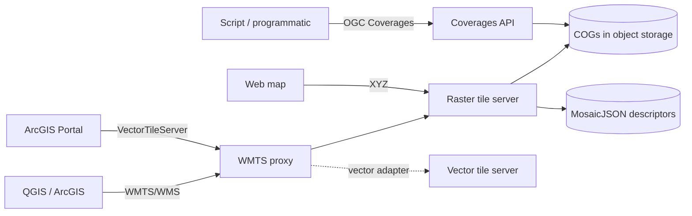
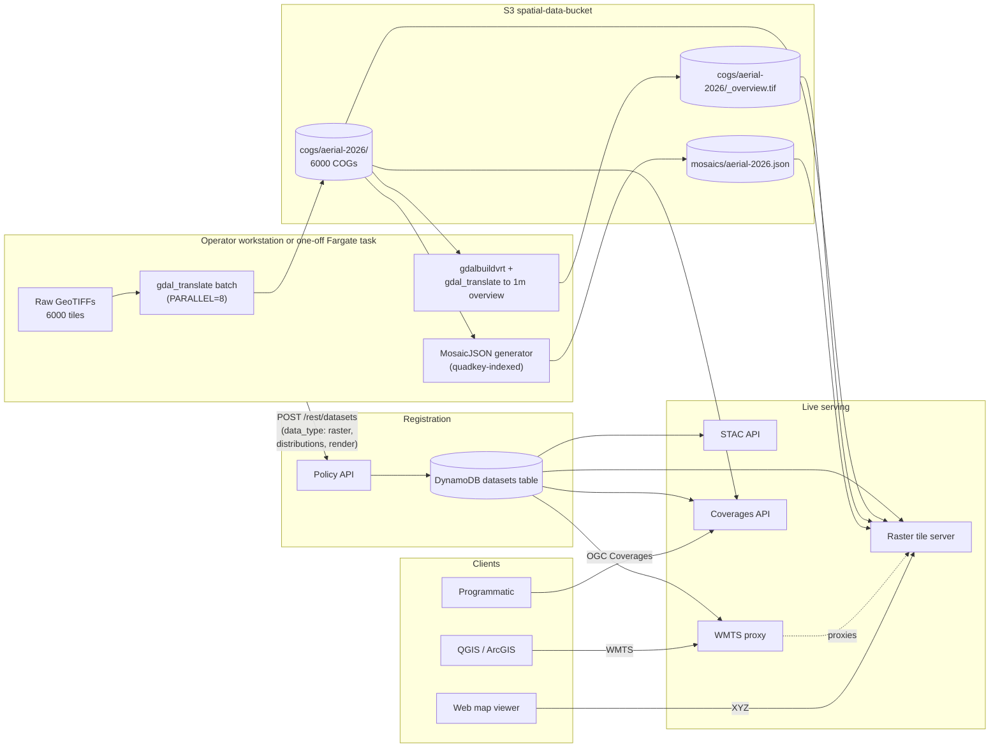
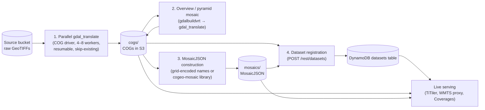

# 08 — Raster Services

Raster handling covers four related concerns: serving dynamic raster tiles, supporting OGC WMTS/WMS for desktop GIS, providing an OGC Coverages API for programmatic raster access, and offering an ArcGIS-compatible adapter. All four read from Cloud-Optimized GeoTIFFs and MosaicJSON descriptors in object storage.

## Format choices

**Cloud-Optimized GeoTIFF (COG).** A GeoTIFF organised so it can be read efficiently over HTTP range requests:
- Internally tiled (typical block size 256×256 or 512×512).
- Includes overviews (downsampled versions of the data) for fast access at lower zoom levels.
- Header contains the byte offsets of every tile and overview.

A COG-aware client (GDAL is the reference implementation; rasterio is the Python binding) reads only the tiles needed for a given output, never the whole file.

**MosaicJSON.** A descriptor that references many COG URLs and describes their spatial arrangement. A raster tile server that supports MosaicJSON can serve tiles from a virtual mosaic of dozens or hundreds of COGs.

## Raster tile server

A dynamic raster tile server reads COGs and MosaicJSON from S3 and renders tiles on demand. The reference substrate is **TiTiler** (Development Seed), an open-source FastAPI service built on rasterio and GDAL, deployed as a **Fargate service**. GDAL's VSIS3 driver provides the S3 byte-range read access; only the COG header, requested tile, and relevant overview levels are read for each tile request.

Capabilities:

| Endpoint class | Purpose |
|---|---|
| COG endpoints | Serve tiles, info, statistics, and previews for a single COG by URL |
| MosaicJSON endpoints | Serve tiles for a mosaic of COGs |
| STAC endpoints | Serve tiles for items from a STAC API (optional) |
| Healthz | Health check |

Tile parameters supported: tile matrix set (WebMercator by default), zoom/x/y, output format (PNG/WebP/JPEG), band selection, rescaling, colour maps, hillshade, expressions (band math), and resampling method.

The service is CPU-intensive (GDAL processing) and benefits from a few GB of memory per task for caching. It runs as a Fargate service with **ECS Service Auto Scaling** driven by CPU utilisation.

## WMTS/WMS proxy

OGC WMTS 1.0.0 and WMS 1.3.0 are the lingua franca for desktop GIS interoperability. Neither QGIS nor ArcGIS speak XYZ tiles natively; both speak WMTS and WMS.

A lightweight Fargate service translates WMTS/WMS requests into raster tile server requests. The proxy generates the WMTS GetCapabilities XML dynamically from the DynamoDB dataset registry — there is no static configuration file to maintain per dataset.

Capabilities:

| Endpoint | Purpose |
|---|---|
| `GET /wmts?service=WMTS&request=GetCapabilities` | Layered capabilities XML describing all available layers, tile matrix sets, dimensions |
| `GET /wmts/.../tile/...` | GetTile — translates to raster tile server request |
| `GET /wms?service=WMS&request=GetCapabilities` | WMS capabilities XML |
| `GET /wms?...&request=GetMap` | GetMap — translates to raster tile server request |

The proxy supports the **TIME dimension** for date-keyed mosaics. A layer's GetCapabilities lists available times (derived from MosaicJSON filenames in object storage); a GetTile request with a `TIME` parameter is redirected to the appropriate MosaicJSON.

The proxy does not implement full WMS: GetFeatureInfo and SLD styling are not supported. The use case is "render this raster at this zoom/extent" for desktop GIS, not the full WMS feature surface.

## ArcGIS-compatible vector tile adapter

ArcGIS Enterprise Portal consumes vector tiles via Esri's **VectorTileServer** REST interface — not via standard MVT TileJSON. The platform offers an adapter under the WMTS proxy service that exposes vector tile datasets as VectorTileServer endpoints.

Capabilities:

| Endpoint | Purpose |
|---|---|
| `GET /esri/vectortiles/catalog` | List available vector tile sources |
| `GET /esri/vectortiles/{source}/VectorTileServer` | Root metadata |
| `GET /esri/vectortiles/{source}/VectorTileServer/resources/styles` | Mapbox GL v8 style document |
| `GET /esri/vectortiles/{source}/VectorTileServer/tile/{z}/{y}/{x}.pbf` | Tile proxy |

This lets an ArcGIS Enterprise administrator add the platform's vector layers via Content → New Item → URL, with the VectorTileServer URL.

The adapter is a thin translation; it does not own data and does not implement Esri-specific styling beyond what Mapbox GL can express.

## OGC API Coverages

OGC API Coverages provides programmatic access to raster *data* rather than rendered images. A user can fetch a coverage as a subset of a COG with band selection and bbox.

Capabilities:

| Endpoint | Purpose |
|---|---|
| `GET /coverages/v1/collections` | List coverage collections |
| `GET /coverages/v1/collections/{id}/coverage/domainset` | Spatial extent and CRS |
| `GET /coverages/v1/collections/{id}/coverage/rangetype` | Band information |
| `GET /coverages/v1/collections/{id}/coverage` | Fetch coverage (subset by bbox, band) |
| `GET /coverages/v1/collections/{id}/point` | Sample a single pixel value |

The Coverages API reads COGs directly via GDAL. It does not pre-render; subsets are computed on demand. Output formats include GeoTIFF, NetCDF, and JSON for point queries.

## How they fit together



The raster tile server and the vector tile server are independent. The WMTS proxy is the unifying layer for desktop GIS; the Coverages API is the unifying layer for programmatic raster access.

## Ingest — batch processing tooling

COGs and MosaicJSON descriptors are produced outside the request path. Imagery typically arrives as raw GeoTIFFs (often thousands of tiles for a statewide aerial dataset) and must be converted, optimised, and indexed before it can be served. The platform expects this pre-processing to be handled by **batch scripts** run from an operator workstation or a one-off EC2 / Fargate task. Four tools cover the common needs.

### 1. Parallel GeoTIFF → COG conversion

A shell-driven batch over `gdal_translate` with the COG driver, parallelised across multiple workers (typically 4–8). Key features:

- **Resume from offset.** The conversion of a 6,000-tile statewide dataset takes hours; the script supports resuming from a specified index so an interrupted run continues rather than restarts.
- **`SKIP_EXISTING` semantics.** A re-run does not reconvert tiles already present at the destination, making the script idempotent.
- **Configurable parallelism.** `PARALLEL=8` for high-CPU workstations; `PARALLEL=4` is the default.
- **GDAL flags.** COG driver with appropriate compression (LZW or DEFLATE for visual imagery, LERC for scientific), block size 512×512, internal overviews via `OVERVIEW_RESAMPLING=average` or `bilinear`, and the appropriate `BIGTIFF=IF_SAFER` for large outputs.
- **S3 upload.** Each output is uploaded to the `cogs/` prefix as soon as it is built (so a partial run still produces usable COGs).

A single-file mode (`--single <filename>`) is provided for one-off reprocessing and validation.

### 2. Overview / pyramid mosaic

For datasets with thousands of small COGs, low-zoom tile rendering would otherwise require querying many COGs per tile. A **reduced-resolution overview mosaic** is built once and serves the low zoom levels:

1. `gdalbuildvrt` constructs a virtual mosaic across all source COGs.
2. `gdal_translate` materialises a reduced-resolution (typically 1 m where sources are 10 cm) COG of the full extent.
3. Optional alpha band for transparency at the dataset boundary.
4. Uploaded to the same `cogs/` prefix and referenced by the dataset's MosaicJSON for low-zoom serving.

The WMTS proxy and raster tile server fall back to the overview at zooms where querying the full mosaic would be impractical.

### 3. MosaicJSON construction

Two approaches depending on the source data shape:

- **Grid-encoded filenames** (e.g. Victorian aerial imagery named `eNNNnNNNN_…`): a shell script parses the grid reference from each S3 key, computes EPSG:7855 (or appropriate projected CRS) bounds, and writes a quadkey-indexed MosaicJSON. No GDAL required for this path.
- **Date-grouped imagery** (e.g. Sentinel-2 acquisitions): a Python script groups COGs by acquisition date and produces one MosaicJSON per date under `mosaics/{dataset}-{date}.json`. The WMTS proxy uses these for the TIME dimension.

For high-density COG grids, the **`cogeo-mosaic` library** is used to build proper quadkey-indexed mosaics from a Python script. This is appropriate when the source layout is irregular or when MosaicJSON construction needs to read each COG's geometry (rather than infer from filename).

### 4. Dataset registration

After COGs and the MosaicJSON are in S3, the dataset is registered in DynamoDB via the Policy API:

- Data type: `raster`
- Distributions: URLs to the MosaicJSON (or individual COGs)
- Default rendering parameters: band order, rescaling range, default colour map, hillshade flag
- Optional time-dimension metadata (list of dates available for TIME-aware WMTS)

The dataset-sync Lambda also surfaces newly-uploaded `cogs/` entries with `needs_review: true`, so an operator can register them via the admin UI rather than via the API directly.

### Operational notes

- These scripts run **outside** the live request path. They typically execute on an operator workstation with AWS credentials, or as a one-off Fargate task launched manually.
- The COG conversion is the longest single step (hours for a statewide aerial dataset); the rest take minutes.
- A full refresh of a time-dimension dataset (e.g. adding a new acquisition date) runs the COG conversion for the new tiles, builds the new MosaicJSON, and uploads both. No service restart is required; the WMTS proxy and raster tile server pick up the new MosaicJSON on the next request.

The platform does not include a fully-automated COG ingestion pipeline because the inputs are heterogeneous (different source formats, different filename conventions, different CRSs, different sensor types). The batch scripts are operator-facing tools that wrap GDAL with sensible defaults, not a service.

## Journey: aerial imagery from raw TIFs to a live, discoverable raster dataset

> *In plain terms:* a folder of 6,000 untiled GeoTIFFs becomes a single addressable dataset that QGIS, ArcGIS, and the web map viewer can all consume — without writing any code beyond the GDAL batch invocations.

A statewide aerial photography programme has just delivered a year's worth of imagery: 6,000 untiled, uncompressed GeoTIFFs, named by grid reference (e.g. `e310n5810_2026jan_air_vis_10cm_epsg7855.tif`), staged in an operator's source bucket.

1. **Set up the run.** The operator clones the batch scripts to a workstation (or launches a one-off Fargate task with the scripts and AWS credentials baked in). Environment variables select the source bucket, the destination `cogs/` prefix in the platform's S3 bucket, the compression profile (LZW for visual imagery), and the parallelism (`PARALLEL=8` on a 16-core workstation).

2. **Convert in parallel.** The `gdal_translate` batch script reads each TIF, applies the COG driver with internal tiling (512×512), builds internal overviews (typically 5 levels at 2× decimation, with `average` resampling), enables `BIGTIFF=IF_SAFER`, and uploads the resulting COG to `s3://spatial-data-bucket/cogs/aerial-2026/{grid_ref}.tif` immediately on completion. With `PARALLEL=8` and 6,000 source tiles, the run takes 6–10 hours; `SKIP_EXISTING=1` means an interrupted run resumes safely. Partial completion already produces usable COGs.

3. **Build the overview / pyramid mosaic.** Once the COGs are uploaded, a second script reduces them all to a single low-resolution overview for low-zoom serving. `gdalbuildvrt` constructs a virtual mosaic across all COGs in the `cogs/aerial-2026/` prefix; `gdal_translate` materialises that VRT to a single 1-metre-resolution COG (down from the source 10 cm) at `s3://spatial-data-bucket/cogs/aerial-2026/_overview.tif`. The overview is small (a few GB) and serves zooms 0–14 efficiently without querying the 6,000 full-resolution tiles.

4. **Construct the MosaicJSON.** A third script parses the grid references from the COG filenames in S3, computes EPSG:7855 (or the appropriate projected CRS) bounds per tile, builds a quadkey-indexed MosaicJSON, and writes it to `s3://spatial-data-bucket/mosaics/aerial-2026.json`. For a date-keyed time series (multiple acquisition dates per location), one MosaicJSON is written per date and the filenames follow `aerial-2026-{date}.json` so the WMTS proxy can surface them as a TIME dimension.

5. **Register the dataset in the catalogue.** The data manager calls the Policy API to register a new raster dataset:

   ```
   POST /rest/datasets
   {
     "dataset_id": "aerial-2026",
     "name": "Aerial Imagery — 2026 capture",
     "data_type": "raster",
     "active": true,
     "public": false,
     "metadata": {
       "description": "Statewide aerial photography, 10 cm resolution, captured January–March 2026.",
       "attribution": "State Government",
       "lineage": "Captured by [vendor], processed to COG using GDAL 3.8, MosaicJSON quadkey index."
     },
     "distributions": {
       "mosaic": "s3://spatial-data-bucket/mosaics/aerial-2026.json",
       "overview": "s3://spatial-data-bucket/cogs/aerial-2026/_overview.tif",
       "cogs_prefix": "s3://spatial-data-bucket/cogs/aerial-2026/"
     },
     "render": {
       "bands": [1, 2, 3],
       "rescale": "0,255",
       "default_colormap": null,
       "resampling": "bilinear"
     }
   }
   ```

   Optionally, the dataset is linked to a platform group so only authenticated users in that group can access it:

   ```
   POST /rest/auth/groups/internal-staff/datasets { "dataset_id": "aerial-2026" }
   ```

   For a public dataset, `public: true` suffices and no group link is needed.

6. **Verify discoverability.** The dataset appears in:
   - **STAC API** at `/stac/collections/aerial-2026` with the bbox, time range, and distribution links.
   - **WMTS GetCapabilities** as a layer with a TIME dimension (if multi-date).
   - **Raster tile server endpoints** for direct XYZ access (`/tiles/raster/aerial-2026/{z}/{x}/{y}.png`).
   - **OGC Coverages API** at `/coverages/v1/collections/aerial-2026/coverage` for programmatic access to the raster data.

   The dataset-sync Lambda will also have detected the new COGs in S3 on its next scheduled run, but because the data manager registered the dataset manually, the sync finds nothing new and the dataset is `active: true` from the start (not `needs_review: true`).

7. **Clients connect.** QGIS users add a WMTS connection pointing at the WMTS GetCapabilities URL with their API key in the `X-Api-Key` header; the new layer appears alongside existing ones. ArcGIS users add it via the same WMTS endpoint. The web map viewer references the TileJSON for the raster tile server endpoint. The first request after registration warms the raster tile server's GDAL cache; subsequent requests are fast.



**Time-series variant.** When the same area is captured monthly or annually, each capture date is processed independently and produces its own MosaicJSON: `aerial-2026-01.json`, `aerial-2026-02.json`, … The dataset registration is updated to list all the dates in `metadata.time_dimension.values`, and the WMTS proxy surfaces a TIME parameter. Clients pass `TIME=2026-01-15` (or equivalent) to fetch tiles from the appropriate mosaic.

**Re-running parts of the pipeline.** If a small number of source TIFs are re-delivered (e.g. corrections to a few tiles), the operator re-runs the COG conversion for those filenames only (`--single` mode), uploading replacements to `cogs/aerial-2026/`. The MosaicJSON does not need rebuilding because filenames are stable. The next request to a covered tile reads the replacement COG; no service restart is needed. If new tiles are added (extending coverage), the MosaicJSON is rebuilt and re-uploaded.

The four steps, in flow:



> *In plain terms:* each step is a one-shot batch with a clear input and output; an operator can pause after any step, inspect the result, and resume.

## What this serves well

- Time-series imagery (aerial photography, satellite data) where users want to specify a date and get a tile.
- Elevation and bathymetry layers served as both rendered tiles and queryable coverages.
- Multi-source mosaics (e.g. statewide imagery composed of hundreds of tiles).
- Mixed clients: web maps via XYZ, QGIS/ArcGIS via WMTS, programmatic clients via Coverages.

## Limits

- **No reprojection on the fly** beyond what the raster tile server's tile matrix sets support (WebMercator is the universal default).
- **Server-side processing chains** (band math beyond simple expressions, atmospheric correction, machine-learning inference) are not provided. The platform serves what it stores.
- **WMS is partial.** GetFeatureInfo (clicking a pixel to get the value behind it) is not implemented; use the Coverages API for that.
