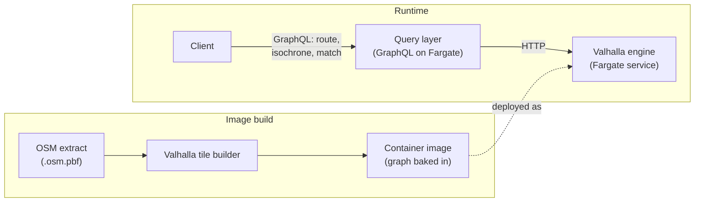

# 09 — Routing

Network routing — calculating drive-time isochrones, optimal routes between points, map-matching GPS traces to roads, and snapping coordinates to the nearest road — requires a road graph and graph traversal algorithms. The platform's spatial query engine (DuckDB) does not have these. Routing is handled by a dedicated component.

## Service shape at a glance

Routing is a dedicated Fargate service backed by Valhalla, with the road graph baked into the container image at build time from a regional OSM extract. At runtime there is no external dependency; clients reach the engine through the query layer, which wraps routing operations as GraphQL fields returning the same `Feature` type as every other spatial operation.



The rest of this document specifies the engine, the operations, the data lifecycle, and the integration contract with the query layer.

## Engine choice: Valhalla

The recommended engine is **Valhalla** (open-source, originated by Mapzen, maintained by the OSM community). The rationale:

- **Comprehensive coverage**: route, isochrone, map-match, snap-to-road, plus matrix and elevation in a single binary.
- **Self-contained operation**: the engine loads pre-built routing tiles from local disk; no external API or runtime download required.
- **Tile-based road graph**: graph is sliced spatially into hierarchical tiles, supporting partial loads and region-specific deployments.
- **Configurable cost models**: vehicle profiles (auto, truck, bicycle, pedestrian) with adjustable preferences (avoid highways, prefer shorter, prefer faster).

## Operations

| Operation | Input | Output |
|---|---|---|
| `route` | List of waypoints, vehicle profile | Route geometry, turn-by-turn instructions, total distance and time |
| `isochrone` | Origin point, list of time or distance thresholds | One or more polygons describing the reachable area at each threshold |
| `trace_route` (map-match) | List of GPS positions | Snapped route geometry along the road network |
| `locate` (snap-to-road) | Single coordinate | Nearest road segment metadata |
| `matrix` | Sources, targets | Pairwise travel time/distance matrix |

The platform exposes these through the query layer (see [07 Query Layer](07_QUERY_LAYER.md)) as GraphQL operations. The query layer issues HTTP calls to the routing engine internally and wraps the results as standard `Feature` types so they compose with spatial operations.

## Data: regional OSM extracts

The road graph is built from OpenStreetMap (OSM) data, regionally extracted. A typical deployment selects an OSM extract for a state, country, or other region of interest (e.g. Victoria, Australia; California, USA; United Kingdom).

The graph is built once at **image build time** by Valhalla's tile-building tools:

```
OSM extract (.osm.pbf) → Valhalla tile builder → routing tiles (.gph files)
```

The resulting tiles are packaged into the routing engine's container image. A typical regional graph is between 500 MB and 5 GB, well within container image limits.

This design choice has consequences:

- **No external runtime dependencies.** The engine starts and serves immediately; no data download.
- **No real-time traffic.** The graph reflects road network structure, not live conditions. Traffic-aware routing requires a separate live data feed (Valhalla supports this via plugins; it is not deployed by default).
- **Data freshness is image rebuild frequency.** Updating the road network for a region means rebuilding the image. Monthly or quarterly cadence is typical.
- **Region expansion is non-trivial.** Adding a new region means a larger OSM extract, longer build time, larger image. Multi-region deployments may want multiple routing services rather than one large one.

> *In plain terms:* the road network is frozen into the container the routing engine runs in. That makes the engine deterministic and dependency-free at runtime — but updating road data means rebuilding and redeploying the image, not pointing it at a fresher feed.

## Compute model

The routing engine runs as a **Fargate service**. Memory requirements depend on graph size; a regional graph typically fits in 4–8 GB. CPU per request is modest; the bottleneck is graph traversal.

Concurrency is per-request: each HTTP request is handled by a thread. The engine is not horizontally stateful — multiple Fargate tasks can run independently, each with its own copy of the (read-only) graph baked into the image.

For scale-to-zero: the engine cold-starts in tens of seconds (Fargate task start, image pull, graph load). The `minimal` scaling mode keeps one warm task at low cost. Routing is not on the critical path for tile or feature serving, so cold starts on the routing engine do not affect the platform's core read latency.

## Integration with the query layer

The query layer integrates routing as a set of GraphQL operations that:

1. Resolve inputs via the shared input resolver (point, dataset+bbox, dataset+feature_ids).
2. Issue HTTP calls to the routing engine.
3. Wrap responses as `Feature` objects.
4. Return them in the same shape as any other operation.

This means a workflow like *"compute a 15-minute drive-time isochrone from each fire station, union them, intersect with property boundaries, save the result as a vector dataset"* can be expressed as a single GraphQL query that touches the routing engine and the spatial engine without the user knowing where one ends and the other begins. The result is vector — polygon, line, or point features — not a raster coverage; routing operations return GeoJSON-shaped `Feature`s throughout.

**Per-request limits.** The shared input resolver enforces a configurable batch size (typically 50 features) to prevent runaway calls. Operations that need to call the routing engine for every feature in a large dataset are rejected; the client must batch.

**Timeouts.** Routing calls have a configurable timeout (typically 30 seconds). Pathological queries (very large isochrones, distant route endpoints) hit this limit rather than running indefinitely.

## When to deploy routing

Routing is one of the optional service groups (see [12 Deployment](12_DEPLOYMENT.md)). Deploy it when:

- Drive-time analyses are a documented use case.
- Map-matching of GPS traces is required (e.g. fleet telemetry post-processing).
- Snap-to-road is needed for cleaning user-submitted location data.

Skip it when:

- Users only need to view and query static spatial data.
- The region of interest is global and a per-region OSM build would be impractical (in which case, consider an external routing API).

## Limits

- **Single region per service**, by current design.
- **No real-time traffic**, by current design.
- **No multi-modal trips** (transit + walking + driving) without additional Valhalla profiles.
- **Image rebuild required** for road network updates.

For users who need global coverage or real-time traffic, the right answer is an external routing API consumed at the application layer, not by this platform. The platform's routing is for self-contained, deterministic, region-bounded routing where data sovereignty and absence of external dependencies are valued.
