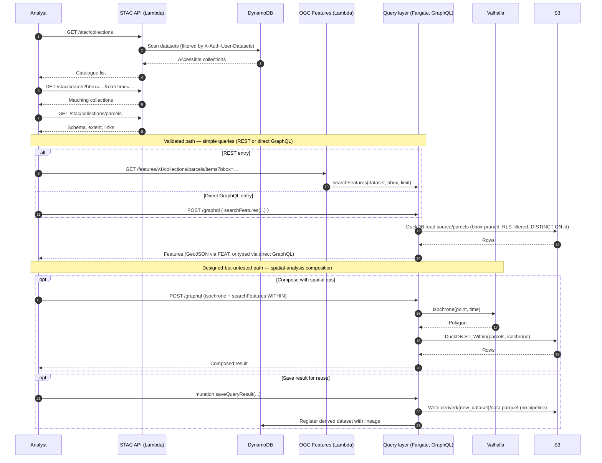
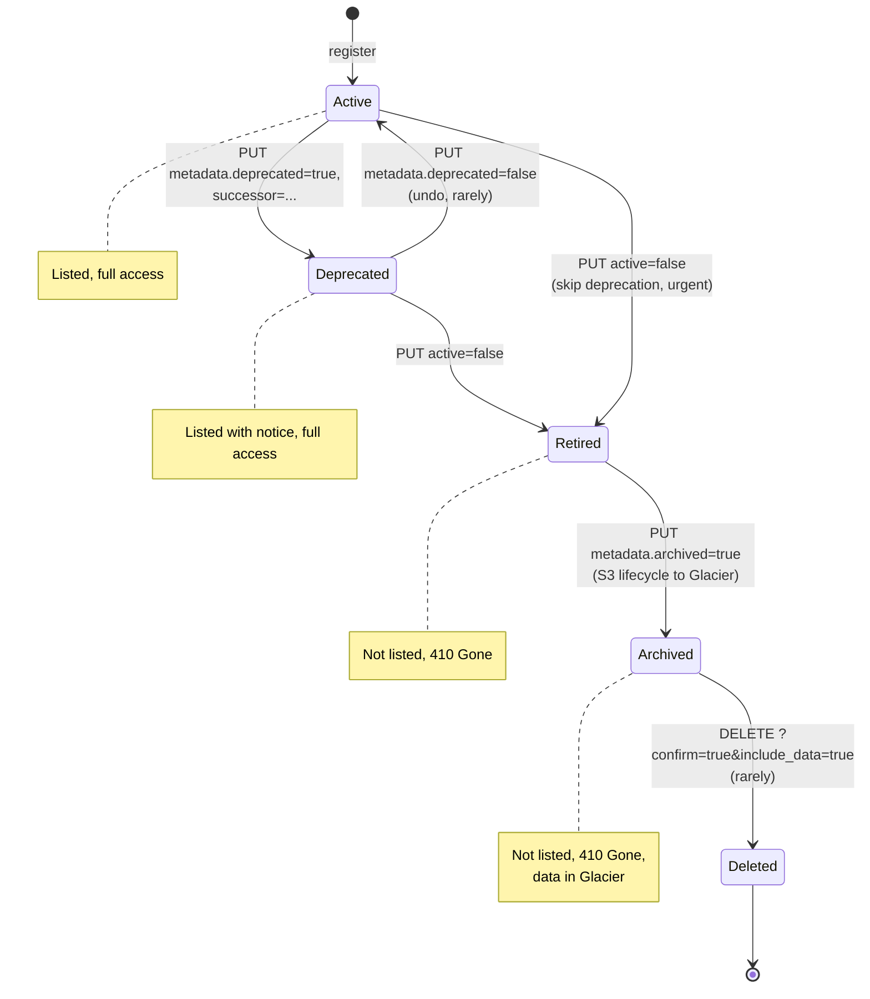
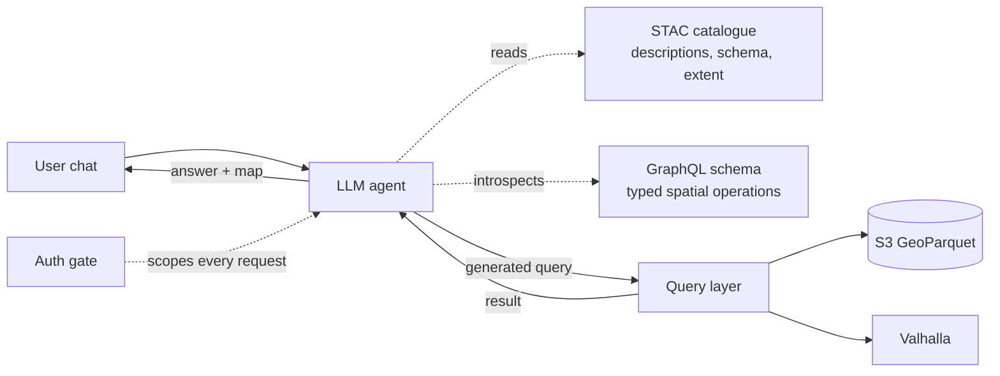

# 10 — Discovery

Clients need to know what datasets exist before they can query them. The platform offers two discovery surfaces: a **STAC API** (Lambda) for spatial-data catalogues and a **catalogue API** (the Policy API Lambda's `/rest/datasets/*` routes) for richer admin metadata. Both read from the same DynamoDB dataset registry; they differ in what they expose and to whom.

> **Prior iteration.** The original platform ran STAC as a **Fargate service backed by [pgSTAC](https://github.com/stac-utils/pgstac)** on an Aurora PostgreSQL Serverless v2 cluster — the same shape used by Development Seed's [eoAPI](https://eoapi.dev/) (the closest peer assembly to this platform, as discussed in [Peer stacks and prior art](16_DESIGN_DECISIONS.md) within [16 Design Decisions](16_DESIGN_DECISIONS.md)). When the rest of the platform moved off the database (vector to PMTiles + GeoParquet, raster to COGs), pgSTAC was left as the last database dependency. It was eventually replaced with a small Lambda that reads directly from the DynamoDB datasets table. The STAC surface is small enough that no separate cataloguing engine is needed; the registry *is* the catalogue. This is also why STAC items are not stored separately — the platform's notion of an "item" is a dataset, and per-asset items are returned by reference to the OGC/tile endpoints.

## STAC

**STAC** — SpatioTemporal Asset Catalog — is the de facto standard for cataloguing geospatial assets. The specification defines a small JSON schema for items, collections, and catalogues, and a small REST API for browsing them.

The platform implements **STAC API 1.0.0** for the core conformance classes that matter to consumers:

| Endpoint | Purpose |
|---|---|
| `GET /stac/` | Root catalogue with links to children |
| `GET /stac/conformance` | Declared conformance classes |
| `GET /stac/collections` | List of collections the caller may access |
| `GET /stac/collections/{id}` | Single collection description |
| `GET /stac/collections/{id}/items` | Returns an empty FeatureCollection in this prototype — see note below |
| `GET /stac/search` | Collection-level search by bbox, datetime, collection id |

**What an "item" is in this platform.** The prototype's STAC model is **collection-centric**: one STAC collection per dataset, and no separate STAC item store. `/collections/{id}/items` is implemented as a stub that returns an empty `FeatureCollection`; `/search` returns matching *collections* (not items) so that bbox/datetime narrowing still works at the catalogue level. Per-feature access is delegated to the OGC Features API for vector datasets and the Coverages / raster-tile endpoints for raster datasets. A future iteration could expose one synthetic item per COG (with `assets` pointing at each acquisition) and back item search by an indexed store — the shape is reachable without changing collections, since collections already carry the dataset's bbox, time interval, and asset references.

Each collection in the STAC response corresponds to a dataset in the registry. The mapping is straightforward:

| STAC field | Source |
|---|---|
| `id` | Dataset identifier |
| `title`, `description` | Dataset name and metadata description |
| `extent.spatial.bbox` | Dataset bounding box from registry |
| `extent.temporal.interval` | Time range, if the dataset is temporal |
| `summaries`, `keywords` | From dataset metadata |
| `links.items` | OGC Features endpoint for the collection |
| `links.tiles` | TileJSON endpoint for the collection (if tiled) |
| `assets` | References to the canonical storage object (COG, PMTiles) |

The catalogue is filtered by the caller's permissions: a user only sees collections their permission context includes (`X-Auth-User-Datasets` plus public datasets).

## Catalogue API

For administrators and dataset managers, a richer catalogue surface exposes operational metadata that does not belong in the public STAC view:

| Endpoint | Purpose |
|---|---|
| `GET /rest/datasets` | List all datasets (admin view; includes inactive) |
| `GET /rest/datasets/{id}` | Detailed dataset information including lineage and pipeline status |
| `POST /rest/datasets` | Register a new dataset |
| `PUT /rest/datasets/{id}` | Update dataset metadata |
| `DELETE /rest/datasets/{id}` | Soft-delete (sets `active: false`) |
| `POST /rest/datasets/{id}/regenerate` | Trigger a regeneration job (without re-uploading data) |

Operational fields exposed here but not in STAC:
- `pipeline_status` — `idle`, `processing`, `failed`
- `last_job_id`
- `last_promoted_at`
- `validation_sequences` — applied validation rules
- `review_required`, `history_enabled` flags
- `needs_review` — reserved (set manually today; was intended to be auto-set by the sync scanner; see "Auto-sync of datasets" below)

## Auto-sync of datasets

A **Lambda function on an EventBridge schedule** (every 15 minutes) **validates the existing registry against S3**. For each registered dataset, the scanner checks that the GeoParquet / PMTiles / MosaicJSON paths referenced in the dataset's distributions list actually exist in S3. Missing paths are recorded against the dataset for operator attention.

The scanner does **not** create new registry rows for S3 content that has no matching entry. Dataset registration is always an explicit action — through the Policy API (`POST /rest/datasets`) or as a side-effect of the editing pipeline writing the first successful job. The original design called for the scanner to write `active: false`, `needs_review: true` skeleton entries when it found unowned S3 content; that auto-creation step was dropped during prototyping in favour of explicit registration, partly to avoid accidentally exposing files that landed in S3 outside the editing pipeline and partly because the surface for "needs review" classification was never built. A vendor build that wants the original auto-discovery behaviour should restore it deliberately, with the operator-facing classification UI included.

The scanner is otherwise conservative: it never modifies dataset metadata, never deletes anything, and never activates a dataset.

## Public vs private datasets

The `public` flag on a dataset determines whether anonymous (unauthenticated) requests can see it. When the flag is true:

- STAC listings include the collection for unauthenticated callers.
- OGC Features and tile endpoints serve content without credentials.
- CDN caching for these requests does not key on a credential header (a single edge cache entry per dataset).

When the flag is false:
- Anonymous callers do not see the collection in any catalogue listing.
- Authenticated callers see the collection only if their permission context includes the dataset identifier.
- CDN caching keys on the credential header, so each credential gets its own cache entry.

The flag is set by an administrator when registering or updating the dataset. The platform does not automatically classify datasets.

## Search semantics

The STAC `search` endpoint accepts:

| Parameter | Meaning |
|---|---|
| `bbox` | Filter collections to those overlapping the bbox |
| `datetime` | Filter to those within the time range |
| `collections` | Limit search to specific collections |
| `ids` | Restrict to specific collection ids (no per-item index in this prototype) |
| `limit` | Page size |

Search is paginated with cursor semantics and operates **at the collection level only** in this prototype — `/search` returns matching collections rather than items. The implementation does not require an index beyond the dataset registry; for raster archives with millions of acquisitions, a STAC items service backed by a search-optimised store (e.g. pgSTAC or OpenSearch) is the natural extension. Per-feature access for vector datasets is delegated to the OGC Features API; per-COG access for raster datasets is delegated to the Coverages and raster tile endpoints.

## Journey: from STAC discovery to first query

> *In plain terms:* a new user starts with "what datasets are there?", narrows by area and time, picks one, and immediately starts asking it questions. Simple queries (select, bbox, single-feature) are well-trodden whether they come in over REST or GraphQL — both ride the same DuckDB read path. Where the road gets less travelled is the spatial-analysis operations: buffer, distance, dissolve, isochrone composition. Those are designed as thin GraphQL resolvers over DuckDB spatial functions; they should work, but they have not been exercised in anger.

A spatial analyst joins an organisation. They have an API key or a JWT, a web map viewer, and possibly QGIS open in another window. They need to find what is available before doing any analysis.

1. **Browse the catalogue.** The analyst calls:

   ```
   GET /stac/collections
   ```

   They receive a STAC-formatted list of every dataset their permissions allow them to see. Each entry includes id, title, description, spatial and temporal extent, attribution, and links to the actual data endpoints (`items` for OGC Features, `tiles` for vector/raster tiles, `assets` for direct downloads of COGs and PMTiles where appropriate). A web map viewer can render this list as a layer picker.

2. **Search by spatial or temporal scope.** The analyst is interested in the western suburbs of Melbourne in early 2026. They call:

   ```
   GET /stac/search?bbox=144.7,-37.9,144.9,-37.7&datetime=2026-01-01/2026-03-31
   ```

   Collections whose extents overlap the bbox and time window are returned. The analyst spots `parcels`, `aerial-2026`, and `roads-2026` — vector boundaries, raster imagery, and a road network for the area.

3. **Inspect a specific collection.** They look at the parcels collection:

   ```
   GET /stac/collections/parcels
   ```

   The response carries the dataset's attribute schema (so the analyst knows which fields they can query and filter on), the full spatial extent, the time the dataset was last promoted, deprecation status if any, and direct links to the OGC Features endpoint and the vector tile endpoint.

4. **Query the dataset — well-trodden paths.** The analyst can ask for parcels intersecting their bbox in one of two interchangeable ways. Both end up at the same DuckDB read against `source/parcels/`, partition-pruned and RLS-filtered against the caller's effective claims.

   **Via REST OGC Features** — the standards-compliant surface, ideal for QGIS, ArcGIS, generic HTTP clients:

   ```
   GET /features/v1/collections/parcels/items?bbox=144.7,-37.9,144.9,-37.7&limit=500
   ```

   **Via direct GraphQL** — the same engine, called from a custom front-end that wants typed responses and field projection:

   ```graphql
   query {
     parcels: searchFeatures(
       dataset: "parcels",
       bbox: [144.7, -37.9, 144.9, -37.7],
       limit: 500
     ) {
       id
       geometry
       properties
     }
   }
   ```

   In deployments that run the query layer (the prototype's shape), the REST surface is a façade over the same GraphQL layer that the direct query uses: the OGC API translates its parameters into a `searchFeatures` call and formats the response as GeoJSON. In an OGC-only deployment that omits the query layer, the standalone Lambda-over-GeoParquet shape ([06 OGC Features API](06_OGC_FEATURES_API.md)) backs the same REST contract directly against DuckDB; the response is identical to the client. Either entry point gives the same partition-pruned, RLS-aware, deduplicated read. These query shapes — select, bbox, single feature by id, dataset metadata lookup — are the validated baseline.

5. **Compose spatial operations — designed but largely untested.** When the analyst's question requires more than filter-and-project — *parcels within a 15-minute drive of these fire stations*, or *the dissolved boundary of all the addresses in a council* — they reach for GraphQL operations that the REST surface does not expose:

   ```graphql
   query {
     reach: isochrone(point: {lon: 144.8, lat: -37.8}, costing: "auto", time_minutes: 15) {
       geometry
     }
     parcels: searchFeatures(
       dataset: "parcels",
       geometryFilter: { fromQuery: "reach" },
       predicate: WITHIN
     ) {
       id
       geometry
       properties
     }
   }
   ```

   The query layer computes the isochrone via the routing engine, uses the resulting geometry to filter parcels via DuckDB spatial, and returns both results in a single response. Buffer, union, dissolve, intersect, simplify, centroid, convex hull, distance, point-in-polygon, and the routing operations are all designed as **thin GraphQL resolvers over DuckDB spatial functions and the routing engine**. The underlying functions are well-tested in DuckDB and Valhalla; the resolver wrappers — argument coercion, error handling, batch limits, the cross-engine composition — have not been exercised against real workloads. They are expected to work. They have not been proven to.

6. **Save a query result as a new dataset.** Designed-but-undertested: the prototype's `saveQueryResult` mutation writes the composed result to a separate `derived/{name}/data.parquet` prefix (not `source/`) and registers it as a *derived* dataset with lineage metadata pointing at the source query. It does **not** flow through the editing pipeline — no validation, no PMTiles generation, no review gate — and the resolver does not enforce a role check at the schema layer in the prototype. The intent was always that this would graduate into the editing pipeline (write to a session, route through validation and generation, gate on `editor` or `data_manager`), but that work was not completed. Treat the current behaviour as a prototype hook, not a finished surface; a hardened build should route saves through the editing pipeline and require an explicit role.



### Aspirational front-end patterns built on the query layer

The query layer is intended to support interactive workflows that the OGC surface cannot. Two patterns worth investigating in a future front-end build:

- **Chained queries.** The web map viewer composes a workflow as a directed graph of GraphQL queries, each step feeding the next: *compute isochrones from these points → union them → intersect with property boundaries → render as a new overlay*. The user sees intermediate results progressively and can branch from any step. This is more powerful than a single saved query because the intermediate steps are inspectable and adjustable.

- **Persisted user workspaces as tabs.** Each tab in the viewer holds a named query (or a chain) with its parameters. Closing the browser preserves the tabs server-side via the **view definitions** primitive described in [07 Query Layer](07_QUERY_LAYER.md); the user picks up where they left off. Tabs can be shared with colleagues by URL, with parameters bound to context variables that the recipient resolves to their own values (e.g. "their council" rather than the originator's).

**What is solid, what needs work.**

Solid — exercised by the prototype, expected to work for any equivalent build:
- STAC discovery (`/stac/collections`, `/stac/search`, single-collection lookup).
- OGC Features REST for select, bbox, single feature by id, collection metadata.
- The same operations called directly via GraphQL (`searchFeatures`, dataset lookup).
- The shared DuckDB read path underneath, with partition pruning, RLS filtering, and cross-partition deduplication.

Designed but undertested — the resolvers exist, the underlying DuckDB and Valhalla functions are mature, but the wrappers and their composition have not been exercised:
- Spatial-analysis GraphQL operations: buffer, distance, dissolve, union, intersect, simplify, centroid, convex hull, explode, point-in-polygon, radius search.
- Routing operations as GraphQL: isochrone, route, map-match, snap-to-road.
- Geometry-filter composition (`geometryFilter: { fromQuery: ... }` chaining one resolver's output into another's input).
- The `saveQueryResult` mutation and its hand-off into the editing pipeline.
- Context variables and view definitions as front-end persistence primitives.
- The chained-query and persisted-tab front-end patterns described above.

**This is the area of the platform most in need of further validation work** before a vendor build commits to specifics. The shape is right; what is missing is load testing, error-path coverage, and a worked-through front-end that proves the composition story end-to-end. A vendor build should expect to spend meaningful effort here — more than on the read path or the editing pipeline.

## Dataset lifecycle: deprecation and retirement

> *In plain terms:* datasets are not simply "deleted." They progress through observable states — active, deprecated, retired, archived — each of which is a permission and a discoverability change, not a data deletion. The data itself persists until an explicit archive step.

Datasets accumulate. Some become canonical and persist for years; others are superseded by a better version and need to be wound down. The platform offers four lifecycle states, each set explicitly by a data manager, each visible in the catalogue.

### The states

| State | `active` | `metadata.deprecated` | `metadata.archived` | Catalogue visibility | Data accessibility | Use case |
|---|---|---|---|---|---|---|
| Active | true | false | false | Listed normally | Full read/write | Default for live datasets |
| Deprecated | true | true | false | Listed with deprecation notice and successor link | Full read; writes may be restricted | A successor exists; clients should migrate |
| Retired | false | true | false | Not listed; direct access returns 410 Gone | Read returns 410 Gone | Stop new use; preserve data for audit |
| Archived | false | true | true | Not listed; direct access returns 410 Gone | Data moved to S3 Glacier Deep Archive | Long-term retention; restore is hours-long |

A dataset can be **removed entirely** by deleting its DynamoDB registry entry and the underlying S3 objects, but this is rarely done — archival is usually preferred so the data remains recoverable for compliance or audit purposes.

### Journey: deprecating, retiring, and archiving a superseded dataset

A `roads-2024` vector dataset has been replaced by `roads-2026`. The new dataset has different attribute columns and a different identifier scheme; clients cannot use one in place of the other without code changes. The data manager wants to phase out the old dataset over six months.

1. **Deprecate.** The data manager marks the old dataset as deprecated and points clients at the successor:

   ```
   PUT /rest/datasets/roads-2024
   { "metadata": {
       "deprecated": true,
       "deprecated_at": "2026-04-01",
       "successor": "roads-2026",
       "deprecation_notice": "Replaced by roads-2026 with updated attribute schema. Migrate before 2026-10-01."
     }
   }
   ```

   The dataset remains `active: true` — existing clients continue to function. STAC and the catalogue API now include the deprecation fields in the collection response. A web map viewer can render a banner; QGIS users see the notice in the layer description.

   The dataset event log records the deprecation. Operators can query CloudWatch Logs Insights to identify which credentials are still hitting `roads-2024` and reach out to them directly.

2. **Retire.** Six months later, with usage near zero, the data manager retires the dataset:

   ```
   PUT /rest/datasets/roads-2024
   { "active": false,
     "metadata": { "retired_at": "2026-10-01" }
   }
   ```

   The dataset disappears from catalogue listings (STAC `/collections`, OGC Features `/collections`, dataset listings in the policy API for non-admin callers). The S3 objects remain in place. Direct requests to `/features/v1/collections/roads-2024/items`, `/tiles/vector/roads-2024/...`, or the STAC collection endpoint return **HTTP 410 Gone** with a JSON body pointing at the successor:

   ```
   HTTP 410 Gone
   { "code": "dataset_retired",
     "message": "roads-2024 has been retired.",
     "successor": "roads-2026",
     "retired_at": "2026-10-01" }
   ```

   410 (Gone) is used deliberately rather than 404 (Not Found): it tells clients the resource *intentionally* no longer exists, so they should stop retrying rather than treat it as a transient miss.

3. **Archive.** After another retention interval (typically one year for vector data, longer for raster archives), the data manager triggers archival:

   ```
   PUT /rest/datasets/roads-2024
   { "metadata": { "archived": true, "archived_at": "2027-10-01" } }
   ```

   In the prototype, archival is a **metadata flag only**: the Policy API sets `metadata.archived=true` and `history_archive_to_glacier=true` on the dataset record, and the 410 Gone response begins to be returned for data requests. The actual S3 Lifecycle transition to **S3 Glacier Deep Archive** is *not* applied in the same call — there is no lifecycle rule today that watches for the flag, and there is no immediate `CopyObject` to Glacier. The intent is that a separate scheduled task (or an operator-managed lifecycle rule keyed on object tags) drives the transition asynchronously. A hardened build should either add a tag-keyed S3 Lifecycle rule that the archive call sets, or run an EventBridge-scheduled tagger that walks archived datasets and applies tags. The DynamoDB registry entry remains as a tombstone either way — the dataset's metadata, lineage, schema, and event log stay queryable by admins for audit.

   Restoring from Glacier Deep Archive takes 12–48 hours and incurs retrieval cost. The expectation is that archived datasets are restored only for compliance review, not for resumed serving.

4. **(Optional) Full deletion.** Truly final removal — DynamoDB entry deleted, S3 objects deleted — is supported but reserved for cases with explicit legal or contractual need. The operation is `DELETE /rest/datasets/{id}?confirm=true&include_data=true`. The deletion writes a final event-log entry recording who deleted what, when, and why; the event log itself is retained.



**Why state transitions instead of deletion.** Each transition is observable in the catalogue and in the dataset event log. A client that suddenly sees 410 Gone can trace back through the catalogue history to find when the dataset was retired, who retired it, and what the successor is. A silent deletion offers none of this. The lifecycle states also align with common compliance regimes that distinguish "not actively used" from "permanently destroyed."

**Successor relationships.** The `metadata.successor` field is a soft reference — clients may follow it programmatically but the platform does not auto-redirect requests. Auto-redirection (e.g. HTTP 301 from `roads-2024` to `roads-2026`) is deliberately avoided because the successor is rarely a drop-in replacement; clients need to migrate deliberately, not transparently.

## Limits

- The STAC search endpoint operates over collections by default. Cross-collection item search at scale requires a dedicated indexing backend, not included in this design.
- The platform does not implement STAC transactions (insert/update items via the API). New datasets and items are added through the editing pipeline and the admin catalogue API.
- The STAC API does not support arbitrary property filtering beyond what is in the collection summaries.

## Postscript: agentic access — where this design was heading

> *In plain terms:* never built, but the pieces happened to fit. A chat box, an LLM agent, and the existing STAC + GraphQL surface would together give users natural-language access to spatial data at scale, without anyone running a database underneath.

The query layer's shape — a typed, introspectable GraphQL schema over composable spatial operations — was chosen partly because it composes naturally with another consumer: a language model acting on behalf of a user. The STAC catalogue already describes every dataset in human-readable terms (title, description, keywords, attribution, schema, spatial and temporal extent). The GraphQL schema is introspectable and statically typed. With a chat interface, the path looks like:

1. **User asks**, in natural language: *"show me parcels within a 15-minute drive of any fire station in the western suburbs."*
2. **Agent reads STAC** to find candidate datasets — parcels, fire stations — and their schemas, extents, and access constraints.
3. **Agent introspects the GraphQL schema** — it learns about `searchFeatures`, `isochrone`, `geometryFilter`, the predicate enum, the input modes (point, bbox, dataset+ids).
4. **Agent generates the GraphQL query**, likely a chain of operations of the same shape the discovery journey shows above.
5. **The query layer executes** against DuckDB and Valhalla. The user sees the result on the map. The agent narrates what it did and offers refinements.



The architectural property that makes this attractive — and that distinguishes it from a traditional database-backed GIS bolted to a chat surface — is that **there is no connection pool to exhaust, no schema cache to refresh, no per-tenant compute to provision**. Every query is a stateless read against S3 partitions, scaled by the cloud's own elasticity. An agent fanning out fifty exploratory queries to find the right framing is fifty more S3 reads; the cost shape does not change. Global-scale datasets — continental cadastres, planetary imagery indices — are reachable on the same primitives.

The agent inherits the auth gate by construction. It sends requests with the user's JWT or API key; it cannot reach datasets the user cannot reach; row-level security still filters every response. The agent can be more skilful than a human at composing queries, but no more privileged.

**Was this built?** No. Not even a prototype. The intention shaped the query layer's design — typed, composable, introspectable, no hidden state — but the agent itself was never written, the chat surface was never built, and the connective tissue (retrieving catalogue context efficiently, showing the user the generated query before execution, fan-out guardrails, observability, evaluation harnesses) was not designed.

**Why mention it.** Because the design choices already made — STAC descriptions are human-readable, the GraphQL schema is introspectable, the auth gate is request-scoped, the read path is stateless — make this a natural next step rather than a re-architecture. The same platform that serves QGIS via WMTS could serve an agent via GraphQL, with the same data, the same auth, the same cost shape.

This is an area worth exploring further. The platform substrate is in place. The work yet to do is the agent, the chat surface, the prompt and tool design, and the safety and observability that would surround them — not the data layer underneath.

A richer agent shape — a supervisor agent orchestrating specialist sub-agents (Discovery, Cartography, Spatial Query, CV) over Amazon Bedrock AgentCore, backed by a Bedrock Knowledge Base — is sketched in [§6 of 17 Further Directions](17_FURTHER_DIRECTIONS.md). That document is also where the related ideas live: semantic dataset discovery, geocoding, point cloud serving, computer vision inference, 3D rendering, automated reports, spatial subscriptions, and live data.
