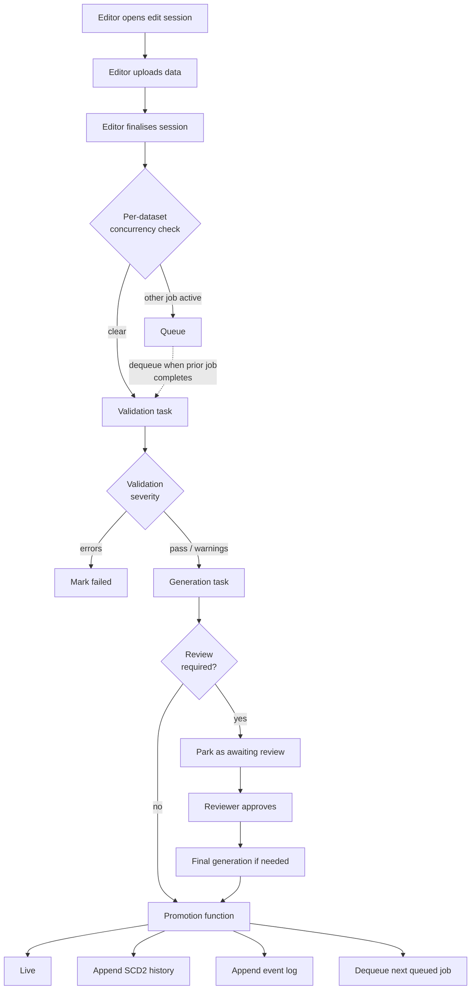
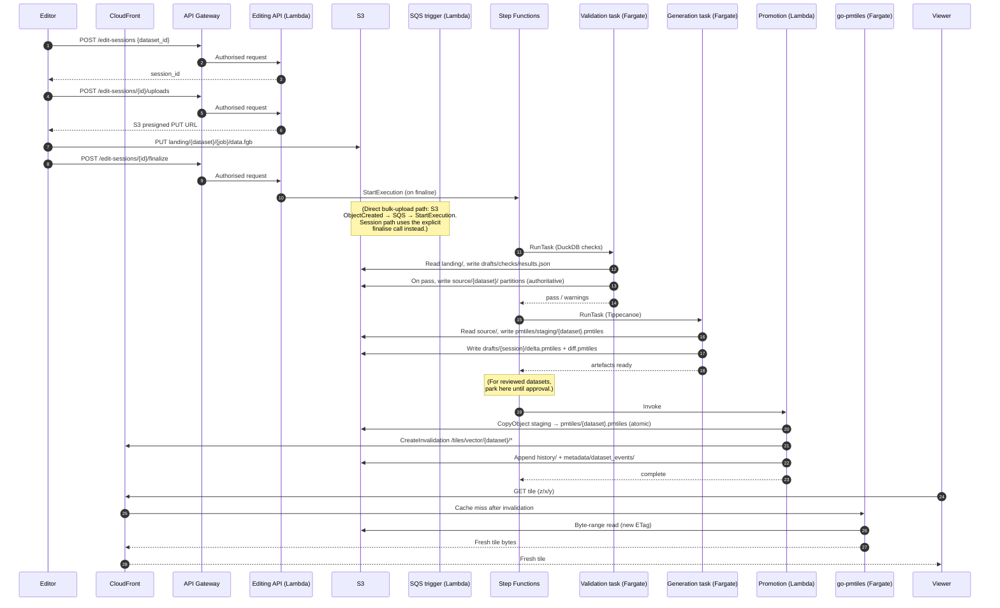
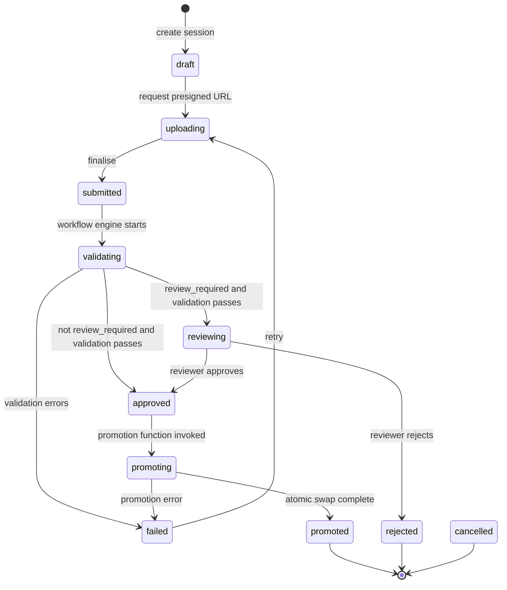
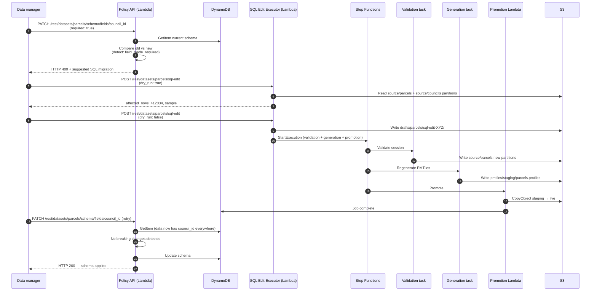

# 11 — Editing Pipeline

The editing pipeline is how new data and changes to existing data enter the platform. It is asynchronous by design: a user submits an edit, the pipeline validates and processes it, and the result is atomically promoted to live serving. Edits to high-trust datasets pass through a human review step before promotion.

This is the most complex subsystem in the platform. It is also where the platform's value beyond "serving static data" lives.

The pipeline is built from **AWS Step Functions** orchestrating **transient ECS tasks on Fargate** and **AWS Lambda** functions, reading and writing **S3** and **DynamoDB**.

> *Why this was built rather than adopted.* No standards-compliant OGC stack at the time of this design provided object-store-resident GeoJSON / GeoParquet feature editing with validation, review gates, and audit history in the form needed. [pygeoapi](https://pygeoapi.io/) covers the read side but did not (then) implement transactions for object-store providers; [GeoServer](https://geoserver.org/)'s WFS-T requires a database; [tipg](https://developmentseed.org/tipg/) is read-only. The editing pipeline below fills that gap. See [Peer stacks and prior art](16_DESIGN_DECISIONS.md) in [16 Design Decisions](16_DESIGN_DECISIONS.md) for the wider landscape.

> **Prior iteration.** An earlier version of the pipeline had no edit sessions and no per-dataset queueing: each upload triggered an independent pipeline run, which meant two near-simultaneous edits to the same dataset could overlap their partition writes and produce corrupted source GeoParquet. The session model, the state machine, and the per-dataset concurrency limit (one active job, others queued) were introduced as a single piece of work after that class of corruption was observed. The reviewed-editing variant with delta and difference PMTiles arrived shortly after, in response to a need for human approval before cadastral data was promoted to live.

## The lifecycle, top to bottom



## End-to-end edit journey

The same flow, drawn against a time axis with AWS participants — from an editor's first click to a fresh tile arriving in a colleague's browser:



> *In plain terms:* the editor's HTTP work is short and synchronous; everything heavy happens behind a job identifier the editor can poll. From the viewer's perspective, the swap looks like the tile just changed on the next refresh.

## Components

The pipeline is composed of small services with well-defined responsibilities:

| Component | AWS substrate | Role |
|---|---|---|
| **Editing API** | Lambda | User-facing write endpoints — manages edit sessions, generates S3 presigned upload URLs, handles finalisation, accepts reviewer approvals, and manages validation rules. |
| **Upload gate** | Lambda | Lightweight authorisation check for direct bulk uploads (non-session edits), returning S3 presigned URLs. |
| **SQS trigger** | Lambda | Bridges S3 `landing/` object-created events (delivered via SQS) into `StartExecution` calls on the Step Functions state machine. Used for the direct bulk-upload path; the session-based path invokes `StartExecution` explicitly from the editing API on finalise, so the SQS trigger does not gate on session state. |
| **State machine** | Step Functions | Orchestrates validation → generation → promotion. Retry policies with exponential backoff cover transient `EcsAmazonECSException` and `States.Timeout` errors. Catch blocks route to the failure handler. |
| **Validation task** | Fargate transient ECS task | Runs DuckDB schema, geometry, and user-defined SQL checks against an uploaded dataset. 4 vCPU, 16 GB, 100 GiB ephemeral storage. |
| **Generation task** | Fargate transient ECS task | Produces serving artefacts: full or incremental PMTiles via Tippecanoe, plus delta and difference PMTiles for review. 4 vCPU, 16 GB, 200 GiB ephemeral storage. |
| **Promotion function** | Lambda | Atomically swaps staging artefacts into live via S3 `CopyObject`; issues a CloudFront invalidation; writes SCD2 history and event-log entries; dequeues the next queued job. |
| **Failure handler** | Lambda | Step Functions catch target. Marks job and dataset as failed, releases the per-dataset queue. |
| **Job API** | Lambda | Read-only view of job state for clients tracking pipeline progress; honours dataset access from the auth context. |
| **SQL edit executor** | Lambda (3 GiB, 15-minute timeout) | Performs bulk data corrections via DuckDB SQL, routed through the validation pipeline. |
| **History vacuum** | Lambda, EventBridge-scheduled | Compacts per-job SCD2 history files into monthly archives. |
| **Event log compactor** | Lambda, EventBridge-scheduled | Compacts per-job event-log files into monthly archives. |

## State vocabulary at a glance

Three lifecycles run side by side and are easy to confuse — they are deliberately separate so a long-lived edit session can survive multiple short job executions.

| Lifecycle | Where it lives | States |
|---|---|---|
| **Job status** | `JOB#{job_id}` in the jobs table | `queued` → `pending` → `validating` → `generating` → `complete`; terminal also `failed`, `cancelled`. Pipeline execution lifecycle, no review states. |
| **Session status** | `SESSION#{session_id}` in the edit-sessions table | `draft` → `uploading` → `submitted` → `validating` → `reviewing` (when `review_required=true`) → `approved` → `promoting` → `promoted`; terminal also `failed`, `rejected`, `cancelled`. User/review lifecycle, no `generating` state. |
| **Dataset pipeline_status** | `DATASET#{dataset_id}` in the datasets table | `idle`, `processing`, `failed`. Derived summary of the most recent job, used for the concurrency check and dashboard rollups. |

Generation always happens *after* validation and *before* review — the reviewer needs the generated delta and diff PMTiles to see what changed. The session does not pass through a `generating` state because the job state machine owns that transition while the session waits in `validating`/`reviewing`.

## Edit session state machine



State transitions are guarded by optimistic locking (a version counter on the session) so that concurrent operations cannot leave the session in an inconsistent state. The state machine is enforced by the editing API; the workflow engine writes state transitions only through the editing API's interfaces, never directly to the store.

## Per-dataset concurrency

Only one pipeline job may be active for a given dataset at a time. This prevents:

- Overlapping writes to the same set of GeoParquet partitions.
- Validation against an inconsistent schema version.
- Race conditions in atomic promotion.
- For reviewed datasets: a second edit computing its delta against pre-promotion source data.

**Mechanism**. The DynamoDB datasets table has a `pipeline_status` field. The jobs table has a **DynamoDB GSI** on `(dataset_id, status)`. When a new job is submitted, the editing API issues a small number of `Query` calls against that GSI — one per active status (`pending`, `validating`, `generating`) — each using a key-condition expression of the form `dataset_id = :did AND #s = :status` with `Limit=1`. DynamoDB `Query` key conditions do not support `IN` on the sort key; iterating over the small fixed set of active statuses is the actual implementation. If any query returns a row, the new job is created with status `queued` using a DynamoDB `PutItem` with a conditional write, and the request returns HTTP 202.

When a job reaches a terminal state (complete, failed, cancelled), the promotion Lambda (or failure handler, or cancel handler) calls a `dequeue_next_job` routine that:

1. Looks for the oldest job for the same dataset in `queued` status.
2. For datasets with `review_required=true`, defers if the prior job is in a non-terminal review state (so the new job computes its delta against the post-promotion source, not pre-promotion).
3. Transitions the chosen job to `pending` and invokes the workflow engine.

**Cross-dataset parallelism is preserved.** Independent datasets run their pipelines in parallel; only the same-dataset case is serialised.

> *In plain terms:* two editors can submit changes to the same dataset at the same time without producing corrupt partitions — the second submission waits politely behind the first rather than racing it.

## Validation

The validation task performs three layers of checks:

1. **Schema validation** — every feature must match the dataset's declared JSON Schema. Required fields, allowed values, type constraints.
2. **Geometry validation** — well-formed geometries, declared CRS matches the dataset's expected CRS, geometries are valid (no self-intersections in polygons), all features have a non-null geometry where required.
3. **User-defined SQL checks** — checks declared per-dataset and applied in sequence.

### SQL checks: parameterised templates

User-defined checks are SQL templates with declared parameters, stored in the key-value store. Each check has:

| Field | Meaning |
|---|---|
| `check_id` | Identifier |
| `sql_template` | DuckDB-compatible SQL with `{parameter}` placeholders |
| `parameters` | Declared parameter list with names, types, and optional defaults |
| `severity` | `error` (blocks approval) or `warning` (informational) |
| `description` | Human-readable explanation |

A check must return rows of the form `(id, message)`. Each row is a violation; an empty result indicates no violation.

**Parameter validation.** Parameter names of type `column` are validated against the dataset's schema before substitution; this prevents injection.

**Sequences.** Checks are composed into named sequences (`base`, `cadastral`, `planning_zones`, etc.). A dataset references an ordered list of sequences. Common checks (geometry validity, conflict detection) are typically in the `base` sequence applied to every dataset.

**Built-in conflict-detection check.** Every dataset implicitly carries a check that detects features whose corresponding live row has been updated more recently than the session's source. This prevents the lost-update problem: if two editors prepare overlapping changes, the second to submit gets a conflict report rather than silently overwriting the first's work.

**Execution sandbox.** Each check runs in a sandboxed DuckDB session with no filesystem or network access. A per-check timeout (typically 60 seconds) bounds runaway queries.

### Validation outcome

**Where validated data lands.** When validation passes, the same task writes the validated features to the authoritative `source/{dataset}/z={z}/x={x}/y={y}/data.parquet` partitions before the workflow advances to generation. There is no intermediate source-staging prefix. This is a deliberate trade-off — fewer S3 hops, simpler IAM — but it has two consequences worth naming:

- **Reviewed datasets.** For datasets with `review_required=true`, OGC Features and the query layer reflect the proposed changes as soon as validation passes, even though the PMTiles swap (and therefore the map-client experience) waits for reviewer approval. The review gate is on **rendered tiles**, not on the underlying source.
- **Validation failure.** If validation fails, no source partitions are touched — `apply_*` paths only run after the result is marked valid. The failure mode is "no change," not "partial change."

> *Inline note:* the audit picked this up as Finding 1. It is recorded here rather than hidden — the choice is in the code, and a vendor rebuild should make the design tension explicit before deciding whether to keep the simpler shape. Two forward fixes worth considering are below.

### Forward fix A — `source-staging/` prefix (recommended for an incremental rebuild)

Add one prefix and move the `apply_*` step from validation to promotion:

```
source-staging/{dataset}/{job_id}/z={z}/x={x}/y={y}/data.parquet   ← validation writes here
source/{dataset}/z={z}/x={x}/y={y}/data.parquet                    ← authoritative, only promotion writes
```

The change is small:

1. **Validation** writes the new partition set under `source-staging/{dataset}/{job_id}/...` and records the staging key set in the job record. No live partitions are touched.
2. **Generation** still reads from `source/`; the reviewer sees delta and diff PMTiles built against current live data, which is the right reference for "what is changing."
3. **Promotion** gains a step before the PMTiles swap: walk the staging tree and `CopyObject` each staging key to its live `source/` key, then `DeleteObject` for any deletions the validation task recorded. The PMTiles swap stays as today. The Lambda is still idempotent — re-running it finds the live keys already updated and is a no-op.
4. A lifecycle rule expires `source-staging/` after seven days as a safety net, mirroring `landing/`.

Properties:

- The visibility window for unapproved data on OGC and the query layer shrinks from "validation → generation → review → approval" (minutes to hours) to "the duration of promotion's CopyObject fan-out" (seconds for typical edits, longer for `replace` operations). Not atomic across partitions, but bounded.
- Reviewed datasets get a real review gate on the underlying source, not just on rendered tiles.
- One extra `CopyObject` per affected partition is the marginal cost — negligible compared to the generation task itself.
- No reader-side change. Backends still glob `source/{dataset}/z=*/x=*/y=*/data.parquet`.

### Forward fix B — manifest-pointer (Iceberg-style, principled rebuild)

If the platform is being rebuilt from scratch and atomic multi-partition promotion is a hard requirement, the cleaner shape is a manifest pointer:

```
source/{dataset}/v{N}/z={z}/x={x}/y={y}/data.parquet               ← content-addressed by version
metadata/manifests/{dataset}/v{N}.json                             ← lists the partition files for v{N}
DynamoDB datasets table: { dataset_id, current_manifest_version: N }
```

Promotion becomes one DynamoDB conditional update flipping `current_manifest_version` from N to N+1. Readers `GetItem` the dataset first, resolve to a manifest, then read the partition paths listed there.

Properties:

- **Atomic across partitions.** The visibility window is zero — a single DynamoDB pointer flip.
- **Native time-travel and rollback.** Older manifests *are* the history; the SCD2 layer in `history/` becomes a derived view rather than a separate write path. Rolling back a bad promotion is a one-line update to a prior version.
- **Cost.** Every read pays one cached `GetItem` to resolve the manifest, plus the existing S3 reads. Storage grows with version count, bounded by a lifecycle policy that compacts old manifests and their unreferenced partition files.
- **Lift.** Every read backend (Features API, query layer, history vacuum, generation task) needs manifest-aware path resolution. Substantial — this is a redesign of the read path, not a tweak.

This is the shape that mature table formats (Apache Iceberg, Delta Lake) adopt for the same reason. If a future build wants strict review semantics, ACID-ish guarantees, or time-travel as a first-class feature, B is where it lands. A is enough for everything the prototype actually demonstrates.

The validation task writes a results summary to `drafts/{dataset}/{session}/checks/results.json` and emits a summary to the session record:

```json
{
  "checks_run": 12,
  "errors": [
    {"check_id": "...", "feature_id": "...", "message": "..."}
  ],
  "warnings": [...]
}
```

Errors fail the validation; warnings are surfaced but do not block.

## Generation

The generation task produces serving artefacts. It runs as a container task with significant ephemeral storage (typically 100–200 GiB) because some intermediate steps (FlatGeobuf, Tippecanoe) write large temporary files.

### Full generation

For `replace` operations or first-time generation: reads all partitions for the dataset, builds the full PMTiles archive.

```
GeoParquet (source/) → FlatGeobuf intermediate → Tippecanoe → PMTiles → pmtiles/staging/
```

### Incremental generation

For additive edits where the affected partition set is known and a current live PMTiles archive exists, the generation task reads only the affected source partitions, builds a small patch PMTiles, and `tile-join`s it into the current archive to produce a new staging PMTiles. Much faster for large datasets with localised additions.

`tile-join` is an overlay merge — it composes cleanly for adds but cannot remove stale encodings of features that moved or were deleted. For `replace`, `delete`, and any case where the affected partition set is unknown or the live PMTiles does not yet exist, the generation task falls back to **full regeneration**. Updates are handled by widening the affected-partition set on the source-data side (so the patch covers every tile that needs rewriting); deletes always full-regenerate. See [05 Vector Tiles](05_VECTOR_TILES.md) for the per-operation contract.

### Delta and difference PMTiles (reviewed datasets)

For datasets with `review_required=true`, the generation task additionally produces:

| File | Content |
|---|---|
| `drafts/{dataset}/{session}/delta.pmtiles` | Edited features only, with `_edit_op` (add/update/delete) and `_validation_status` tags |
| `drafts/{dataset}/{session}/diff.pmtiles` | Geometric differences (spatial subtraction between session and live) with `_diff_type` tags |

These are small (typically under 1 MB). They are served by the vector tile server under a drafts path so reviewers can render them in a map client with three modes:
- **Operations mode** — colour-coded by edit operation.
- **Diff mode** — geometric before-and-after.
- **Preview mode** — current live data composited with the delta to show the post-promotion state.

## Promotion

The promotion Lambda is invoked by Step Functions after generation succeeds (and, for reviewed datasets, after approval). It performs the following steps, in order:

1. **Atomic swap.** S3 `CopyObject` from `pmtiles/staging/{dataset}.pmtiles` to `pmtiles/{dataset}.pmtiles`. The go-pmtiles server picks up the new ETag on the next access.
2. **CloudFront invalidation.** Invalidate `/tiles/vector/{dataset}/*` and (for datasets exposed via OGC Features) `/features/v1/collections/{dataset}/*` so edge caches re-fetch.
3. **History write** (if `history_enabled`). Append SCD2 delta Parquet and (for updates/deletes) closeout Parquet under `history/{dataset}/`.
4. **Event log write.** Append a job-completion event Parquet to `metadata/dataset_events/dataset_id={dataset}/`.
5. **Cleanup.** Delete the staging S3 object.
6. **Job and dataset status updates.** DynamoDB `UpdateItem` to mark the job `complete`; reset the dataset's `pipeline_status` to `idle`.
7. **Dequeue.** Invoke `dequeue_next_job` for the dataset.

The Lambda is idempotent: a retried invocation finds the live file already in place and continues from the next step. This is essential because Step Functions task retries may double-invoke after a transient error.

> *In plain terms:* if promotion is interrupted halfway through, retrying it does the same thing again safely — the swap that already happened is a no-op the second time, and the steps that did not happen still complete.

## Bulk SQL editing (admin)

When a schema change invalidates existing data (a field becomes required, an enum value is removed, a constraint is tightened), re-uploading the entire dataset is impractical for large datasets. The platform offers a bulk SQL editing surface:

| Endpoint | Purpose |
|---|---|
| `POST /rest/datasets/{id}/sql-edit` (with `dry_run: true`) | Preview affected rows |
| `POST /rest/datasets/{id}/sql-edit` | Execute the edit |

The SQL executor:

1. Parses the SQL with a whitelist parser (allow: `UPDATE … WHERE …`, `SELECT`, `ALTER`; deny: `DROP TABLE`, `TRUNCATE`, `ATTACH`, `COPY TO`).
2. For dry runs, executes against a copy of source partitions and reports affected row counts.
3. For full executions, writes the result to a drafts location, then runs it through the validation pipeline as if it were a regular edit.
4. The pipeline then promotes through the normal flow.

This is data **repair**, not transformation: the SQL operates on the dataset's own rows, in place, with the same validation and review gates as any edit. It exists because the alternative (re-upload) is operationally impractical at scale.

Access is restricted to `data_manager` and `platform_admin` roles.

## Schema changes

Schema changes are managed through admin endpoints:

| Endpoint | Purpose |
|---|---|
| `PUT /rest/datasets/{id}/schema` | Replace schema |
| `PATCH /rest/datasets/{id}/schema/fields/{name}` | Modify a field |
| `DELETE /rest/datasets/{id}/schema/fields/{name}` | Remove a field |

Each mutation is preceded by a **breaking-change detection** step. The platform compares the new schema with the current schema and identifies six categories of breaking change:

1. Field made required when it was optional.
2. Field deleted.
3. Type changed.
4. Enum values reduced.
5. Constraints tightened.
6. `additionalProperties` restricted.

Each detected breaking change includes a suggested DuckDB SQL command that would migrate the data (e.g. *"backfill the new required field with this expression"*). The mutation is rejected with HTTP 400 unless the caller passes `force: true`.

This is a safety net, not a hard constraint. The data manager knows whether the data already satisfies the new schema; `force: true` is the documented escape hatch.

### Journey: making a breaking schema change without losing data

> *In plain terms:* the platform refuses to make a change that would invalidate existing data, hands the data manager a SQL command to fix the data first, and only then lets the schema change through. The two halves — schema and data — never drift apart silently.

A data manager realises the `parcels` dataset needs a `council_id` field, populated for every row. Currently the field doesn't exist; once added, it must be required.

1. **Attempt the schema change.** The data manager calls:

   ```
   PATCH /rest/datasets/parcels/schema/fields/council_id
   { "type": "string", "required": true, "description": "Local government area identifier" }
   ```

2. **The breaking-change detector intervenes.** Adding a required field to a dataset that already contains rows is a breaking change (existing rows have no value). The Policy API runs the comparator before applying the update, identifies the issue, and returns:

   ```
   HTTP 400
   {
     "error": "breaking_change_detected",
     "warnings": [
       {
         "type": "field_made_required",
         "field": "council_id",
         "affected_rows_estimate": 412034,
         "suggested_migration": "UPDATE parcels SET council_id = lookup_council_id(geometry) WHERE council_id IS NULL"
       }
     ],
     "force": "set force: true to apply anyway (data will fail validation on next pipeline run)"
   }
   ```

   The schema is unchanged; nothing has been written.

3. **The data manager backfills the data first.** They have a separate `councils` dataset (polygons of local government area boundaries). A spatial join in DuckDB can derive the council ID for every parcel. They preview the SQL edit:

   ```
   POST /rest/datasets/parcels/sql-edit
   {
     "sql": "UPDATE parcels SET council_id = (SELECT c.id FROM councils c WHERE ST_Contains(c.geometry, ST_Centroid(parcels.geometry)) LIMIT 1) WHERE council_id IS NULL",
     "dry_run": true
   }
   ```

   The SQL Edit Executor parses the SQL against the whitelist, runs it against a copy of source partitions, and reports:

   ```
   {
     "affected_rows": 412034,
     "sample_results": [...],
     "duration_ms": 18750
   }
   ```

4. **The data manager confirms and runs the edit for real.** Same call without `dry_run: true`. The executor writes results to `drafts/parcels/sql-edit-{job_id}/`, then routes the draft through the standard editing pipeline (validation → generation → promotion). The validation step applies the existing dataset's validation sequences; the generation step rebuilds the affected PMTiles; the promotion step performs the atomic swap.

5. **The data manager retries the schema change.** Now every row has a non-null `council_id`:

   ```
   PATCH /rest/datasets/parcels/schema/fields/council_id
   { "type": "string", "required": true, "description": "Local government area identifier" }
   ```

   The breaking-change detector runs again, finds the data is now compatible (no null values in the column), and applies the schema update. The dataset's JSON Schema in DynamoDB is updated; future edits will be validated against the new requirement.

6. **The change propagates.** The next edit submitted to `parcels` is validated against the new schema. An attempt to submit a feature without `council_id` is rejected at validation, with a clear error pointing at the offending feature.



**The escape hatch.** A data manager who *knows* the data is already compatible (for example, the dataset was populated by an external process that has been writing the new column for a week) can pass `force: true` on the schema PATCH to skip the detector. The detector is a guardrail, not a gate.

**Other breaking-change categories** the detector handles the same way: field deletion (suggest a `SELECT * EXCEPT(col)` migration), type change (suggest a `CAST`), enum reduction (suggest a value remap), constraint tightening (suggest a filter), `additionalProperties` restriction (suggest column pruning).

## Row-level history (SCD2)

When a dataset has `history_enabled: true`, every promotion appends per-row history under `history/{dataset}/`. The history records:

- New rows (inserts).
- New versions of updated rows.
- Closeout markers for prior versions of updated or deleted rows.

**Closeout files are not standalone row versions.** Each closeout file contains only `id`, `_valid_to`, `_is_current=false`, and a `_closeout` marker — enough to update the prior delta row's validity window, not a complete superseded row. A point-in-time query that simply globs every Parquet under `history/{dataset}/` and filters on `_valid_from`/`_valid_to` will therefore over-report the prior version as current. The platform's read path is **the history vacuum's compacted output**: the vacuum joins closeouts onto the matching delta rows by `id`, sets `_valid_to` and `_is_current=false` on the superseded versions, and writes a compacted monthly file. Time-travel queries should read the compacted view (or the initial snapshot for periods before history was enabled) rather than the raw per-job deltas and closeouts. The query layer exposes `featureHistory` and `datasetSnapshot` over that compacted view, backed by predicate pushdown on the SCD2 columns.

A scheduled history vacuum compacts small delta files (and applies closeouts as above) into monthly archives, keeping the read path performant as datasets accumulate history. Retention is configurable per dataset (default one year).

## Operational state

Operational concerns of the pipeline:

| Concern | Mechanism |
|---|---|
| **Dead-letter handling** | An SQS-equivalent dead-letter queue captures uploads whose validation could not be parsed; an alarm fires when it has messages. |
| **Failure visibility** | The workflow engine's execution history is the audit trail. Plus the dataset event log under `metadata/`. |
| **Cancellation** | `POST /jobs/{id}/cancel` transitions the job to `cancelled` and releases the queue. |
| **Retry** | A failed session can be retried by uploading a corrected payload; the new job is a separate workflow execution. |
| **Cleanup** | Lifecycle policies clean up `landing/` (immediate), `pmtiles/staging/` (on promotion), `drafts/` (after 90 days). |

## A note on the first-party map client

The platform ships a bundled web map client (see [15 Map Client](15_MAP_CLIENT.md)) that consumes this pipeline end-to-end: it accumulates edits client-side, submits them via the editing API, polls the job API for status, and — for reviewed datasets — renders the delta and difference PMTiles as overlay layers from the `drafts/` prefix as soon as the generation task produces them. The Review Panel exposes the three rendering modes (operations / diff / preview) directly. This is the worked example of how a UI consumes a reviewed editing pipeline; a different client targeting the same APIs can reuse the patterns.

## What this does well

- **Decouples request handling from pipeline work.** Editors do not wait for tile generation.
- **Reviewed editing is a state, not a feature.** Adding the approval step does not change the underlying flow.
- **Delta and difference visualisation makes reviews tractable.** A reviewer sees what changed without comparing two whole datasets.
- **Per-dataset queueing prevents corruption** without per-feature locking.
- **SCD2 history is auditable** and queryable without bloating the read path.

## What it does not do

- **No collaborative real-time editing.** Sessions are coarse-grained; two editors cannot work on the same dataset simultaneously.
- **No partial-feature locking.** Conflicts at promotion time are caught by the conflict-detection check, not prevented by upstream locking.
- **No transactional multi-dataset edits.** Each dataset has its own pipeline; cross-dataset transactions are out of scope.
- **No streaming or live ingest.** All ingest is batch-oriented through the pipeline.
