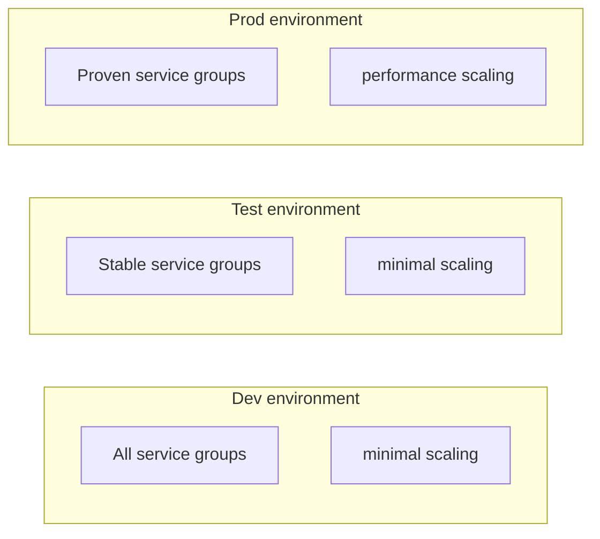
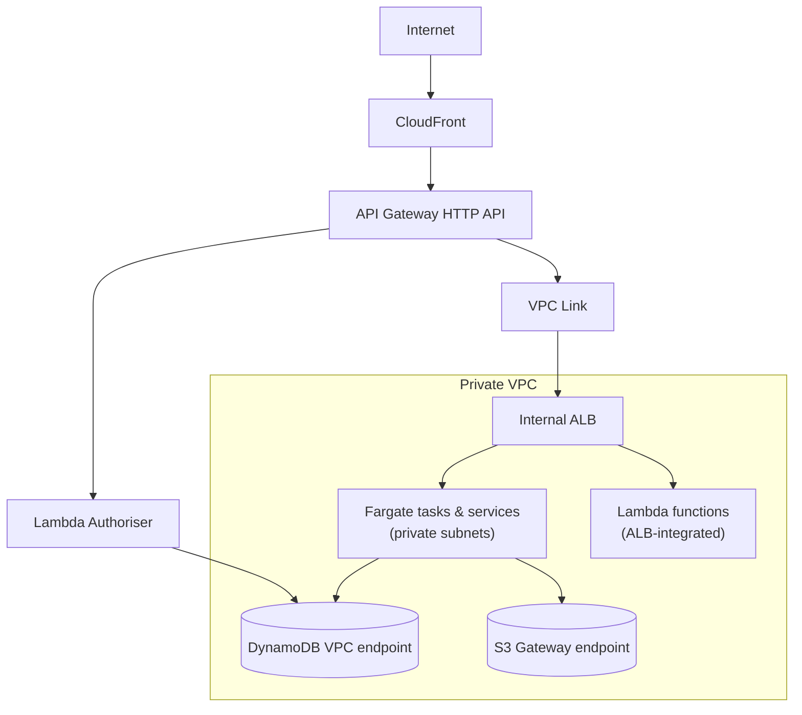

# 12 — Deployment

This document describes how the platform is composed, parameterised, and rolled out. Implementations are free to choose their cloud and their infrastructure-as-code framework; the *structure* described here is what matters.

## Environments

The platform supports three named environments by convention:

| Environment | Service composition | Scaling | Purpose |
|---|---|---|---|
| `dev` | All service groups | minimal | Active development; everything enabled |
| `test` | Stable services only | minimal | Pre-production validation |
| `prod` | Proven services only | performance | Production traffic |

Each environment is a separate deployment, with separate resources, names, and (recommended) separate cloud accounts. There are no shared resources across environments.

A single source repository targets all three environments through context parameters. There is no branching for environment differentiation.

## Service groups

Services are bundled into groups by coupling. Environments toggle groups, not individual services. The canonical groups:

| Group | Members | Notes |
|---|---|---|
| `vector-tiles` | Vector tile server | Standalone |
| `vector-query` | Query layer + OGC Features API | When deployed together, the OGC API is a façade over the query layer; the OGC API can also stand alone (see [06 OGC Features API](06_OGC_FEATURES_API.md)) |
| `raster` | Raster tile server + WMTS/WMS proxy | Proxy depends on tile server |
| `routing` | Routing engine | Optional; query layer degrades gracefully without it |
| `editing` | Editing pipeline + editing API | The full write path |
| `discovery` | STAC API | Catalogue facade |
| `coverages` | OGC Coverages API | Independent |
| `sync` | Dataset sync from external feeds | Optional; deployment-specific |

Core infrastructure — network, storage, authoriser, API gateway, CDN, monitoring — is always deployed regardless of environment. These are the substrates every service depends on.

## Scaling modes

Each service group is configured by a scaling mode. Three modes are defined:

| Mode | Behaviour |
|---|---|
| `off` | Zero running tasks (`desiredCount=0`). Cost approaches zero. **First-request behaviour: the request fails with HTTP 503** because the ALB target group has no healthy targets, and CPU-based target tracking only scales out once a CPU datapoint exists (no requests = no CPU). The prototype ships no wake-up Lambda, no scheduled warmer, and no request-count-based scaler — `off` means "unavailable until manually woken." A hardened deployment should either bind a small Lambda scaler to the ALB 5xx alarm (sets `desiredCount=1`, drops back after the scale-in cooldown), or treat `off` as "stopped" and require an operator to scale up before use. |
| `minimal` | One task per service kept warm. Steady-state low cost; auto-scaling can grow further if CPU rises. This is the recommended default for any service that fronts interactive traffic. |
| `performance` | Multiple pre-warmed tasks, higher CPU and memory allocations. Consistent low-latency response; higher cost. |

> *In plain terms:* `off` is genuinely off — not "off but ready to wake silently." A client hitting a service in `off` mode sees a 503 and is expected to retry after the operator (or a wake-up Lambda) has scaled the service to at least one task. The first task then takes 60–120 seconds to start (Fargate task launch, image pull, extension load, health-check pass) before requests can be served. Use `off` for development environments and demos where unavailability is acceptable between sessions, not for traffic-serving environments. The same trade-off is described in [07 Query Layer](07_QUERY_LAYER.md) for the query layer specifically.

The mode is a deployment parameter. Different environments typically run in different modes (`dev` in minimal, `prod` in performance). The mode is independent of which service groups are deployed.

## Compute split: Fargate vs Lambda

Services are placed on **Fargate** (long-running ECS services or transient ECS tasks) or **Lambda** based on workload characteristics:

| Workload | Compute | Rationale |
|---|---|---|
| Heavy data engines (DuckDB, GDAL, Tippecanoe, routing graphs) | Fargate service | Long warm-up, persistent caches, large memory footprint |
| Tile servers (vector via go-pmtiles, raster via TiTiler) | Fargate service | Benefit from warm caches; desired-count 0 is supported but means 503-until-woken (see scaling-modes note above) |
| OGC API Features (standalone shape) | Lambda | Thin handler, fast cold start, pay-per-request |
| OGC API Features (façade shape) | Lambda | Same — the work is in the Fargate query layer |
| Authoriser | Lambda | Tiny stateless logic; latency-critical |
| STAC API | Lambda | Read-only over DynamoDB |
| Editing API, Upload gate, Job API | Lambda | HTTP handlers over DynamoDB |
| Promotion function, failure handler | Lambda | Step Functions task targets; short execution |
| Validation task, generation task | Fargate transient ECS task | Long-running computation with large ephemeral storage (100–200 GiB) |
| Dataset sync, history vacuum, event log compactor | Lambda (EventBridge-scheduled) | Periodic maintenance |

**Fargate tasks vs Fargate services.** Transient ECS tasks (started by `RunTask` from Step Functions for one job, then exit) are distinct from long-running ECS services (managed by ECS Service Auto Scaling, kept warm at the configured desired count). The validation and generation steps use tasks; everything else on Fargate uses services.

## Network shape

The internal ALB is **not internet-facing** — it sits in private subnets with a security group that allows ingress only from the **VPC Link** security group. The only ingress to backends is through the API Gateway HTTP API via the VPC Link private integration. This:

- Prevents requests from bypassing the Lambda authoriser.
- Removes the need for per-backend authentication code.
- Reduces the public attack surface to a single component (the API Gateway).

> **Prior iteration.** The ALB was once **internet-facing**, in public subnets. All traffic was *supposed* to go through API Gateway for auth, but the ALB was technically reachable directly, bypassing the Lambda authoriser. This was closed in two steps: first restricting the ALB security group to CloudFront IPs only, then moving the ALB to private subnets with VPC Link as the only path. Anyone implementing this design should make the ALB internal-only from day one.

Backends access DynamoDB and S3 through cloud-native **VPC endpoints** (Gateway endpoints for S3 and DynamoDB; Interface endpoints for ECR, CloudWatch Logs, and Secrets Manager where used). No outbound internet egress is required for the read or write paths; this allows the deployment to omit NAT Gateways entirely, eliminating their ~\$65/month-per-AZ baseline cost.

> *In plain terms:* every service the platform talks to lives either inside the VPC or behind a private endpoint, so the cluster doesn't need a paid bridge to the public internet at all.

## Promotion model

A single source-of-truth branch (`main`) targets `dev` automatically on every push. Promotion to `test` and `prod` is driven by **tagged releases**:

| Trigger | Action |
|---|---|
| Push to `main` | Deploy to `dev` automatically |
| Push tag `test/{date}` | Deploy to `test` automatically |
| Push tag `prod/{date}` | Deploy to `prod` (typically requires manual approval) |

Tags are immutable release artefacts; a tag permanently records what was deployed. Hot-fixes follow the same flow (fix on main → tag for test → validate → tag for prod).

This model eliminates branch drift: there is no dev branch separate from prod, no cherry-picks between environments, no merge conflicts in infrastructure code.

## Resource sizing guidance

Per-service container sizing as configured in the prototype's `scaling_config.py`. Values vary by mode (`off` / `minimal` / `performance`); the table below shows the **performance** mode allocation. Validation and generation tasks are mode-independent — they are transient ECS tasks sized for the work, not long-running services. A vendor build should re-baseline against observed traffic rather than inherit these values uncritically; the prototype was sized empirically against light development load.

| Service | CPU (perf) | Memory (perf) | Task count (perf) |
|---|---|---|---|
| Raster tile server (TiTiler) | 4 vCPU | 8 GB | desired 10, max 50 on CPU |
| Vector tile server (go-pmtiles) | 0.25 vCPU | 512 MB | desired 6, max 15 |
| WMTS/WMS proxy | 4 vCPU | 8 GB | desired 10, max 20 |
| Query layer (GraphQL) | 1 vCPU | 2 GB | desired 2, max 8 |
| Coverages API | 2 vCPU | 4 GB | desired 3, max 10 |
| Routing engine (Valhalla) | 4 vCPU | 8 GB | desired 2, max 6 |
| Validation task (per execution) | 4 vCPU | 16 GB | 100 GiB ephemeral storage |
| Generation task (per execution) | 4 vCPU | 16 GB | 200 GiB ephemeral storage |

A couple of these look surprising and are worth naming:

- **Vector tile server is intentionally tiny.** go-pmtiles is a byte-range proxy onto S3 — almost no in-process work — so 0.25 vCPU / 512 MB per task suffices and horizontal scale-out covers traffic.
- **Query layer is smaller than its workload suggests.** The prototype runs the GraphQL service at 1 vCPU / 2 GB even in performance mode because the DuckDB-in-process read path was sized for development-shaped queries, not production fan-out. **This is the most likely place a vendor build should up-size first** — bump to 2–4 vCPU and 4–8 GB if interactive spatial composition is a real workload.

Function-runtime services are typically 256–1024 MB memory, with timeouts appropriate to the work (30 seconds for HTTP handlers, 5–15 minutes for batch maintenance jobs).

## Storage configuration

| Resource | Configuration |
|---|---|
| Object-storage bucket | Single bucket; versioning enabled; lifecycle to lower-cost tier after 30 days; cleanup rules for `landing/`, `pmtiles/staging/`, `drafts/` |
| Key-value tables | On-demand billing; point-in-time recovery enabled; per-item TTL where applicable (sessions, transient items) |

## Identity provider configuration

The identity provider is consumed by configuration:

| Setting | Value |
|---|---|
| Trusted issuers list | Comma-separated list of OIDC issuer URLs |
| JWKS cache TTL | One hour |

Federation (linking an enterprise IdP to a hosted user pool, or pointing the platform at the enterprise IdP directly) is configured on the IdP side, not in this platform.

## Observability

Every deployment includes:

- **Operations dashboard** — load balancer traffic, errors, latency; API gateway metrics; CDN cache hit rate; container CPU/memory/task counts; authoriser invocations and errors; pipeline state machine executions and failures; storage growth.
- **Usage dashboard** — per-credential request counts; data egress; per-service request breakdown; feature downloads; tile requests; editing activity.
- **Alarms** — 5xx rates on load balancer and targets; latency thresholds on the load balancer; authoriser error rate; container CPU saturation.

See [13 Operations](13_OPERATIONS.md) for the operations and runbook view.

## IaC structure (AWS CDK reference)

The reference implementation uses **AWS CDK** in Python. It is structured as a set of CloudFormation stacks, deployed in a defined order:

1. **Storage** — buckets, key-value tables.
2. **Network** — VPC, subnets, security groups, internal load balancer, VPC endpoints.
3. **Compute infrastructure** — container cluster, task definitions, IAM roles.
4. **Each service stack** — conditionally instantiated based on the environment's service groups.
5. **Authoriser stack** — authoriser function, identity provider configuration, policy tables.
6. **API gateway stack** — gateway, integrations to the load balancer.
7. **CDN stack** — distribution and cache behaviours.
8. **Editing pipeline stack** — workflow engine, tasks, related tables.
9. **Monitoring stack** — dashboards, alarms.

Each stack is independently deployable. A single-service update (e.g. swap the raster tile server image) updates only its own stack.

## Reproducibility

The deployment is fully described in code. No console operations are required for a fresh deployment. A new environment can be provisioned by:

1. Creating the cloud account.
2. Bootstrapping the IaC framework.
3. Deploying the stacks with the appropriate environment and scaling-mode parameters.
4. Running an initial bootstrap script to create the first administrator.

The time to first-running deployment from a clean account is on the order of an hour. Most of that is cloud provisioning latency.

## Cross-cloud orientation (AWS is the reference)

This platform is designed on AWS and depends on several AWS service features that do not have like-for-like equivalents on other clouds. The table below maps service categories for orientation; porting the platform to another cloud is not a substitution exercise but a redesign at the networking and edge layers.

| AWS (reference) | Google Cloud (closest) | Azure (closest) |
|---|---|---|
| S3 | Cloud Storage | Blob Storage |
| DynamoDB | Firestore (Datastore mode) | Cosmos DB (Table API) |
| CloudFront | Cloud CDN | Azure Front Door |
| API Gateway HTTP API + Lambda authoriser | API Gateway + Cloud Run | API Management + custom policy |
| Lambda | Cloud Functions | Azure Functions |
| Fargate (tasks + services) | Cloud Run jobs + services | Container Apps jobs + apps |
| Step Functions | Workflows | Durable Functions |
| Application Load Balancer v2 (path-based + URL rewrite) | HTTP(S) Load Balancing | Application Gateway |
| VPC Link (private connectivity, API GW → internal ALB) | Serverless VPC Access + internal LB | VNet Integration |
| Cognito User Pool + post-auth Lambda trigger | Identity Platform + Cloud Functions hook | Entra External ID + custom policies |

Features that are AWS-specific and require redesign on other clouds:

- **ALB v2 path-based routing with URL rewrite transforms** — Google's HTTP(S) Load Balancing and Azure's Application Gateway both support path-based routing but have different URL-rewrite semantics and different rule-priority models.
- **S3 `CopyObject` atomicity within a bucket** — the substrate for the platform's atomic-swap promotion. Cloud Storage and Blob Storage offer different atomic-write primitives (conditional writes, generation matching).
- **API Gateway HTTP API custom-authoriser-to-header parameter mapping** — the design depends on the gateway injecting `X-Auth-*` headers from the authoriser's response context. Equivalent behaviour on other clouds typically requires a small auth proxy in front of the application.
- **DynamoDB single-table design with multiple GSIs** — Firestore and Cosmos DB have different indexing and pricing models; access patterns may need rework.
- **CloudFront per-credential cache keying** — header-based cache-key composition for credential headers is straightforward in CloudFront and not trivial in some other CDNs.
- **Fargate ephemeral storage up to 200 GiB per task** — Cloud Run and Container Apps have different ephemeral-storage allowances; the generation-task pattern may need an attached filesystem.

A team building this on a different cloud should treat the *contracts* in [02 Architecture](02_ARCHITECTURE.md), [03 Authorisation](03_AUTHORISATION.md), and [04 Data Layout](04_DATA_LAYOUT.md) as portable, and accept that the *implementation* of edge routing, atomic promotion, and authoriser integration will be cloud-shaped, not transcribed.
