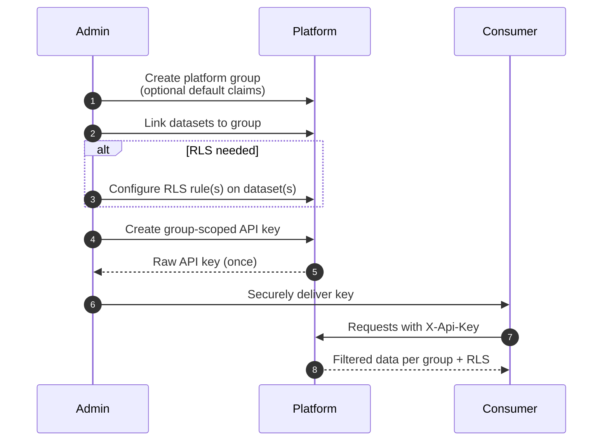

# 14 — Client Integration

This document describes how external systems and users connect to the platform. It is the consumer's-eye view: what each client type sends, what it receives, what authentication flow to use.

## Client types

The platform serves four principal client classes:

| Client class | Examples | Auth |
|---|---|---|
| Desktop GIS | QGIS, ArcGIS Pro, ArcGIS Enterprise Portal | API key (header or query parameter) |
| Web maps | Browser-based map viewers, web applications | OIDC JWT (interactive sign-in) or API key |
| Programmatic clients | Scripts, data-pipeline integrations | API key |
| Server-to-server | Other platforms consuming this one's data | API key (group-scoped) |

## Authentication options

### OIDC sign-in (interactive)

For users of a web application. The web app:

1. Redirects the user to the identity provider's sign-in flow.
2. Receives an OIDC ID token from the provider on callback.
3. Sends the token as `Authorization: Bearer <token>` on subsequent platform requests.
4. Refreshes the token before expiry using the provider's refresh-token flow.

The platform validates the token against the configured trusted issuers and resolves the user's permissions per [03 Authorisation](03_AUTHORISATION.md).

### API key (everything else)

A user with a valid token, or an administrator, creates an API key:

```
POST /rest/auth/me/apikey            (self-service, for the calling user)
POST /rest/auth/apikeys              (admin, with explicit owner)
```

The response contains the raw key, returned exactly once. Subsequent requests send the key as:

```
X-Api-Key: <raw_key>
```

A user-scoped API key is deliberately conservative: it receives the `viewer` role and access only to `public` datasets, *not* the calling user's group memberships or private dataset grants. The downgrade is intentional — a leaked key cannot exercise the user's elevated roles. A group-scoped API key inherits the group's datasets (and the group's RLS-feeding claims) at `viewer`. Group-scoped keys are the canonical choice for desktop GIS teams.

API keys are revoked by setting the `active` flag to false in the DynamoDB `api-keys` table; revocation takes effect within one minute (the authoriser Lambda's warm-container LRU cache TTL).

## QGIS

### WMTS connection

For raster layers and (via redirect) vector layers exposed as raster.

1. Layer → Add Layer → Add WM(T)S Layer.
2. New connection:
   - Name: meaningful label.
   - URL: `https://<cdn>/wmts?service=WMTS&request=GetCapabilities`
3. Authentication tab → custom HTTP header:
   - Header name: `X-Api-Key`
   - Header value: the raw API key.
4. Connect → select layer → Add.

QGIS sends the `X-Api-Key` header on every tile request. The CDN caches per-key.

### WMS connection

Same as WMTS but the URL is `https://<cdn>/wms?service=WMS&request=GetCapabilities`.

### OGC API Features connection

For vector features as features (not as tiles), with access to attributes.

1. Layer → Add Layer → Add WFS / OGC API Features Layer.
2. New connection:
   - URL: `https://<cdn>/features/v1`
3. Add the `X-Api-Key` header as for WMTS.
4. Connect → select collection → Add.

The OGC Features API filters collections by the API key's group datasets and applies row-level security.

## ArcGIS

### ArcGIS Enterprise Portal — vector tile service

The platform exposes vector tile layers via an Esri-compatible adapter.

1. Content → New Item → URL.
2. URL: `https://<cdn>/esri/vectortiles/{source}/VectorTileServer`
3. The platform supplies VectorTileServer metadata, a Mapbox GL v8 style, and tiles in `.pbf` form.

To pass an API key with ArcGIS requests, configure the portal item's request headers or proxy the requests through a service that adds the header.

### ArcGIS Pro — WMTS

ArcGIS Pro consumes WMTS via Add Data → Add Layer From URL with the WMTS GetCapabilities URL. Authentication is configured per the Pro version's documentation.

## First-party web map client

The platform ships a bundled web application — see [15 Map Client](15_MAP_CLIENT.md) — built on React and MapLibre, with embedded GraphiQL, schema-driven editing, reviewed-editing approvals, live job tracking, and dataset history browsing. It consumes every public surface and is the recommended starting point for users who want a working spatial workspace without writing one. The rest of this document covers other client types — desktop GIS variants, generic web maps, and programmatic clients — that integrate against the same APIs.

## Generic web map clients

For map libraries (MapLibre, Leaflet, OpenLayers) used outside the first-party client:

| Source type | URL pattern | Auth |
|---|---|---|
| Vector tile (TileJSON) | `https://<cdn>/tiles/vector/{dataset}/tile.json` | Header via XHR or token in URL where supported |
| Vector tile (direct) | `https://<cdn>/tiles/vector/{dataset}/{z}/{x}/{y}.mvt` | Same |
| Raster tile XYZ | `https://<cdn>/tiles/raster/.../{z}/{x}/{y}.png` | Same |
| WMTS | `https://<cdn>/wmts?service=WMTS&...` | Header |
| Features GeoJSON | `https://<cdn>/features/v1/collections/{id}/items?bbox=...` | Header |

Most map libraries support setting custom request headers via a transform or fetch override. For public datasets, no auth is needed.

## Programmatic clients

For scripts and integrations, two patterns:

### Direct REST/HTTP

Use any HTTP client; send `X-Api-Key` on every request. The platform's REST surfaces follow standard JSON conventions.

### CLI wrapper

A small CLI wrapper can manage API key acquisition and refresh. A reference implementation typically:

- Stores the user's credentials in a local configuration directory.
- Acquires JWTs from the IdP on demand.
- Caches the JWT for its lifetime; refreshes on expiry.
- Adds `Authorization` or `X-Api-Key` to outbound requests transparently.

Such a wrapper makes manual operations (`GET /rest/auth/me`, `POST /rest/auth/groups`, etc.) low-friction without the user managing tokens directly.

## Onboarding a new consumer

The standard onboarding flow for a new partner team or service:



For interactive users rather than service consumers, replace step 3 with an invitation:

```
POST /rest/auth/invites { "email": "...", "group_id": "...", "role": "..." }
```

The user is invited via email; on first sign-in, the post-authentication hook converts the invitation into a membership.

## Common request patterns

### List collections the caller may access

```
GET /features/v1/collections
Authorization: Bearer <token>    or    X-Api-Key: <key>
```

### Query features in a bbox

```
GET /features/v1/collections/parcels/items?bbox=144.9,-37.9,145.1,-37.8&limit=100
```

### Fetch a single feature

```
GET /features/v1/collections/parcels/items/12345
```

### Fetch a vector tile

```
GET /tiles/vector/parcels/12/3300/2100.mvt
```

### Fetch a TileJSON descriptor

```
GET /tiles/vector/parcels/tile.json
```

### Submit a feature update through the editing API

The editing flow is typically: create session, request a presigned upload URL, upload the file, finalise. Poll the job for status. See [11 Editing Pipeline](11_EDITING_PIPELINE.md).

```
POST   /edit-sessions                     { "dataset_id": "parcels" }
POST   /edit-sessions/{id}/uploads        (returns presigned URL)
PUT    <presigned URL>                    (upload the file)
POST   /edit-sessions/{id}/finalize       (kicks off the pipeline)
GET    /jobs/{id}                         (poll for status)
```

### Issue a self-service API key

```
POST /rest/auth/me/apikey { "description": "QGIS at desk" }
```

The request takes a description only. There is no client-supplied `scope` field — every issued key is stored with `scope: public` and resolves to `role: viewer` at use. To grant a key access to private datasets, issue a *group-scoped* key for a group the user is a member of via the admin endpoint instead.

## Public access

For public datasets (`public: true` in the registry), requests do not need credentials. The CDN serves public content from a single edge cache entry not keyed on credentials:

```
GET /tiles/vector/public-dataset/{z}/{x}/{y}.mvt
GET /features/v1/collections/public-dataset/items?bbox=...
```

Anonymous requests succeed; the caller receives only public datasets in catalogue responses.

## Versioning and stability

The platform's external surfaces follow these stability principles:

- **OGC API paths** (`/features/v1/...`, `/coverages/v1/...`) carry a version in the path. Breaking changes increment the version.
- **STAC paths** follow STAC's own versioning (the STAC API spec carries the version).
- **Tile paths** (`/tiles/vector/...`, `/tiles/raster/...`, `/wmts/...`) are stable.
- **Admin paths** (`/rest/...`) are versioned implicitly; breaking changes are infrequent and announced.

The query layer's GraphQL schema is introspectable and the schema's evolution follows GraphQL's deprecation conventions.

## What clients should expect

- **Cold-start latency.** In deployments configured with `off` scaling for container-backed services, the first request after idle returns HTTP 503 while ECS scales the service back up (60–120 seconds typically). Clients should retry with backoff; subsequent requests are fast. Deployments running `minimal` or `performance` mode do not hit this path.
- **Cache effects.** Tiles cache for seven days per credential at the edge; metadata caches for one hour. Permission changes are visible within five minutes.
- **No reorderable response.** OGC Features returns results in a consistent order (typically by feature ID).
- **Standards conformance.** OGC APIs, STAC, WMTS, WMS, TileJSON, and MVT follow the relevant standards for the declared conformance classes the platform implements. Several optional classes are deliberately not exposed — WMS `GetFeatureInfo` and SLD styling are omitted from the WMTS/WMS proxy; OGC Features Transactions are typically omitted (the editing pipeline is the write surface, not WFS-T); STAC item search is collection-level only in this prototype (per-feature access is via OGC Features, per-COG access via Coverages or raster tiles). Clients that exercise only the conformance classes the platform declares should work with other implementations of the same classes.
