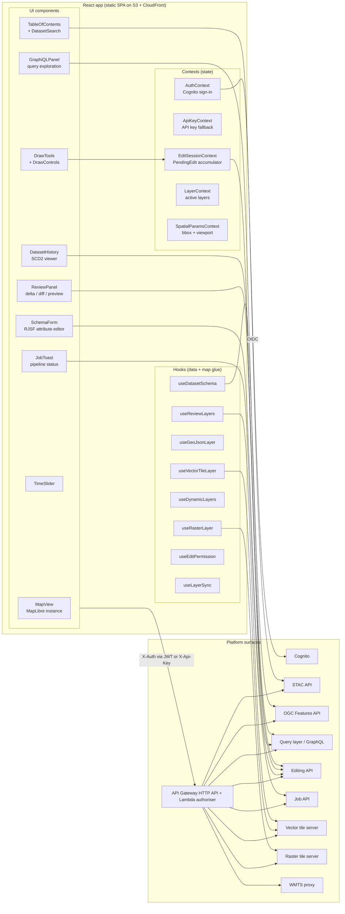
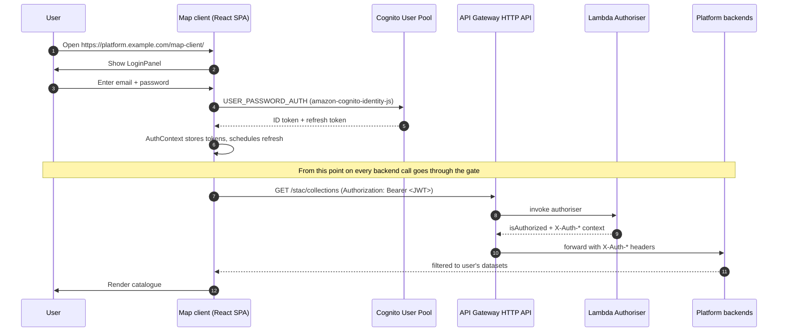

# 15 — Map Client (Web Application)

The platform ships a first-party web map application that consumes every public surface — vector tiles, raster tiles, the OGC Features API, the GraphQL query layer, the STAC catalogue, the editing API, and the job and review APIs — and demonstrates how they compose into a working spatial workspace. It is the reference client. Anyone building a different front-end against the same platform can read its component shape as a worked example.

> *In plain terms:* one web app that lets a user browse the catalogue, render layers, draw and edit features, submit edits to the reviewed pipeline, watch the pipeline produce its draft tiles in near-real-time, and approve or reject sessions — all while logged in via the same auth gate the rest of the platform uses.

## Technology stack

- **React 19** with TypeScript and the React Compiler runtime for ergonomic reactivity.
- **Vite** for the dev server and the production build (single-page app).
- **MapLibre GL JS** for vector and raster tile rendering. WebGL-based, supports the same Mapbox style spec the platform emits, renders PMTiles via the standard MVT pipeline.
- **GraphiQL** (`@graphiql/react`) embedded as a panel for interactive GraphQL query exploration against the query layer.
- **React JSON Schema Form (RJSF)** for schema-driven attribute editing — datasets provide their JSON Schema via the dataset registry, and RJSF renders an appropriate form per feature.
- **Amazon Cognito Identity JS** for OIDC sign-in against the platform's Cognito User Pool. API key access is supported in parallel for machine-friendly scenarios.

The client is a static single-page application. It is built to a `dist/` directory and deployed to S3 under a `map-client/` prefix, served by the same CloudFront distribution that fronts the API. No server-side rendering, no Node runtime in production.

## What a user can do

A user signed in to the client can:

1. **Browse the dataset catalogue.** A table of contents lists available datasets grouped by type (vector, raster, table). Dataset search filters by name and metadata. Each dataset entry shows status (active, deprecated, processing) so users see catalogue state, not just titles.
2. **Add layers to the map.** Vector datasets render as MVT layers from the vector tile server; raster datasets render via the raster tile server or WMTS proxy depending on dataset type. The client respects the user's authorisation — only datasets the user has access to appear in the catalogue.
3. **Inspect features.** Clicking a feature opens a popup with attribute values and links to the feature's history (SCD2 queries via the query layer).
4. **Scrub time.** For datasets with a TIME dimension, a slider control switches the active mosaic and re-fetches tiles.
5. **Measure.** A measurement tool computes lengths and areas client-side from drawn geometries.
6. **Draw and edit.** Drawing tools create or modify geometries directly on the map. Attribute editing is driven by the dataset's schema — RJSF generates a form from the schema and validates inputs client-side before they are submitted.
7. **Accumulate edits into a session.** Edits do not submit immediately. An `EditSessionContext` collects `PendingEdit[]` in client state; the user reviews their pending changes and chooses when to submit.
8. **Submit a session and watch the pipeline.** Submission posts the accumulated edits to the editing API, which creates a session and starts the workflow. The client receives the job identifiers and displays a job-status toast that polls the job API until completion.
9. **See draft layers as they generate.** For datasets with reviewed editing enabled, the generation task produces delta and difference PMTiles in the `drafts/{dataset}/{session}/` prefix. The client renders these as overlay layers as soon as they are available — a live link into the editing pipeline that gives reviewers something visual to act on before promotion.
10. **Review and approve.** The Review Panel selects an edit session and renders the delta and diff PMTiles in one of three modes (see below). The reviewer approves or rejects via the editing API; the underlying state machine progresses to promotion or rejection.
11. **Inspect dataset history.** A dataset history view queries the SCD2 history through the query layer and shows previous versions of features, the time each version was valid for, and which job made the change.
12. **Compose GraphQL queries interactively.** A GraphiQL panel is embedded so advanced users can build queries against the query layer with full schema introspection and authentication carried across.

## Review modes

The Review Panel renders draft tiles in one of three explicit modes (type literally `'operations' | 'diff' | 'preview'`):

| Mode | What it shows | When it helps |
|---|---|---|
| `operations` | The delta PMTiles only — every edited feature, colour-coded by edit operation (add / update / delete) and validation status. | Quick scan of "what is the editor changing", with operation type immediately visible. |
| `diff` | The diff PMTiles — geometric ST_Difference between session and live data, classified by diff type (geometry added, geometry removed, attributes only, etc.). | Precise before-and-after visualisation, especially for polygon datasets where boundary changes are subtle. |
| `preview` | The live data composited with the delta — what the dataset will look like after promotion. | The "final read" before approving. |

Switching modes re-styles the map without re-fetching tiles — both PMTiles files are loaded once when the review session opens.

## Component architecture

## State and context model

Five React contexts carry the app's state. Each is a single source of truth for one concern:

- **`AuthContext`** — Cognito sign-in state, ID and refresh tokens, current user profile, sign-out. Drives the `fetchWithAuth` helper that signs every outbound request with the user's JWT.
- **`ApiKeyContext`** — API key fallback for non-interactive sessions and tests. Either auth path produces the same trusted `X-Auth-*` headers at the platform's gate.
- **`EditSessionContext`** — accumulates `PendingEdit[]` from the drawing and form components, exposes `submitAll()` that posts the batch to the editing API and returns the resulting job identifiers. Holds the active server-side session record (`ServerSession`) once one exists, with its status (`draft`, `uploading`, `submitted`, `validating`, `reviewing`, `approved`, `promoting`, `promoted`, `failed`, `rejected`, `cancelled`).
- **`LayerContext`** — registry of layers currently on the map, their visibility, paint properties, and source URLs. The map view subscribes to it; component changes flow through `useLayerSync`.
- **`SpatialParamsContext`** — current bbox, zoom, centre. Drives data fetches that need a spatial scope (catalogue search by extent, history queries within a bbox).

Per-component hooks compose these contexts. `useEditPermission(datasetId)` reads `AuthContext` and the dataset registry to determine whether the active user may edit the given dataset; `useDatasetSchema(datasetId)` fetches the JSON Schema once and caches it; `useReviewLayers(sessionId, mode)` builds the MapLibre layer specifications for the chosen review mode and applies them to the map instance.

## Authentication flow

For headless or scripted use, the same client can run with an API key supplied via `ApiKeyContext` instead of the Cognito flow. The `fetchWithAuth` helper transparently picks the available credential.

## Live link to the editing pipeline

The "live" feel of the client comes from two cooperating mechanisms.

**Job status polling.** When `submitAll()` succeeds, the editing API returns job identifiers. `JobToast` subscribes via the job API and polls until each job reaches a terminal state. The polling cadence is short (low single-digit seconds) so users see state transitions as they happen: `pending → validating → generating → promoting → complete` or the failure path. On completion the toast offers a link to the dataset and (for reviewed sessions) the Review Panel.

**Draft tile rendering during generation.** For datasets with reviewed editing, the generation task writes delta and diff PMTiles to `drafts/{dataset}/{session}/...` as soon as it has them. The client requests these tile URLs against the vector tile server; once the objects exist, MapLibre renders them automatically on the next viewport change. The reviewer can see what is being produced *before* the workflow has even reached the review state — useful for catching obvious mistakes early.

The pattern is fully asynchronous: no WebSocket, no SSE. The platform's S3 + ETag-driven refresh and the client's polling carry the load.

## Permission-aware UI

The client never exposes operations a user cannot perform.

- The catalogue only lists datasets in `X-Auth-User-Datasets`.
- Edit tools are hidden when `useEditPermission(datasetId)` returns false.
- The Review Panel is hidden when the user's role is below `publisher`.
- The GraphiQL panel is available to any authenticated user, but operations the user cannot authorise simply fail at the gate — the client does not pre-filter the schema.
- Anonymous (no-credential) load is supported for read-only browsing of public datasets; the client adjusts its UI accordingly.

## Deployment

The map client builds to a `dist/` directory and is uploaded to S3 under a `map-client/` prefix. The platform's CloudFront distribution has a behaviour mapping `/map-client/*` to the bucket via Origin Access Control. The static cache policy serves assets with a one-hour default TTL; the SPA entry point is configured to bypass caching for the HTML shell.

A small static viewer (`/viewer/*` in S3) accompanies the map client for cases where a self-contained, dependency-free HTML map is preferred — typically for embedding into reports or sharing a URL with no application setup. The viewer covers a subset of the map client's features (display, no editing).

## Limits and open work

- **The review-panel workflow exists** (`ReviewPanel`, `useReviewLayers`, `draftDeltaTileUrl`, `draftDiffTileUrl`) and the three modes are wired. Like the rest of the reviewed-editing path, it has not been load-tested with real reviewers and large sessions. Treat the visual fidelity of the diff classification as designed, not proven.
- **The GraphiQL embed is for advanced users.** It exposes the full query layer surface, including the undertested spatial-analysis resolvers covered in [10 Discovery](10_DISCOVERY.md). Casual users should stay with the curated UI components.
- **Offline behaviour is undefined.** The client assumes connectivity; a future build should consider a service worker for resilient tile caching.
- **There is no multi-user editing coordination in the UI.** If two users open the same dataset and edit, both batches submit; per-dataset concurrency on the platform side queues them. The client does not show that a queue is forming.
- **Mobile is not a primary target.** Layout, drawing precision, and touch gestures are functional but not refined.

## What this serves well

- Demonstrating the platform's full surface to a stakeholder or new user.
- A bundled answer to "how do users actually interact with this?" without forcing every consumer to build their own client.
- A reference implementation of the patterns a third-party client would also need: credential-aware fetches, permission-aware UI, schema-driven editing, batched edits via sessions, live job tracking, delta/diff review rendering.

A team writing a different web client — perhaps tailored to a narrow workflow — can pick up these patterns without copying the code. The contracts are what matter; the React app is one valid realisation.
