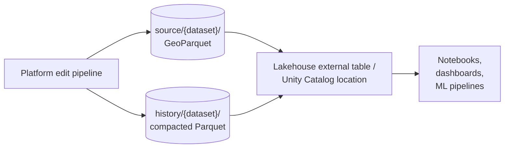
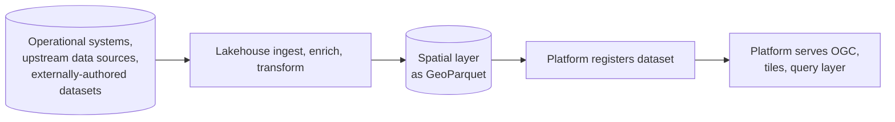

# 19 — Lakehouse Integration

This platform and a modern data lakehouse (Delta Lake on Databricks, Iceberg on Snowflake, Iceberg on Spark or Trino, or equivalent) overlap visibly enough that an architect with a lakehouse already in production is right to ask whether this platform is duplicating capability they already pay for. The honest answer is: the overlap is real, the lakehouse has closed several of the gaps that justified building this platform in the first place, and there is still a defensible line — but it is a line drawn by **who consumes the data**, not by what kind of data it is.

This document draws that line, acknowledges the lakehouse improvements that narrowed it, and describes how the two systems compose when they exist in the same organisation.

> *In plain terms:* the lakehouse is where data goes to be joined, transformed, and analysed. This platform is where authoritative spatial data goes to be served and edited. Both can hold the same Parquet files; both are needed when consumers span analysts and interactive map clients.

## The reframe: consumer, not data type

Earlier drafts of this document tried to draw the line at "vector vs raster" or "transactional vs analytical." Both lines turn out to be wrong. The lakehouse can hold vector spatial data competently; this platform can be made to do simple analytics with enough effort. The line that *holds* is who is asking for the data and how they expect to receive it.

| Consumer | Belongs in |
|---|---|
| Interactive map in a browser or mobile app, drawing tiles every second | This platform |
| Desktop GIS (QGIS, ArcGIS) consuming WMTS, WMS, OGC Features | This platform |
| External partner or agency hitting an OGC URL on a per-call basis | This platform |
| Imagery, COG, WMTS, point-cloud byte-range streaming | This platform |
| Reviewed editing where the reviewer needs to see spatial delta and difference overlays | This platform |
| Agent calling a spatial API as a tool, expecting sub-second responses | This platform |
| Wide-audience consumption where load is unpredictable and could spike | This platform |
| Analyst in a notebook, joining spatial data to operational tables | Lakehouse |
| ML feature pipeline that needs spatial joins at scale | Lakehouse |
| Dashboard that pre-aggregates before display | Lakehouse |
| Multi-source ingest and enrichment ETL | Lakehouse |
| Wide temporal analytics over years of history across many datasets | Lakehouse |
| Small internal application for a specific team or project | Lakehouse (Apps + Lakebase) |
| Reviewed editing of low-volume vector data with no public OGC surface | Either; default to lakehouse if it is already in use |

Most arguments about "should this be in the lakehouse?" resolve when the consumer is named. Most datasets have more than one consumer, which is why the two platforms need to co-exist, not compete.

## What the lakehouse has improved (and why the question is reasonable now)

The lakehouse landscape moved during the prototype's life. Several capabilities that would have made earlier versions of this document read as a clear-cut "obviously two different systems" have softened that line:

- **Lakebase (managed Postgres on the lakehouse)** is generally available and scales to zero after an idle timeout. The current timeout is measured in hours rather than seconds, but the trend is downward — a near-future minutes-scale timeout closes most of the gap for low-traffic deployments. For workloads that need a Postgres on the lakehouse side, this removes a previously-significant barrier.
- **Lakebase with PostGIS plus ST_AsMVT() can stream vector tiles directly into a Databricks App** with decent latency for the small-user case. For a handful of analysts looking at a project-scoped dataset, this is a credible vector-serving path that did not exist a year ago.
- **Databricks Apps with Streamlit** can host a custom UI that reads and writes Delta tables under Unity Catalog governance, with audit, lineage, and identity passthrough. A reviewer flow for low-volume vector edits is now buildable in the lakehouse without bolting on external infrastructure. Horizontal scaling of Apps is on the roadmap, which further narrows the gap for higher-volume internal apps.
- **Databricks Apps can also host a FastAPI service**, so an OGC API in front of Lakebase is implementable. The protocol gap is not a hard blocker any more.
- **Native spatial SQL functions** (Public Preview on recent Databricks Runtimes) plus mature H3 indexing and the GeoBrix successor to Mosaic make vector spatial analytics first-class on the lakehouse. Spatial joins at 100M+ records run in single-digit seconds with H3 pre-indexing.
- **Delta time-travel and Change Data Feed** provide SCD2-equivalent semantics natively, without a bespoke delta-and-closeout-and-vacuum pattern.
- **DLT, Workflows, and Unity Catalog** give a turn-key pipeline substrate with lineage, expectations, and governance that is arguably more mature than the Step Functions + Fargate combination this platform uses.

If you weighted only the items above, you would conclude the lakehouse is a strict superset of this platform. The next section is why that conclusion is wrong.

## What the lakehouse still cannot do well

Five concrete things remain hard or impossible on the lakehouse, and the platform exists to do them.

**1. Wide-scale interactive serving at predictable cost.** The Lakebase + PostGIS + ST_AsMVT path works for a few analysts looking at a project dataset. It does not hold up at statewide scale at zoomed-out levels with hundreds or thousands of concurrent users: there is no edge caching in front of it, no precomputed simplification, and the database is the bottleneck — Postgres scales by spending money on bigger and more instances, and Lakebase is not a cheap database to leave warm. Cold-start latency still applies, even if it is database cold-start rather than cluster cold-start. The platform's vector tile server backed by PMTiles on object storage with CloudFront in front absorbs orders-of-magnitude more concurrent load on the same dollar.

**2. Raster and imagery serving.** Random-access byte-range reads of Cloud-Optimized GeoTIFFs through the lakehouse filesystem still need workarounds (typically a two-stage local-staging pattern) that add latency and don't compose into a serving substrate. WMTS, WMS, OGC Coverages, and point-cloud streaming over byte ranges remain this platform's territory. If imagery is in scope at all, "could we go all-lakehouse?" is settled.

**3. OGC API contracts at consumer scale.** A FastAPI App over Lakebase can implement OGC API Features for a small audience. What that path does not give you is the cost shape — every external request lands on the database, every cold start is on the database, every traffic spike is paid for in database capacity. For external consumers that include desktop GIS users, partner agencies, public portals, and agents, the platform's stateless-services-plus-CDN-plus-cheap-object-storage shape costs a fraction of what an equivalently-scaled Lakebase deployment costs, and absorbs spikes that would otherwise require pre-provisioned capacity. The lakehouse can speak the protocol; it cannot serve it cheaply at wide audience scale.

**4. Spatial review at scale.** A Streamlit App can render a small GeoJSON of proposed edits on a static map. It cannot easily render a 100,000-feature delta overlaid against a 5-million-feature live dataset at every zoom level, with per-pixel tile caching at the edge. The platform's delta and difference PMTiles are small (typically under 1 MB), served by the same tile server reviewers use for any other layer, with the same auth gate. For datasets where review volume is small and visual complexity is low, a lakehouse-hosted reviewer is fine; for cadastral-class datasets it isn't.

**5. Per-credential row-level filtering on individual feature reads.** Unity Catalog's row filters are built for SQL workloads. The platform's RLS resolves on every `GET /features/.../items/{id}` from JWT or API-key claims, in the auth Lambda, in a few milliseconds. The shapes differ because the request shapes differ.

## What this platform brings that the lakehouse does not have an equivalent for

Beyond the consumer-side gaps above, several internal design choices give the platform properties that aren't accidental — they were the point.

**Spatial partitioning at the storage layer.** The lakehouse's optimisation for spatial queries is H3 pre-indexing and Z-order or liquid clustering on a spatial key — clever and effective for analytical scans. The platform's authoritative GeoParquet is partitioned by Hive `z=/x=/y=` tile coordinates so that a bounding-box request maps directly to a small set of files via tile math. Cross-partition writes with read-side `DISTINCT ON (id)` dedup mean a feature spanning tiles appears in every tile it intersects with full geometry. The lakehouse cannot adopt this layout cleanly — it violates Iceberg's one-row-one-file contract — and would not need to, because lakehouse queries do not start from "give me everything in this bounding box at this zoom" the way tile and OGC requests do.

**The serving artefact itself is the contract.** A PMTiles archive at `pmtiles/{dataset}.pmtiles` is the live serving surface. Promotion is an atomic `CopyObject`; cache invalidation is a CloudFront path-pattern call; the tile server picks up the new ETag on the next read. The consumer surface is HTTP-cached tile URLs, not a SQL view that requires an engine to interpret it.

**No warm engine in the read path.** Every request passes through the auth Lambda and a DynamoDB datasets-catalogue lookup before reaching a backend — single-digit-millisecond latency, no warm compute required. From there, services read S3 directly (the vector tile server byte-range-reads PMTiles, the OGC Features Lambda reads GeoParquet via DuckDB, the raster tile server reads COGs). The data is gated — buckets are not public, every request is authenticated and catalogue-checked — but the gating is a key-value lookup, not a query-planning engine. The lakehouse equivalent is a SQL endpoint or a database; both have warm-up cost and per-query planning that the platform's read path avoids.

**Multi-tenant serving without multi-tenant compute.** A single deployment of this platform serves many groups and projects from the same set of stateless services, with the auth gate doing the multi-tenancy work per request. The lakehouse-native equivalent — Lakebase instances per group, per project, or per workspace — means managing N database lifecycles, N scaling configurations, N backup policies, and N sets of access policies. For an organisation with many small consumer groups, the operational asymmetry is real.

**Predictable cost and performance at wide adoption.** Adding a thousand new external consumers to the platform changes the bill by the cost of edge cache hits and a marginal number of cold serves. Adding a thousand new external consumers to a Lakebase-backed OGC service changes the bill by whatever capacity is needed to keep the database responsive under spike load. Data product owners get a cost shape they can budget against and a performance envelope that does not depend on coordinating compute capacity with consumption.

**Open formats and an enduring capability.** The data formats are open standards (GeoParquet, COG, PMTiles, MosaicJSON), the spatial software is open source (DuckDB, go-pmtiles, Tippecanoe, Valhalla), and the external contracts are OGC standards. The substrate is AWS today, but the data itself is not locked to a particular vendor's ecosystem. If a deploying organisation changes — a government restructure, a contract that lapses, a strategic shift away from a particular lakehouse vendor — the platform and its data keep working. Consumers of this platform value that endurance: their workflows are not hostage to any one vendor's commercial decisions. A lakehouse-native deployment of the same capability would tie data and tooling to that lakehouse for as long as the data needs to be served.

## On the history layer

The platform's row-level SCD2 history sits in territory the lakehouse handles natively with Delta time-travel and Change Data Feed. The platform's implementation is bespoke (per-job delta and closeout Parquet files with a vacuum compactor) for the same reason most of the rest of the platform is bespoke: the read path is DuckDB in a Lambda, which cannot speak Delta natively, and the promotion function is a Lambda that cannot run `MERGE INTO` without invoking a remote engine. Either dependency would reintroduce the warm-compute requirement the platform exists to avoid.

What history actually buys, in this platform, is a property the design did not initially set out to provide: **versioned datasets in the catalogue, viewable side-by-side in a GIS client at no ETL or query cost**. A reviewer comparing the current parcels layer against last month's version pulls both from the same catalogue; an editor recovering from an accidental change can cherry-pick an older version of a feature back into live. The history layer is not exposed as a separate analytical surface — it is a property of the same datasets the platform already serves, available to the same consumers, through the same auth gate, with the same partitioning.

If you are starting fresh with a lakehouse already in place and you want only the audit trail, the lakehouse-native path is cleaner. If you also want the in-viewer comparison and the easy revert-by-cherry-pick, the platform's history layer earns its place even alongside a lakehouse.

## Co-existence patterns

These patterns assume both systems exist in the same organisation, share an object-storage account (or have cross-account read access), and federate to the same identity provider. Some datasets need only one pattern; some need both.

### Pattern B is the default — platform-as-source-for-lakehouse

This is the recommended starting position and matches the message most teams should be giving stakeholders: **authoritative spatial data lives in the platform; the lakehouse reads it for analytical work.** The platform's GeoParquet is already in a format the lakehouse can read as an external table without copy. The cross-partition dedup pattern (`DISTINCT ON (id)` on read) is the only gotcha to document for analysts.

This pattern says: the platform owns the data; the lakehouse is one of many consumers.

### Pattern A — lakehouse-as-source-for-platform

Use this when:

- The lakehouse is the natural ingestion point — operational systems write to it first, and a periodic job derives a spatial layer that the platform then serves.
- A dataset is **authored elsewhere** (an external provider, a partner agency, a different team's pipeline) and needs **enrichment** in the lakehouse — spatial joins to other lakehouse datasets, attribute additions, cleanup — before being **distributed to a wide audience** through the platform. The lakehouse does the enrichment; the platform does the wide distribution.

The lakehouse export should produce GeoParquet partitioned for the platform's serving access pattern (Hive `z=/x=/y=`), not for analytical access. That partitioning step is real work and belongs in the lakehouse pipeline that produces the layer.

This pattern says: the lakehouse owns derivation and enrichment lineage; the platform owns serving.

### Pattern C — federated history

The platform's `featureHistory` resolver answers per-feature time-travel cheaply via DuckDB on the compacted Parquet. The lakehouse answers wide-scale temporal queries that the platform's per-request cost shape would not support ("compute area-of-change per catchment per year across all parcels"). Both read from the same `history/` files. The boundary is the query shape, not ownership.

### Pattern D — convergence on a shared table format (future)

If geometry support in Iceberg matures and a catalog-less read mode becomes viable, the platform's authoritative storage could converge on the same table format the lakehouse uses, with the cross-partition write pattern replaced by an alternate spatial clustering scheme. Three things have to be true before this is the right move: cross-partition writes can be redesigned, Iceberg geometry support matches GeoParquet, and the read path can avoid a catalog dependency. Treat this as a watch-list item, not a plan.

## Summary

| Concern | Platform | Lakehouse |
|---|---|---|
| Interactive map tile serving | ✓ | |
| OGC API surfaces for external and wide-audience consumers | ✓ | |
| Raster and imagery serving (COG, WMTS, Coverages, point cloud) | ✓ | |
| Per-feature reads with claims-based RLS at sub-100ms | ✓ | |
| Reviewed editing with delta/diff visualisation at scale | ✓ | |
| Spatial partitioning at the storage layer | ✓ | |
| Multi-tenant serving without per-tenant compute | ✓ | |
| Predictable cost as consumption scales | ✓ | |
| Vendor-free data formats; portable, enduring capability | ✓ | |
| In-viewer dataset version comparison and feature-level revert | ✓ | |
| Ad-hoc SQL, BI, dashboards | | ✓ |
| ML feature pipelines and training | | ✓ |
| Multi-source ingest and enrichment ETL | | ✓ |
| Wide-scale temporal and cross-dataset analytics | | ✓ |
| Native ACID table format with time-travel | | ✓ |
| Mature data governance and lineage (Unity Catalog, DLT, lineage UI) | | ✓ |
| Small internal apps with custom UI tightly coupled to the data | | ✓ |
| Object storage as substrate | shared | shared |
| Identity provider | shared | shared |

The overlap is at the substrate (Parquet on object storage) and in the parts of the audit-history pattern that a lakehouse provides natively. Everywhere else, the two systems are doing different jobs for different consumers, and an organisation with both serving needs and analytical needs benefits from running both.

This platform exists because there is a class of work — stateless, wide-audience, vendor-portable serving of authoritative spatial data, with reviewed editing and per-request authorisation, scaled to zero when idle and to many consumers when not — that the lakehouse does not do and that bolting onto the lakehouse reproduces this platform in worse form. Where that work is in scope, the platform earns its keep. Where it is not, default to the lakehouse and skip the rest.
